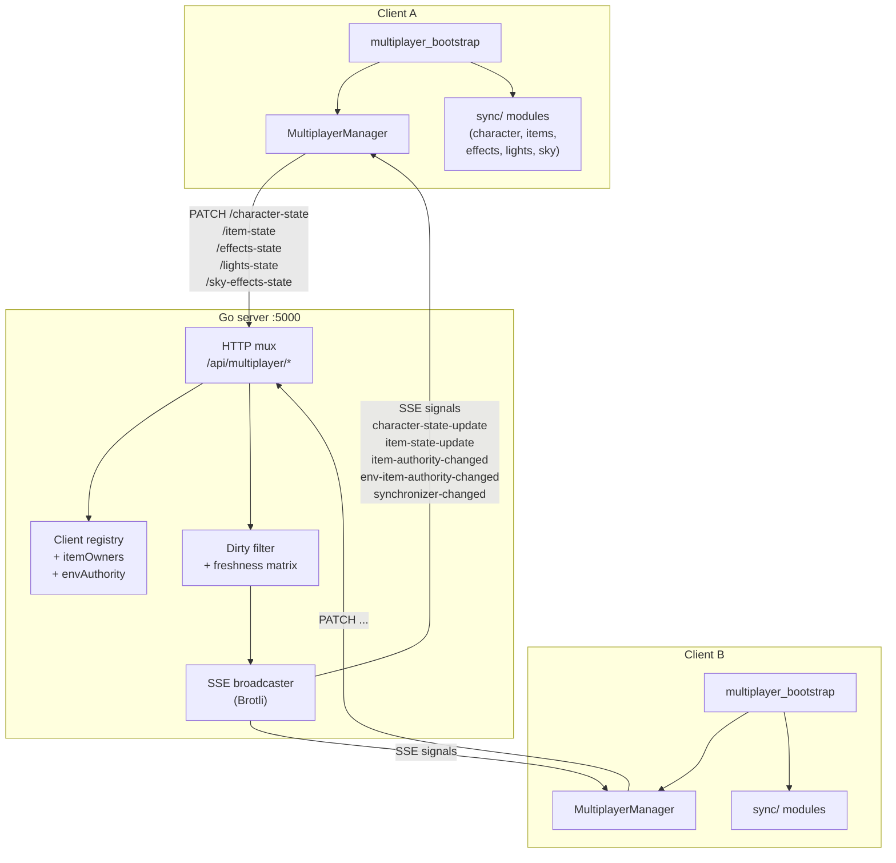
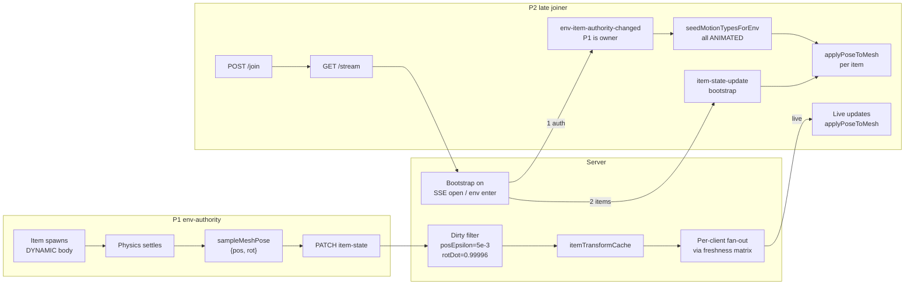
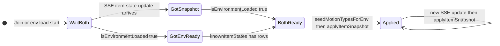

# Multiplayer

> [!NOTE]
> This is the **onboarding + operations** guide: how the multiplayer stack is wired, how to run it, and how to debug it. The **normative wire contract and authority rules** live in [`MULTIPLAYER_SYNCH.md`](MULTIPLAYER_SYNCH.md) — whenever this page and the spec disagree, the spec wins.

## Contents

- [30-second overview](#30-second-overview)
- [Architecture](#architecture)
- [File layout](#file-layout)
- [Configuration](#configuration)
- [Running it locally](#running-it-locally)
- [How the client is wired](#how-the-client-is-wired)
- [Receiver rules (mandatory four)](#receiver-rules-mandatory-four)
- [Two-player item-sync flow](#two-player-item-sync-flow)
- [Client render-loop latch](#client-render-loop-latch)
- [Testing with multiple clients](#testing-with-multiple-clients)
- [Troubleshooting](#troubleshooting)
- [References](#references)

## 30-second overview

Babylon Game Starter ships a multiplayer stack built on a small Go server, SSE (`Content-Encoding: br`), and [Datastar](https://github.com/starfederation/datastar-go). Authority is split into three independent tiers, two of which apply to items:

1. **Every client publishes its own character** (position, rotation, animation, boost).
2. **Tier 1 — Base synchronizer** (one client, global). The first connected client publishes lights, sky effects, and environment particles.
3. **Tier 2 — Environment item authority** (one client per environment). The first client into an environment runs dynamic physics for every item in that env that nobody has explicitly claimed. Everyone else runs those bodies as `ANIMATED` (kinematic) and writes remote pose updates directly onto the mesh. Handoff goes in arrival order if the current authority leaves.
4. **Tier 3 — Explicit item owner** (any client, per `instanceId`). Proximity claims let a client override env-authority for one specific item until release.
5. **Server broadcasts** item / character / effect / light / sky updates every 50–100 ms with a **dirty filter** that drops unchanged item rows so bandwidth scales with actual motion.

> [!IMPORTANT]
> The resolved owner of any item row is: **explicit owner if present, else env-authority for the item's environment, else none**. The server's owner-pin invariant means owners should never receive rows for their own items; self-echo defense on the client is defense-in-depth only.

## Architecture



## File layout

Client-side:

```text
src/client/
  datastar/datastar_client.ts            # SSE wrapper
  managers/multiplayer_manager.ts        # MP session + message bus
  managers/multiplayer_bootstrap.ts      # Wires MP into the scene (entry point)
  sync/
    character_sync.ts
    item_sync.ts
    configured_items_sync.ts
    environment_physics_sync.ts
    item_authority_tracker.ts
    proximity_claim_observer.ts
    effects_sync.ts
    lights_sync.ts
    sky_sync.ts
    multiplayer_wire_guards.ts
  types/multiplayer.ts
  utils/multiplayer_serialization.ts
```

Server-side:

```text
src/server/multiplayer/
  main.go                 # Entry point, HTTP mux
  handlers.go             # HTTP endpoint handlers
  item_authority.go       # Explicit + env-scope authority registries
  compression.go          # Brotli / gzip SSE middleware
  utils.go                # Helpers
  go.mod
```

The HTTP endpoints are:

| Method | Path | Purpose |
| ------ | ---- | ------- |
| `POST` | `/api/multiplayer/join` | Join a session; returns client id and initial role |
| `POST` | `/api/multiplayer/leave` | Graceful leave |
| `GET`  | `/api/multiplayer/stream` | Long-lived SSE stream |
| `GET`  | `/api/multiplayer/health` | Health probe |
| `PATCH` | `/api/multiplayer/character-state` | Publish own character state |
| `PATCH` | `/api/multiplayer/item-state` | Publish `ItemInstanceState` rows + collection events |
| `PATCH` | `/api/multiplayer/effects-state` | Base-synchronizer: particle effects |
| `PATCH` | `/api/multiplayer/lights-state` | Base-synchronizer: lights |
| `PATCH` | `/api/multiplayer/sky-effects-state` | Base-synchronizer: sky effects |
| `PATCH` | `/api/multiplayer/item-authority-claim` | Proximity claim |
| `PATCH` | `/api/multiplayer/item-authority-release` | Release claim |
| `PATCH` | `/api/multiplayer/env-switch` | Server-observed env switch |

> [!WARNING]
> The HTTP path for item updates is `PATCH /api/multiplayer/item-state`. `item-state-update` is the **SSE signal name**, not the path. Older docs (now archived) conflated these.

## Configuration

All client-side multiplayer tunables live in [`src/client/config/game_config.ts`](src/client/config/game_config.ts). That file is the single source of truth:

```typescript
MULTIPLAYER: {
  ENABLED: true,
  PRODUCTION_SERVER: 'bgs-mp.onrender.com',
  LOCAL_SERVER: 'localhost:5000',
  CONNECTION_TIMEOUT_MS: 15000,     // Render cold-start tolerance
  PRODUCTION_FIRST: true,

  // Per-item authority tunables (MULTIPLAYER_SYNCH.md §4.7).
  CLAIM_RADIUS_METERS: 2.5,         // Proximity radius that triggers a claim
  CLAIM_GRACE_MS: 1200,             // Keep ownership for N ms after leaving bubble
  CLAIM_IDLE_TIMEOUT_MS: 1500       // Owner idle window before another client can claim
}
```

Forks can point the client at their own Go server without editing this block by setting `VITE_MULTIPLAYER_HOST` in `.env` / `.env.local` (see `.env.example`). To disable multiplayer entirely, set `ENABLED: false`.

The server reads these environment variables:

| Variable | Default | Purpose |
| -------- | ------- | ------- |
| `PORT` | `5000` | Listen port |
| `MULTIPLAYER_SSE_COMPRESSION` | `brotli` | `brotli`, `gzip`, or `off` (last resort for proxy debugging) |

## Running it locally

The simplest fullstack loop:

```bash
npm run dev:fullstack
```

This runs Vite and the Go server together. Go restarts automatically on changes under `src/server/multiplayer/**` (see `nodemon.multiplayer.json`). Alternatively run them in two terminals:

```bash
# Terminal 1 — Go multiplayer server on :5000
npm run dev:multiplayer

# Terminal 2 — Vite dev server on :3000
npm run dev
```

With `VITE_MULTIPLAYER_HOST` unset, the client talks to the server through Vite's proxy (same-origin `/api/multiplayer/*`) — see [`vite.config.ts`](vite.config.ts).

## How the client is wired

Integration is centralized in [`src/client/managers/multiplayer_bootstrap.ts`](src/client/managers/multiplayer_bootstrap.ts). It is called from the top-level entry point and handles:

- `MultiplayerManager.join` / `leave` and SSE subscription.
- Character sampling + publishing each frame.
- Environment-physics and configured-item sampling / publishing gated by `ItemAuthorityTracker.isOwnedBySelf`.
- Incoming `item-state-update` dispatch: `collections[]` first, then `updates[]` routed to `applyRemoteConfiguredItemState` / `applyRemoteEnvironmentPhysicsItemState`.
- `item-authority-changed` / `env-item-authority-changed` / `synchronizer-changed` handling, including motion-type flips via `CollectiblesManager.setItemKinematic`.
- Scene/env-switch lifecycle: holding items `ANIMATED`, retaining `knownItemStates`, replaying on env load.

You do not need to wire multiplayer into `SceneManager` directly. The `multiplayer_bootstrap` module is the single seam; extending multiplayer usually means either adding a new `sync/` module, adding a listener inside the bootstrap, or extending an existing sync module's `sampleState` / `applyRemoteState` pair.

## Receiver rules (mandatory four)

Every client MUST implement these four rules when consuming `item-state-update`:

| # | Rule | Why |
|---|------|-----|
| 1 | **Self-owner drop.** If `authorityTracker.isOwnedBySelf(row.instanceId)` returns `true`, skip the row. | Defense-in-depth for the server's owner-pin invariant. Under a conforming server you should never receive self-owned rows; reconnect races can deliver them. Applying them corrupts the local simulation ("cake hovering / oscillating"). |
| 2 | **Non-owner kinematic apply (pose-direct write).** For non-self rows keep the body in `PhysicsMotionType.ANIMATED`. The wire carries exactly `pos` (3 floats, world position) and `rot` (4 floats, unit quaternion `[x,y,z,w]`) per Invariant P. Call `applyPoseToMesh(mesh, { pos, rot })` which writes `mesh.position.set(...)` and `mesh.rotationQuaternion.set(...)` verbatim; Havok's pre-step (default `disablePreStep = false`) copies mesh → body on the next tick. Never call `setTargetTransform`, `setLinearVelocity`, `applyImpulse`, or `addForce` on a non-owned body. Never touch `mesh.scaling` (static per-client config value). Never read/write `mesh.rotation.x/y/z` (Euler) — Invariant E. | The resolved owner's physics is authoritative. Pose-on-the-wire sidesteps the negative-scale decomposition trap that broke Present rotations historically. |
| 3 | **Collection hide, always — with feedback parity.** Process every `collections[]` entry by hiding/despawning locally, independent of `updates[]`. When the local representation is still present, play the same particle burst and spatialized sound as the local-collect path (anchored at the mesh's last world position). Never credit currency, mutate inventory, or emit scoring side-effects for a remote collection — those are the collector's. Idempotent: repeated collections MUST NOT error. | Server delivers collection events regardless of freshness state. Fixes "P2 does not see collectibles disappear" and "observer hears nothing when a peer collects." |
| 4 | **Unseeded-env hold (ANIMATED-default-then-promote).** On env entry, hold every item `ANIMATED` and wait for both the bootstrap `item-state-update` and the authority snapshot to arrive and be applied. Only then resume local physics. Promote to `DYNAMIC` **only** when an explicit authority signal names self as resolved owner (`item-authority-changed`, `env-item-authority-changed`, or the SSE-open authority snapshot). Treat "no confirmed authority yet" as "I am a non-owner." | Fixes "items whizzing in a blur on P2" and "cake runs DYNAMIC on both clients, no transforms propagate." Two clients both optimistically self-claiming drive each other's receivers into self-echo drops. |

> [!TIP]
> See [`MULTIPLAYER_SYNCH.md §5.2.2`](MULTIPLAYER_SYNCH.md#522-per-client-freshness-matrix) for the server-side freshness matrix that makes rule 1 defense-in-depth rather than primary defense.

## Two-player item-sync flow



## Client render-loop latch

The bootstrap holds two latched booleans; both must be `true` before item state is applied to physics bodies:



## Testing with multiple clients

Run the dev server and open two browser tabs. Both talk to the same Go server on `:5000`:

```bash
# One terminal
npm run dev:fullstack

# Open two tabs at http://localhost:3000
```

Quick sanity checklist:

- [ ] Both tabs show "Connected to multiplayer"; first shows `(Sync)`, second `(Client)`.
- [ ] Character movement from one tab appears on the other.
- [ ] Items collected on one tab vanish on the other within one broadcast window.
- [ ] Disconnect the first tab — the second is promoted to base synchronizer (`synchronizer-changed`).
- [ ] Claim an item on tab A (walk up to it); tab B sees `item-authority-changed` and its body flips to `ANIMATED`.
- [ ] Env-authority handoff: tab A joins RV Life alone and sees the cake settle on the floor; tab B joins later and sees the cake in its final resting position (freshness AOI bootstrap), not bouncing.

## Troubleshooting

### SSE connection fails with 404

```text
Error: PATCH /api/multiplayer/character-state failed: 404
```

Backend isn't running. Start it:

```bash
npm run dev:multiplayer
```

### Characters move locally but not on other clients

- Check `mp.isMultiplayerActive()` and that you are seeing `character-state-update` events in the SSE stream.
- Confirm `CharacterSync.applyRemoteCharacterState()` is reached for the remote client id.
- Throttle may be too aggressive (50 ms default) for the movement scale; temporarily lower `CHAR_SIGNIFICANT_POS_DELTA` in the sync module.

### Item stays DYNAMIC on non-owner

Symptom: the cake (or any non-collectible physics item) runs local physics on both clients; each client's SSE stream shows it is not receiving rows for this `instanceId` (owner-pin drops them as self-echoes on both sides).

- Confirm `ItemAuthorityTracker.isOwnedBySelf(instanceId)` returns `false` by default — for any item the tracker has not seen an explicit authority assignment for. See [`MULTIPLAYER_SYNCH.md §4.8`](MULTIPLAYER_SYNCH.md#48-environment-item-authority-lifecycle) *No-authority-means-non-owner*.
- Verify `seedMotionTypesForEnv(envName)` runs on three triggers: (a) `item-authority-changed` for items in that env, (b) `env-item-authority-changed` for that env, (c) authority-snapshot application on SSE open.
- Confirm the server's authority snapshot pushed on SSE open includes **both** `envAuthority` and `itemOwners` for every active env.
- Confirm the client `includeRow` publish guard refuses to publish for an env whose authority snapshot has not been absorbed yet.

### Observer does not see collection burst

Symptom: P1 collects a present; on P1 there is a particle burst and a pop sound; on P2 the present simply disappears silently.

- Verify the `item-state-update` handler routes each `collections[]` entry through `applyRemoteCollectedWithFeedback(instanceId)`, not through the silent `applyRemoteCollected(instanceId)` path. See [`MULTIPLAYER_SYNCH.md §6.2`](MULTIPLAYER_SYNCH.md#62-item-state-update) rule 1 *Remote-collect feedback parity*.
- Capture the mesh world position **before** disabling / disposing. Reading `getAbsolutePosition()` after cleanup returns zero and anchors the VFX off-screen.
- Ensure the `isCollected: true` branch on `updates[]` stays silent (no VFX) — feedback is `collections[]`-only, or you get two bursts.
- Collection sound should be spatialized (`spatialSound = true`, emitter attached to the mesh or a transient node at the stored position).

### Non-owner bodies stay at spawn / items whiz in a blur

Symptom: P2 joins an env after P1 has it settled; items appear to spin, jitter, or fly around for ~1 second before snapping into place.

- P2's local physics loop is ticking before the bootstrap `item-state-update` has been applied. Confirm the env-physics loop is paused and every env item held `ANIMATED` until the first snapshot for this env is applied.
- The server should emit a bootstrap per-recipient `item-state-update` on AOI enter. Under the freshness matrix that burst arrives in the first broadcast window after `onEnvEnter`; if it does not, check that `onEnvEnter` was called for P2 when P2 joined the env.

### Cake hovers / oscillates for the owner (self-echo loop)

Symptom: P1 is the only client in an env; the cake hovers and oscillates; presents fall noticeably slower than gravity would predict.

- Capture the SSE stream for P1 and grep for any `item-state-update` row whose `instanceId` P1 resolves as self-owned. The count MUST be zero. Non-zero means the **owner-pin invariant** is not being enforced and the server is echoing rows back; P1 applies them via the non-owner path and fights its own dynamic body.
- As an interim mitigation, verify the client-side defense-in-depth drop in the `updates[]` handler: `if (authorityTracker.isOwnedBySelf(row.instanceId)) continue;`.
- Permanent fix: the server's fan-out producer must build per-recipient payloads filtered by the freshness matrix.

### Present rotations disagree between clients

Symptom: Presents appear face-forward on P1 and face-away (180° mismatch) on P2. Cake looks correct.

- Confirm the wire payload carries `pos: [3]` AND `rot: [4]` and does NOT carry `matrix`, `rotation` (Euler), `velocity`, or `scale` (Invariant P).
- Confirm `ItemSync.applyRemoteItemState` writes `mesh.position` / `mesh.rotationQuaternion` via `applyPoseToMesh` and does NOT call `body.setTargetTransform`.
- Confirm no code path writes `mesh.rotation.x/y/z` (Euler) on a replicated item mesh (Invariant E). Legacy spin-in-place animations on collectibles must be quaternion-based and gated to massless items.

### SSE events arrive in bursts every few seconds

Symptom: character or item updates arrive in bursts rather than continuously; authority signals lag.

- Inspect response headers on `GET /api/multiplayer/stream`: expect `Content-Encoding: br` (or `gzip`) and no `Content-Length`. A `Content-Length` header means the proxy is buffering the whole response.
- If a proxy sits between server and browser (nginx, Traefik, Cloudflare, etc.), confirm it forwards `Content-Encoding` unchanged and does not buffer chunks (nginx: `proxy_buffering off;` on that location; do not set `gzip on;` at that level).
- Last-resort mitigation: start the server with `MULTIPLAYER_SSE_COMPRESSION=off`. See [`MULTIPLAYER_SYNCH.md §9.1`](MULTIPLAYER_SYNCH.md#91-sse-transport-compression-non-normative) for the full invariants.

### Orphan items after env-authority leaves

Symptom: P1 (env-authority) leaves the env; P2 (no prior claim) is still present. Items stop moving or clients disagree about who should publish rows.

- Confirm the server emitted `env-item-authority-changed(newAuthorityId = P2, reason = "failover" | "env_switch" | "disconnect")`.
- On P2: after receiving the signal, every item whose resolved owner is now P2 must flip from `ANIMATED` to `DYNAMIC` and P2 must begin publishing rows within one send-tick.
- Server-side: confirm `markTerminalNextRow` was called so the next row from P2 is unconditionally dirty and projected via the freshness matrix.

## References

- [`MULTIPLAYER_SYNCH.md`](MULTIPLAYER_SYNCH.md) — normative spec (wire contract, authority rules, freshness matrix, appendices)
- [`SERIALIZATION_GUIDE.md`](SERIALIZATION_GUIDE.md) — character / item serialization helpers
- [Datastar Go SDK](https://github.com/starfederation/datastar-go)
- [Babylon.js v9 documentation](https://doc.babylonjs.com/)
- [Havok physics integration](https://www.babylonjs-playground.com/?version=9#NBVTQG)
