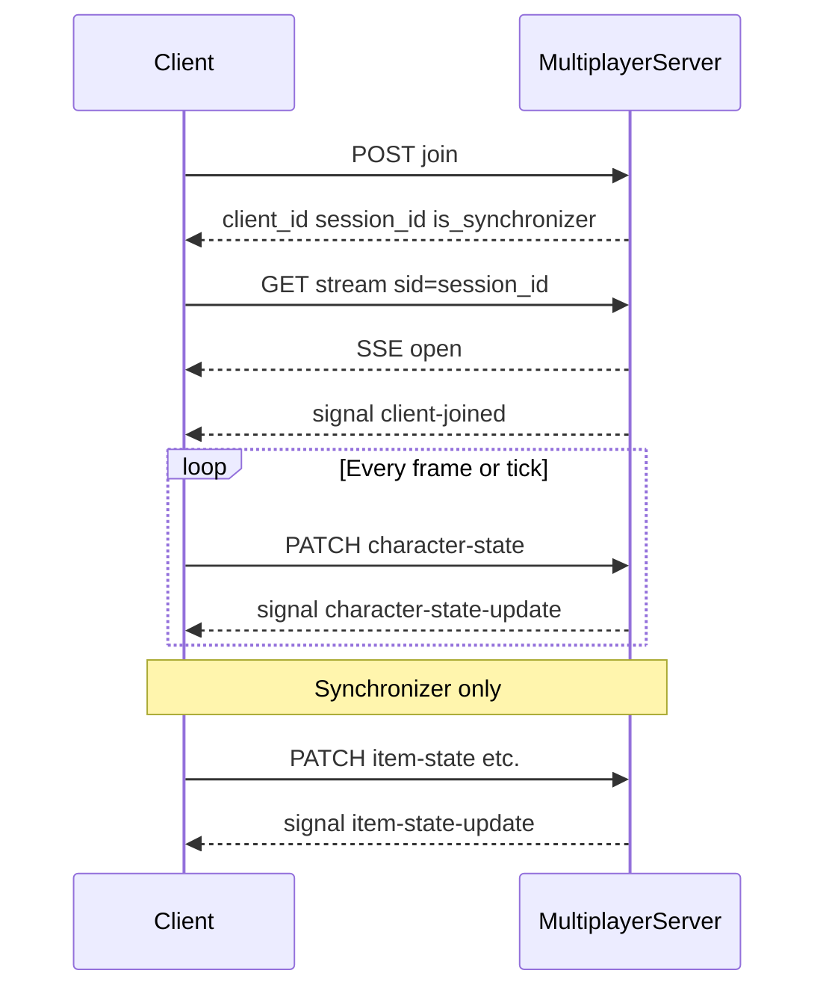

# Multiplayer synchronization protocol

| Field | Value |
|-------|--------|
| **Short name** | BGS-MP-SYNC |
| **Document status** | Normative specification |
| **Encoding** | JSON (`application/json`; UTF-8) |
| **Primary transport** | HTTPS + Server-Sent Events (SSE) |

This specification defines the **application-level contract** between the Babylon Game Starter multiplayer client and the Go multiplayer service. Deployment, build tooling, and editor setup are **non-normative** and appear only in [§10 Informative references](#10-informative-references-non-normative).

---

## Conformance

The key words **MUST**, **MUST NOT**, **SHOULD**, **SHOULD NOT**, **MAY**, **RECOMMENDED**, and **OPTIONAL** are to be interpreted as described in [RFC 2119](https://datatracker.ietf.org/doc/html/rfc2119) and [RFC 8174](https://datatracker.ietf.org/doc/html/rfc8174).

An implementation is **conforming** if and only if it satisfies all **MUST** / **MUST NOT** requirements for the roles it claims (client, server, or both).

---

## 1. Goals and scope

### 1.1 Goals

- Provide **authoritative replication** of shared game state across browser tabs/clients connected to one multiplayer service instance.
- Separate **per-player state** (each client owns one avatar stream) from **world state** (exactly one writer per logical game world partition: the synchronizer).
- Avoid duplicate channels for the same logical datum (single character snapshot stream for pose, presentation, and boost cues).

### 1.2 Out of scope

- Matchmaking, persistence, replay, cryptographic authentication, anti-cheat, and geographic scaling.
- Binary encodings other than UTF-8 JSON over HTTP/SSE as specified herein.

---

## 2. Terms and definitions

| Term | Definition |
|------|-------------|
| **Client** | A browser or runtime instance that has completed [§4.2 Join](#42-join) and holds a valid `session_id`. |
| **Session** | The tuple `(client_id, session_id)` bound by the server after join; used to authorize the SSE stream. |
| **Synchronizer** | The single client allowed to publish **world state** messages ([§5](#5-world-state-messages)). The server designates one synchronizer per connected set; it MAY change over time ([§4.6](#46-synchronizer-changes)). |
| **`characterModelId`** | Opaque, non-empty string that **identifies which character model asset** (e.g. GLB choice) a client uses. Peers MUST use this field—not join metadata alone—to resolve remote avatars. |
| **Signal** | A named Datastar patch-signal event delivered to every connected SSE client (payload is a JSON object). |
| **World state** | Items, scripted particles, environment particles, lights, and sky effects—data that is not owned by a single player’s `client_id` in the character stream. |

---

## 3. Protocol overview

1. Client **joins** with `POST` ([§4.2](#42-join)). Server returns `client_id`, `is_synchronizer`, and `session_id`.
2. Client opens **SSE** with `GET` ([§4.4](#44-server-sent-event-stream)), passing `session_id`. The server MUST register the stream before broadcasting presence for that client ([§6.4](#64-client-joined)).
3. Each client MAY send **character state** with `PATCH` ([§5.1](#51-character-state)); the server validates ownership and rebroadcasts.
4. The synchronizer MAY send **world state** with `PATCH` ([§5.2](#52-item-state)–[§5.5](#55-sky-effects-state)); the server validates leadership and rebroadcasts.
5. All participants receive JSON payloads via **signals** ([§6](#6-sse-signals-normative-payloads)).

---

## 4. Session lifecycle (HTTP)

Unless stated otherwise, request and response bodies use JSON. Numbers are JSON numbers (IEEE 754 binary64). Arrays for vectors use **exactly three** elements unless a field’s type says otherwise.

### 4.1 Origin and transport

Clients MUST use the **same origin** (scheme + host + port) for:

- join/leave/state `PATCH` requests, and  
- the EventSource URL for `/api/multiplayer/stream`.

Using different hosts for REST and SSE is **undefined** unless the deployment explicitly guarantees equivalent routing and CORS behavior; production configuration is informative ([§10](#10-informative-references-non-normative)).

### 4.2 Join

**Request**

- **Method:** `POST`
- **Path:** `/api/multiplayer/join`
- **Body:**

| Field | Type | Requirement |
|-------|------|----------------|
| `environment_name` | string | REQUIRED |
| `character_name` | string | REQUIRED — human-readable or legacy label supplied at join; MUST NOT be treated as the sole authority for peer model loading ([§5.1](#51-character-state)). |

**Response** — `200 OK`

| Field | Type | Requirement |
|-------|------|----------------|
| `client_id` | string | REQUIRED |
| `is_synchronizer` | boolean | REQUIRED |
| `existing_clients` | integer | REQUIRED — count of other clients already present before this join |
| `session_id` | string | REQUIRED — bound to this client for SSE |

**Errors**

- **`503 Service Unavailable`** — server at capacity (`maxClients`).

### 4.3 Leave

**Request**

- **Method:** `POST`
- **Path:** `/api/multiplayer/leave`
- **Client identity:** `X-Client-ID: <client_id>` **OR** query `client_id=<client_id>`

**Response** — `200 OK`: `{"ok": true}`

**Errors**

- **`400 Bad Request`** — missing client id.

### 4.4 Server-Sent Event stream

**Request**

- **Method:** `GET`
- **Path:** `/api/multiplayer/stream`
- **Session:** `sid` query parameter **OR** header `X-Session-ID` — value MUST equal `session_id` from join.

**Success** — **`200 OK`**

- Response establishes a long-lived SSE connection. The message format is defined by the Datastar library in use (e.g. `datastar-patch-signals` carrying JSON payloads). Clients MUST parse signal **names** and **payload objects** as specified in [§6](#6-sse-signals-normative-payloads).

**Errors**

- **`400 Bad Request`** — missing session id.
- **`401 Unauthorized`** — unknown or expired `session_id`.
- **`409 Conflict`** — a stream is already open for this `session_id` (at most one concurrent live SSE per session).

**Normative behavior**

- After a successful GET, the server MUST **register** the SSE session before emitting `client-joined` for that client ([§6.4](#64-client-joined)).

### 4.5 Health (optional probe)

**`GET /api/multiplayer/health`** — informational; no contract for game state.

### 4.6 Synchronizer changes

When the synchronizer disconnects and other clients remain, the server MUST promote the earliest-joined remaining client (implementation-defined ordering: first in join order) and MUST emit **`synchronizer-changed`** ([§6.6](#66-synchronizer-changed)).

---

## 5. State messages (HTTP ingress)

All state endpoints below:

- **Method:** **`PATCH`** (not `POST`).
- **Header:** `X-Client-ID` MUST be present and MUST equal the authenticated role described in each subsection.
- **Content-Type:** `application/json`.
- **Success:** `200 OK` with body `{"ok": true}`.

**Errors (common)**

| Status | Meaning |
|--------|---------|
| `405 Method Not Allowed` | Wrong HTTP method |
| `400 Bad Request` | Body not valid JSON |
| `403 Forbidden` | Authorization failed ([§7](#7-security-model)) |

### 5.1 Character state

**Path:** `/api/multiplayer/character-state`

**Authorized sender:** Any known client (`client_id` registered).

**Authorization rule:** For each object `u` in top-level array `updates`, `u.clientId` MUST equal the `X-Client-ID` header value. Servers MUST reject otherwise ([§7.1](#71-character-state-authorization)).

**Request body**

| Field | Type | Requirement |
|-------|------|----------------|
| `updates` | array | REQUIRED — length ≥ 1 |
| `updates[]` | `CharacterState` | REQUIRED — see [§5.1.1](#511-characterstate) |
| `timestamp` | integer | REQUIRED — sender wall clock, milliseconds |

#### 5.1.1 `CharacterState`

Every object in `updates` MUST conform to:

| Field | Type | Requirement |
|-------|------|----------------|
| `clientId` | string | REQUIRED — MUST equal sender’s `client_id` |
| `characterModelId` | string | REQUIRED — non-empty; identifies model asset for peers ([§2](#2-terms-and-definitions)) |
| `position` | `[number, number, number]` | REQUIRED — world-space position |
| `rotation` | `[number, number, number]` | REQUIRED — Euler radians `[x, y, z]` |
| `velocity` | `[number, number, number]` | REQUIRED — world-space velocity |
| `animationState` | string | REQUIRED — semantic state token (e.g. `idle`, `walk`, `run`, `jump`, `fall`) |
| `animationFrame` | number | REQUIRED — normalized playback phase in `[0, 1]` unless animation is inactive; sender MUST document interpretation |
| `isJumping` | boolean | REQUIRED |
| `isBoosting` | boolean | REQUIRED |
| `boostType` | string or null | OPTIONAL — constrained vocabulary (e.g. `superJump`, `invisibility`) when boosting |
| `boostTimeRemaining` | number | REQUIRED — milliseconds remaining for active boost effect; `0` when inactive |
| `timestamp` | integer | REQUIRED — sample time, milliseconds |

**Normative uniqueness**

- **`characterModelId`** is the **only** interoperable identifier for **which** character mesh peers MUST load or swap for that `clientId`. Join field `character_name` MUST NOT replace `characterModelId` for rendering decisions.

**Broadcast**

- Server MUST rebroadcast the accepted JSON object unchanged as signal **`character-state-update`** ([§6.1](#61-character-state-update)).

### 5.2 Item state

**Path:** `/api/multiplayer/item-state`

**Authorized sender:** Synchronizer only (`X-Client-ID` equals server’s synchronizer id).

**Request body**

| Field | Type | Requirement |
|-------|------|----------------|
| `updates` | array of `ItemInstanceState` | REQUIRED |
| `collections` | array of `ItemCollectionEvent` | OPTIONAL |
| `timestamp` | integer | REQUIRED |

Item field definitions: see [§8.2](#82-iteminstancestate-and-itemcollectionevent).

**Broadcast:** Signal **`item-state-update`** ([§6.2](#62-item-state-update)).

### 5.3 Effects state

**Path:** `/api/multiplayer/effects-state`

**Authorized sender:** Synchronizer only.

**Wire keys (compatible with reference client)**

The reference TypeScript client emits **snake_case** top-level keys on the wire:

| Field | Type | Requirement |
|-------|------|----------------|
| `particle_effects` | array of `ParticleEffectState` | OPTIONAL |
| `environment_particles` | array of `EnvironmentParticleState` | OPTIONAL |
| `timestamp` | integer | REQUIRED |

Servers MUST forward the parsed object as the signal payload without renaming keys.

**Broadcast:** Signal **`effects-state-update`** ([§6.3](#63-effects-state-update)).

### 5.4 Lights state

**Path:** `/api/multiplayer/lights-state`

**Authorized sender:** Synchronizer only.

**Request body**

| Field | Type | Requirement |
|-------|------|----------------|
| `updates` | array of `LightState` | REQUIRED |
| `timestamp` | integer | REQUIRED |

**Broadcast:** Signal **`lights-state-update`** ([§6.5](#65-lights-state-update-and-sky-effects-state-update)).

### 5.5 Sky effects state

**Path:** `/api/multiplayer/sky-effects-state`

**Authorized sender:** Synchronizer only.

**Request body**

| Field | Type | Requirement |
|-------|------|----------------|
| `updates` | array of `SkyEffectState` | REQUIRED |
| `timestamp` | integer | REQUIRED |

**Broadcast:** Signal **`sky-effects-state-update`**.

---

## 6. SSE signals (normative payloads)

Signals are JSON objects. Field names below use **camelCase** unless explicitly stated. Receivers MUST tolerate unknown fields (forward compatibility).

### 6.1 `character-state-update`

| Field | Type | Requirement |
|-------|------|----------------|
| `updates` | `CharacterState[]` | REQUIRED — same as [§5.1.1](#511-characterstate) |
| `timestamp` | integer | REQUIRED — from sender’s PATCH body |

### 6.2 `item-state-update`

| Field | Type | Requirement |
|-------|------|----------------|
| `updates` | array | REQUIRED |
| `collections` | array | OPTIONAL |
| `timestamp` | integer | REQUIRED |

### 6.3 `effects-state-update`

Payload MAY use **snake_case** keys as in [§5.3](#53-effects-state). Receivers MUST accept `particle_effects` and `environment_particles`.

### 6.4 `client-joined`

Emitted after the joining client’s SSE session is registered.

| Field | Type | Requirement |
|-------|------|----------------|
| `eventType` | string | REQUIRED — constant `"joined"` |
| `clientId` | string | REQUIRED |
| `environment` | string | REQUIRED — copy of join `environment_name` |
| `character` | string | REQUIRED — copy of join `character_name` |
| `totalClients` | integer | REQUIRED |
| `timestamp` | integer | REQUIRED |

### 6.5 `lights-state-update` and `sky-effects-state-update`

Each payload MUST contain `updates` (array) and `timestamp` (integer). Field shapes: [§8](#8-data-shapes-typescript-reference-alignment).

### 6.6 `synchronizer-changed`

| Field | Type | Requirement |
|-------|------|----------------|
| `newSynchronizerId` | string | REQUIRED |
| `reason` | string | REQUIRED — opaque token (reference server emits `"disconnection"` when promoting after the prior synchronizer leaves; other values are reserved for future use) |
| `timestamp` | integer | REQUIRED |

Clients that send world-state PATCH requests MUST verify `isSynchronizer` locally and MUST observe this signal to stop sending when demoted.

### 6.7 `client-left`

| Field | Type | Requirement |
|-------|------|----------------|
| `eventType` | string | REQUIRED — `"left"` |
| `clientId` | string | REQUIRED |
| `totalClients` | integer | REQUIRED |
| `timestamp` | integer | REQUIRED |

---

## 7. Security model

This protocol assumes a **cooperative** game environment on a trusted network path. It does **not** provide cryptographic integrity or confidentiality.

### 7.1 Character state authorization

Servers MUST enforce:

1. `X-Client-ID` identifies a registered client.
2. Every element of `updates` has `clientId === X-Client-ID`.

Violation MUST yield **`403 Forbidden`** and MUST NOT broadcast.

### 7.2 World state authorization

Servers MUST enforce that `X-Client-ID` equals the current synchronizer id for routes in [§5.2](#52-item-state)–[§5.5](#55-sky-effects-state). Violation MUST yield **`403 Forbidden`**.

### 7.3 Session binding

SSE streams MUST only attach to valid `(session_id → client_id)` mappings established at join.

---

## 8. Data shapes (TypeScript reference alignment)

Normative semantics are defined by this document. The project maintains parallel interfaces in [`src/client/types/multiplayer.ts`](src/client/types/multiplayer.ts); conforming implementations MUST keep field meanings identical.

### 8.1 `Vector3Serializable` / `ColorSerializable`

- **`Vector3Serializable`:** `[number, number, number]`
- **`ColorSerializable`:** `[r, g, b]` or `[r, g, b, a]` with components in conventional 0–1 shading space unless documented otherwise.

### 8.2 `ItemInstanceState` and `ItemCollectionEvent`

As defined in [`src/client/types/multiplayer.ts`](src/client/types/multiplayer.ts): instance identity (`instanceId`, `itemName`), transforms, velocity, collection flags (`isCollected`, `collectedByClientId`), `timestamp`.

### 8.3 `ParticleEffectState` / `EnvironmentParticleState`

Effect identity (`effectId` / `name`), world `position`, `isActive`, optional deterministic `frameIndex`, optional `ownerClientId`, `timestamp`.

### 8.4 `LightState`

Includes `lightId`, `lightType` (`POINT` \| `DIRECTIONAL` \| `SPOT` \| `HEMISPHERIC` \| `RECTANGULAR_AREA`), colors, intensity, geometric parameters when applicable, `isEnabled`, `timestamp`.

### 8.5 `SkyEffectState`

Includes `effectType` (`base` \| `heatLightning` \| `colorBlend` \| `colorTint`), `isActive`, optional modifier fields (`visibility`, `colorModifier`, `intensity`, timing), `timestamp`.

---

## 9. Operational requirements (development proxies)

Reverse proxies and dev servers that buffer or time out long-lived SSE connections **MUST** disable inappropriate read/write timeouts for the multiplayer route. The reference Vite configuration sets infinite timeouts for the multiplayer proxy prefix; conforming local setups SHOULD mirror that behavior ([§10](#10-informative-references-non-normative)).

---

## 10. Informative references (non-normative)

| Topic | Location |
|-------|-----------|
| Integration guide, Datastar overview, config | [MULTIPLAYER_INTEGRATION.md](MULTIPLAYER_INTEGRATION.md) |
| Quick start | [MULTIPLAYER_QUICK_START.md](MULTIPLAYER_QUICK_START.md) |
| Implementation notes | [MULTIPLAYER_IMPLEMENTATION_SUMMARY.md](MULTIPLAYER_IMPLEMENTATION_SUMMARY.md) |
| Go server entry | [`src/server/multiplayer/main.go`](src/server/multiplayer/main.go) |
| Go handlers | [`src/server/multiplayer/handlers.go`](src/server/multiplayer/handlers.go) |
| Client orchestration | [`src/client/managers/multiplayer_manager.ts`](src/client/managers/multiplayer_manager.ts) |

---

## Appendix A. Implementation conformance checklist

| Requirement | Reference client status |
|-------------|-------------------------|
| `PATCH` for state endpoints | Satisfied (`datastarClient.patch`) |
| `characterModelId` on every `CharacterState` | Satisfied ([`multiplayer.ts`](src/client/types/multiplayer.ts), sampling in [`multiplayer_bootstrap.ts`](src/client/managers/multiplayer_bootstrap.ts) / [`character_sync.ts`](src/client/sync/character_sync.ts); server rejects empty — [`handlers.go`](src/server/multiplayer/handlers.go)) |
| Peer avatars load GLB by `characterModelId` | Satisfied — [`remote_peer_proxy.ts`](src/client/managers/remote_peer_proxy.ts) imports the asset named in `characterModelId`, falls back to a box if unknown/failed |
| World state only from synchronizer | Satisfied (client guard + server check) |

This appendix is informative; normative text is in sections [§1](#conformance)–[§9](#9-operational-requirements-development-proxies).
