# Multiplayer synchronization protocol

| Field | Value |
|-------|--------|
| **Short name** | BGS-MP-SYNC |
| **Document status** | Normative specification |
| **Encoding** | JSON (`application/json`; UTF-8) |
| **Primary transport** | HTTPS + Server-Sent Events (SSE) |

> [!IMPORTANT]
> This is the **normative** multiplayer specification — the source of truth for wire shapes, authority rules, and server/client obligations. For an onboarding walkthrough and debugging playbook, see [`MULTIPLAYER.md`](MULTIPLAYER.md). Where the two disagree, this document wins.

This specification defines the **application-level contract** between the Babylon Game Starter multiplayer client and the Go multiplayer service. Deployment, build tooling, and editor setup are **non-normative** and appear only in [§10 Informative references](#10-informative-references-non-normative).

## Contents

- [Conformance](#conformance)
- [1. Goals and scope](#1-goals-and-scope)
- [2. Terms and definitions](#2-terms-and-definitions)
- [3. Protocol overview](#3-protocol-overview)
- [4. Session lifecycle (HTTP)](#4-session-lifecycle-http)
- [5. State messages (HTTP ingress)](#5-state-messages-http-ingress)
- [6. SSE signals (normative payloads)](#6-sse-signals-normative-payloads)
- [7. Security model](#7-security-model)
- [8. Data shapes (TypeScript reference alignment)](#8-data-shapes-typescript-reference-alignment)
- [9. Operational requirements (development proxies)](#9-operational-requirements-development-proxies)
- [10. Informative references (non-normative)](#10-informative-references-non-normative)
- [Appendix A. Implementation conformance checklist](#appendix-a-implementation-conformance-checklist)
- [Appendix B. Item-sync state machines and interaction diagrams (implementation patterns)](#appendix-b-item-sync-state-machines-and-interaction-diagrams-implementation-patterns)

---

## Conformance

The key words **MUST**, **MUST NOT**, **SHOULD**, **SHOULD NOT**, **MAY**, **RECOMMENDED**, and **OPTIONAL** are to be interpreted as described in [RFC 2119](https://datatracker.ietf.org/doc/html/rfc2119) and [RFC 8174](https://datatracker.ietf.org/doc/html/rfc8174).

An implementation is **conforming** if and only if it satisfies all **MUST** / **MUST NOT** requirements for the roles it claims (client, server, or both).

---

## 1. Goals and scope

### 1.1 Goals

- Provide **authoritative replication** of shared game state across browser tabs/clients connected to one multiplayer service instance.
- Separate **per-player state** (each client owns one avatar stream) from **global world state** (exactly one writer per logical game world partition: the base synchronizer — lights, sky effects, environment particles).
- Provide **per-environment default authority** so every dynamic item always has a resolved owner — the first client present in that environment runs the item simulation locally until/unless a proximity claim or failover reassigns it ([§4.8](#48-environment-item-authority-lifecycle)).
- Support **per-item authority** overrides for individual dynamic items so the player closest to an item drives its simulation without a single-writer bottleneck ([§4.7](#47-item-authority-lifecycle)).
- Avoid duplicate channels for the same logical datum (single character snapshot stream for pose, presentation, and boost cues).

### 1.2 Out of scope

- Matchmaking, persistence, replay, cryptographic authentication, anti-cheat, and geographic scaling.
- Binary encodings other than UTF-8 JSON over HTTP/SSE as specified herein.

---

## 2. Terms and definitions

| Term | Definition |
|------|-------------|
| **Client** | A browser or runtime instance that has completed [§4.2 Join](#42-join) and holds a valid `session_id`. |
| **Session** | The tuple `(client_id, session_id)` bound by the server after join; used to authorize the SSE stream. |
| **Base synchronizer** | The single client allowed to publish **global world state** messages — lights, sky effects, effects/environment particles ([§5.3](#53-effects-state)–[§5.5](#55-sky-effects-state)). The server designates one base synchronizer per connected set; it MAY change over time ([§4.6](#46-base-synchronizer-changes)). The base-synchronizer role is **scoped to global world state only**; it does NOT confer default authority over items. Prior revisions used the bare term "Synchronizer"; this MUST be read as **base synchronizer** wherever it appears. |
| **Environment item authority** (env-authority) | The single client designated as the **default owner** of every item (`environment.items` + `environment.physicsObjects` with `mass > 0`) inside a given `environmentName`. Assigned to the earliest remaining arrival in that environment ([§4.8](#48-environment-item-authority-lifecycle)). One env-authority per environment per server instance. Env-authority is independent of the base-synchronizer role and of per-item proximity claims. |
| **Env-authority arrival order** | Per-environment FIFO list of `client_id`s ordered by server-observed arrival time (initial join into the env, or environment switch into it). Used to break ties during env-authority failover ([§4.8](#48-environment-item-authority-lifecycle)). Switching out and back pushes the client to the back of the list. |
| **Item owner** | The client that holds an **explicit** per-`instanceId` claim (set via [§5.6](#56-item-authority-claim)) and therefore **overrides** env-authority for that one item. A client MAY hold zero, one, or many explicit claims simultaneously. When no explicit claim exists, the item's resolved owner is the env-authority of the item's environment ([§4.8](#48-environment-item-authority-lifecycle)). |
| **Resolved owner** | The owner of an item row at evaluation time. Defined as: **explicit item owner** if any; else **env-authority** of the item's environment; else **none**. Row acceptance ([§5.2](#52-item-state)) and client-side dynamic-physics flipping both use the resolved owner. |
| **Item authority** | The right to publish `ItemInstanceState` rows for a specific `instanceId`; held by the current resolved owner. |
| **Proximity claim** | A client request to become the explicit item owner for a specific `instanceId`, emitted when the client's character enters a configured radius around the item ([§5.6](#56-item-authority-claim)). Also called a *pre-claim* when issued before physical collision to let the client flip the item's local motion type to `DYNAMIC` before contact. |
| **Claim grace period** | The interval after a proximity bubble exits during which the current explicit owner retains authority ([§4.7](#47-item-authority-lifecycle)). |
| **`characterModelId`** | Opaque, non-empty string that **identifies which character model asset** (e.g. GLB choice) a client uses. Peers MUST use this field—not join metadata alone—to resolve remote avatars. |
| **Signal** | A named Datastar patch-signal event delivered to every connected SSE client (payload is a JSON object). |
| **Global world state** | Effects/environment particles, lights, and sky effects — data that is not owned by a single player's `client_id` in the character stream and does not participate in item authority. Published exclusively by the base synchronizer. |
| **Item world state** | `ItemInstanceState` rows and `ItemCollectionEvent`s ([§5.2](#52-item-state)). Rows are published by the **resolved owner** of each `instanceId` (explicit item owner when present, otherwise env-authority). Collection events are first-write-wins and MAY be published by any client (see [§5.2](#52-item-state)). |

---

## 3. Protocol overview

1. Client **joins** with `POST` ([§4.2](#42-join)). Server returns `client_id`, `is_synchronizer` (base synchronizer flag), and `session_id`.
2. Client opens **SSE** with `GET` ([§4.4](#44-server-sent-event-stream)), passing `session_id`. The server MUST register the stream before broadcasting presence for that client ([§6.4](#64-client-joined)).
3. On join (and on every later environment switch), the server evaluates **env-authority** for the target environment and MAY emit `env-item-authority-changed` ([§6.9](#69-env-item-authority-changed)). Bootstrap of the current env-authority for every non-empty environment MUST be replayed to the new SSE session.
4. Each client MAY send **character state** with `PATCH` ([§5.1](#51-character-state)); the server validates ownership and rebroadcasts.
5. The **base synchronizer** MAY send **global world state** with `PATCH` ([§5.3](#53-effects-state)–[§5.5](#55-sky-effects-state)); the server validates leadership and rebroadcasts.
6. Any client MAY **claim item authority** with `PATCH` ([§5.6](#56-item-authority-claim)). On accept, the server emits `item-authority-changed` ([§6.8](#68-item-authority-changed)). The **resolved owner** of an item (explicit owner if present, else the env-authority for the item's environment) MAY publish `ItemInstanceState` rows via `PATCH` ([§5.2](#52-item-state)); rows whose sender is not the resolved owner are silently dropped (see [§7.5](#75-item-authority-authorization)).
7. All participants receive JSON payloads via **signals** ([§6](#6-sse-signals-normative-payloads)).

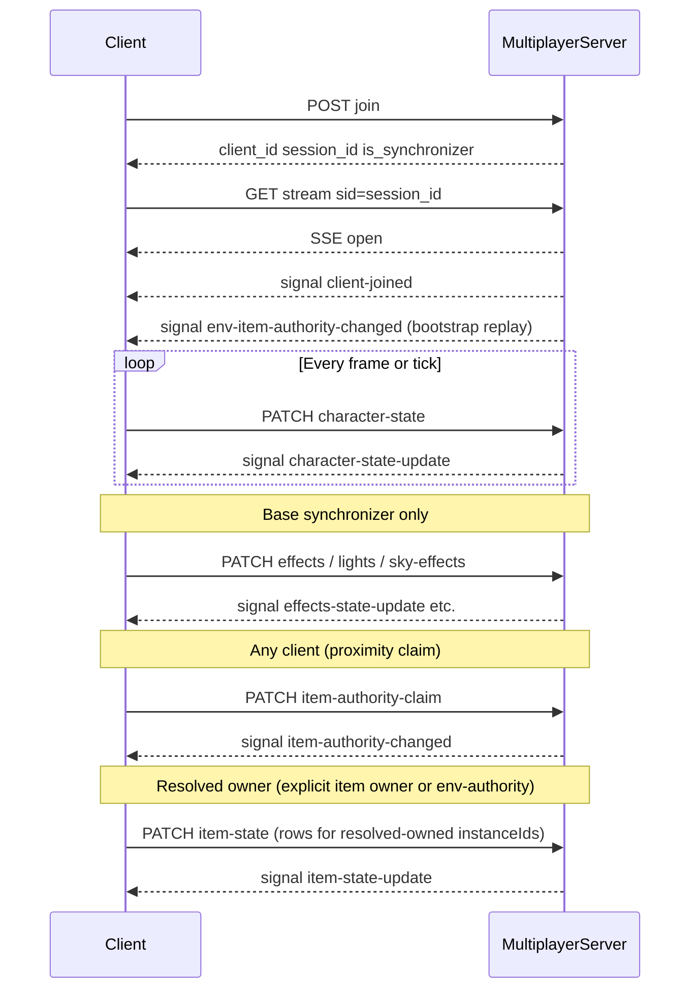

---

## 4. Session lifecycle (HTTP)

Unless stated otherwise, request and response bodies use JSON. Numbers are JSON numbers (IEEE 754 binary64). Arrays for vectors use **exactly three** elements unless a field’s type says otherwise.

### 4.1 Origin and transport

Clients MUST use the **same origin** (scheme + host + port) for:

- join/leave/state `PATCH` requests, and  
- the EventSource URL for `/api/multiplayer/stream`.

Using different hosts for REST and SSE is **undefined** unless the deployment explicitly guarantees equivalent routing and CORS behavior; production configuration is informative ([§10](#10-informative-references-non-normative)).

### 4.2 Join

**Request**

- **Method:** `POST`
- **Path:** `/api/multiplayer/join`
- **Body:**

| Field | Type | Requirement |
|-------|------|----------------|
| `environment_name` | string | REQUIRED |
| `character_name` | string | REQUIRED — human-readable or legacy label supplied at join; MUST NOT be treated as the sole authority for peer model loading ([§5.1](#51-character-state)). |

**Response** — `200 OK`

| Field | Type | Requirement |
|-------|------|----------------|
| `client_id` | string | REQUIRED |
| `is_synchronizer` | boolean | REQUIRED |
| `existing_clients` | integer | REQUIRED — count of other clients already present before this join |
| `session_id` | string | REQUIRED — bound to this client for SSE |

**Errors**

- **`503 Service Unavailable`** — server at capacity (`maxClients`).

### 4.3 Leave

**Request**

- **Method:** `POST`
- **Path:** `/api/multiplayer/leave`
- **Client identity:** `X-Client-ID: <client_id>` **OR** query `client_id=<client_id>`

**Response** — `200 OK`: `{"ok": true}`

**Errors**

- **`400 Bad Request`** — missing client id.

### 4.4 Server-Sent Event stream

**Request**

- **Method:** `GET`
- **Path:** `/api/multiplayer/stream`
- **Session:** `sid` query parameter **OR** header `X-Session-ID` — value MUST equal `session_id` from join.

**Success** — **`200 OK`**

- Response establishes a long-lived SSE connection. The message format is defined by the Datastar library in use (e.g. `datastar-patch-signals` carrying JSON payloads). Clients MUST parse signal **names** and **payload objects** as specified in [§6](#6-sse-signals-normative-payloads).

**Errors**

- **`400 Bad Request`** — missing session id.
- **`401 Unauthorized`** — unknown or expired `session_id`.
- **`409 Conflict`** — a stream is already open for this `session_id` (at most one concurrent live SSE per session).

**Normative behavior**

- After a successful GET, the server MUST **register** the SSE session before emitting `client-joined` for that client ([§6.4](#64-client-joined)).

### 4.5 Health (optional probe)

**`GET /api/multiplayer/health`** — informational; no contract for game state.

### 4.6 Base synchronizer changes

When the **base synchronizer** disconnects and other clients remain, the server MUST promote the earliest-joined remaining client (implementation-defined ordering: first in join order) and MUST emit **`synchronizer-changed`** ([§6.6](#66-synchronizer-changed)).

This failover applies **only to global world state** ([§5.3](#53-effects-state)–[§5.5](#55-sky-effects-state)) — lights, sky effects, environment/particle effects. It does NOT confer authority over items:

- **Explicit item authority** ([§4.7](#47-item-authority-lifecycle)) is handled independently — item ownership is NOT transferred on base-synchronizer promotion.
- **Environment item authority** ([§4.8](#48-environment-item-authority-lifecycle)) is likewise independent — the first-in-env / arrival-order rule governs item defaults even when a different client holds the base-synchronizer role.

As a consequence, three clients in three different environments can hold three independent env-authority roles while exactly one of them also holds the base-synchronizer role for global effects.

### 4.7 Item authority lifecycle

This section describes **explicit per-`instanceId`** authority — the proximity-claim override that a client takes for a single dynamic item. Explicit authority is layered on top of the **environment item authority** default defined in [§4.8](#48-environment-item-authority-lifecycle): an item's **resolved owner** is its explicit owner if one exists, otherwise the env-authority of the item's environment.

Each dynamic item `instanceId` is at any moment in exactly one explicit-ownership state on the server. The server maintains an `itemOwners` map `{ instanceId → { ownerClientId, lastUpdatedAt } }` and drives transitions as described below. Entries are present only while an explicit claim is active; absence of an entry means the item falls back to env-authority per [§4.8](#48-environment-item-authority-lifecycle).

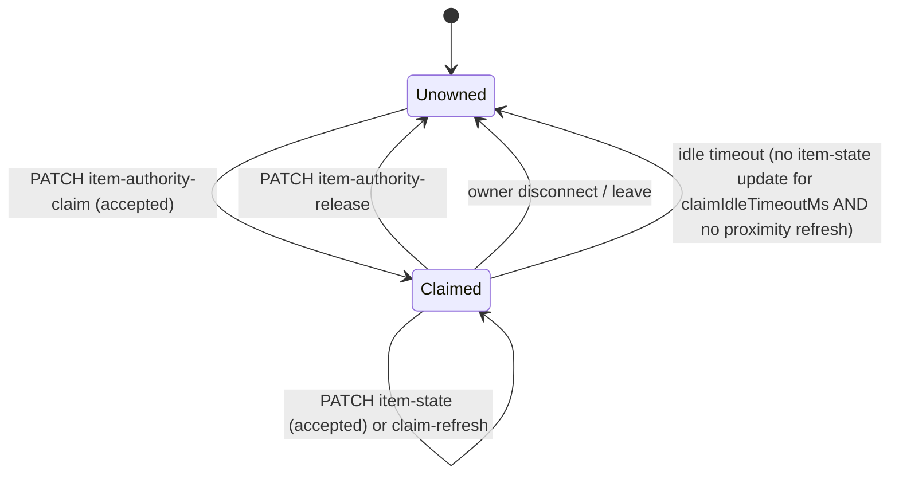

**Normative rules.**

1. **Initial state.** All `instanceId`s spawned for an environment start in the `Unowned` state on the server.
2. **Claim acceptance.** Upon receiving `item-authority-claim` for `instanceId = I` from `client_id = X`:
   - If `I` is `Unowned`, set owner to `X`, set `lastUpdatedAt = now`, and emit `item-authority-changed` with `reason = "claim"`.
   - If `I` is already owned by `X`, refresh `lastUpdatedAt = now`; no signal is emitted.
   - If `I` is owned by `Y ≠ X`, **accept** the claim only when at least one of the following is true:
     - (a) `now − lastUpdatedAt ≥ claimIdleTimeoutMs` (the previous owner has been idle); or
     - (b) `Y` has disconnected or left the environment.
     On acceptance the server MUST emit `item-authority-changed` with `reason = "claim"`. On rejection the server responds `200 OK` with `{"ok": true, "accepted": false, "currentOwnerId": "<Y>"}` (see [§5.6](#56-item-authority-claim)) and MUST NOT emit a signal.
3. **Release.** An explicit `item-authority-release` from the current owner transitions `I` to `Unowned` (dropping the explicit claim) and MUST emit `item-authority-changed` with `reason = "release"` and `newOwnerId = null`. The item's resolved owner falls back to the env-authority for its environment, per [§4.8](#48-environment-item-authority-lifecycle). Releases from non-owners are no-ops (idempotent).
4. **Disconnect failover.** On `client-left` or session disposal for `client_id = X`, the server MUST transition every `instanceId` with an explicit owner of `X` to `Unowned` and MUST emit `item-authority-changed` with `reason = "disconnect"` and `newOwnerId = null` for each. Items fall back to env-authority; env-authority failover itself is handled separately per [§4.8](#48-environment-item-authority-lifecycle).
5. **Environment boundary.** When the server observes the explicit owner changing environment (character-state `environmentName` differs from the one in which the `instanceId` lives), the server MAY transition `I` to `Unowned` with `reason = "env_switch"`. Clients MUST tolerate this signal arriving at any time; the item again falls back to env-authority.
6. **Activity tracking.** An accepted `item-state-update` row referencing `instanceId = I` MUST refresh `lastUpdatedAt` on the server-side `itemOwners` entry for `I`. A claim refresh from the current owner ([§5.6](#56-item-authority-claim)) likewise refreshes `lastUpdatedAt`.
7. **Proximity claim emission.** Clients SHOULD emit claims when their character display capsule enters the item's configured `claimRadiusMeters` bubble, to ensure the body is already `DYNAMIC` locally before collision. Clients SHOULD emit a release after `claimGraceMs` of continuous non-proximity with body at rest. Both thresholds are implementation-defined tunables. The canonical values for the reference client live in [`src/client/config/game_config.ts`](src/client/config/game_config.ts) under `MULTIPLAYER.CLAIM_RADIUS_METERS`, `MULTIPLAYER.CLAIM_GRACE_MS`, and `MULTIPLAYER.CLAIM_IDLE_TIMEOUT_MS`. Any numeric example in this document that disagrees with `game_config.ts` is stale; the config file is authoritative.
8. **Scope.** Per-item authority applies to:
   - `environment.physicsObjects` entries with `mass > 0`, and
   - `environment.items` entries with `collectible: false`.
   Collectible items (`collectible: true`) are **not** subject to per-item transform authority. Their `ItemCollectionEvent`s use first-write-wins (see [§5.2](#52-item-state)); the base synchronizer MAY publish their static `ItemInstanceState` transform for late-joiner bootstrap.

**Orphan reassignment on leave (explicit).** On disconnect, leave, or env-switch by the current explicit owner `O` of `I`, after the rule 4 transition to `Unowned`, the server MUST re-run the resolved-owner rule for `I`. When the item still has an env-authority (per [§4.8](#48-environment-item-authority-lifecycle)), the resolved owner silently becomes that env-authority; the server MUST immediately re-pin the freshness matrix for `I` per [§5.2.2](#522-per-client-freshness-matrix) rule 6 (new resolved owner → `fresh`; previous explicit owner's cell, if the leaver is still somehow resident in the env during the transition, → `stale`). No explicit claim is manufactured; the next `item-state-update` row from the env-authority MUST be accepted under [§7.5](#75-item-authority-authorization) tier 2.

**Timing invariants (normative).**

- A client MUST NOT publish `item-state-update` rows for `instanceId = I` unless it is the **resolved owner** of `I` — that is, either the current explicit item owner for `I` (per this section) or, when no explicit owner exists, the env-authority of the environment in which `I` lives (per [§4.8](#48-environment-item-authority-lifecycle)).
- A client MUST stop publishing rows for `I` within one send-tick of losing resolved ownership — whether because of `item-authority-changed` transferring explicit ownership elsewhere, `env-item-authority-changed` transferring env-authority elsewhere, or its own env switch.
- A client MUST flip its local physics body motion type for `I` to `DYNAMIC` on becoming resolved owner and to `ANIMATED` (kinematic) on losing resolved ownership. On becoming resolved owner of an item previously held as kinematic, the client MUST atomically clear any queued kinematic interpolation target when flipping to `DYNAMIC` to avoid oscillation between the local simulation and a stale target.
- **Self-echo suppression (defense-in-depth).** Under conforming server behavior ([§5.2.2](#522-per-client-freshness-matrix) rule 2), the server MUST NOT deliver `item-state-update` rows for `I` to the resolved owner of `I`. Clients MUST additionally drop any such row they receive (e.g., across a reconnection window or ownership-transition race); the resolved owner's local physics is the canonical source of state for `I` and incoming rows MUST NOT be applied.
- **Non-owner kinematic invariant.** A client that is NOT the resolved owner of `I` MUST keep `I`'s physics body in `ANIMATED` (kinematic) motion type, MUST apply inbound transforms via mesh-direct writes (see [§B.9](#b9--kinematic-apply-pattern-mesh-direct-writes-vs-settargettransform)), and MUST NOT apply `setLinearVelocity`, `applyImpulse`, or `addForce` to `I`. Inbound transforms arrive on the wire as a pose pair `{ pos, rot }` (Invariant P, [§5.2](#52-item-state)); the receiver MUST write `pos` onto `mesh.position` and `rot` onto `mesh.rotationQuaternion` verbatim (no matrix decomposition, no scale mutation — `mesh.scaling` is a static per-client spawn value and stays untouched). Havok's pre-step sync then copies the mesh channels onto the ANIMATED body before the next physics tick. The receiver MUST NOT touch, read, or compose Euler-angle channels on the mesh or physics body as part of this apply path (Invariant E).

### 4.8 Environment item authority lifecycle

Every environment has at most one **environment item authority** (env-authority) at any moment: the client responsible for driving the simulation of every item in that environment that does not currently have an explicit per-`instanceId` owner. This exists so that items naturally subject to gravity (e.g. a Cake spawned in mid-air) always have a client running their dynamic simulation — if no client owned the item, every client would keep it kinematic and it would never settle.

The server maintains two maps keyed by `environmentName`:

- `envArrivalOrder: map[envName] []client_id` — FIFO list of clients currently present in that environment, in the order the server observed their arrival (initial join into the env, or environment switch into it).
- `envAuthority: map[envName] client_id` — the current env-authority, which MUST equal the first entry in `envArrivalOrder[envName]` whenever that list is non-empty.

```mermaid
stateDiagram-v2
  [*] --> Empty
  Empty --> Owned : first client arrives in env
  Owned --> Owned : subsequent client arrives (appended; env-authority unchanged)
  Owned --> Owned : env-authority leaves; next in arrival order promoted
  Owned --> Empty : last client in env leaves
```

**Normative rules.**

1. **Arrival.** When a client `X` enters environment `E` — either by completing `POST /api/multiplayer/join` with `environment_name = E`, or via a server-observed environment switch from a different environment to `E` — the server MUST:
   - Append `X` to the end of `envArrivalOrder[E]` (if not already present).
   - If `envAuthority[E]` was empty, set `envAuthority[E] = X` and emit `env-item-authority-changed` ([§6.9](#69-env-item-authority-changed)) with `previousAuthorityId = null`, `newAuthorityId = X`, `reason = "arrival"`.
   - If `envAuthority[E]` was already set, emit no signal. The new arrival does NOT become authority.
2. **Departure.** When a client `X` leaves environment `E` — via `POST /api/multiplayer/leave`, session disposal, or a server-observed environment switch from `E` to another environment — the server MUST:
   - Remove `X` from `envArrivalOrder[E]`.
   - If `envAuthority[E] === X` and `envArrivalOrder[E]` is now non-empty, set `envAuthority[E]` to the new head of the list and emit `env-item-authority-changed` with `previousAuthorityId = X`, `newAuthorityId = <new head>`, `reason = "failover"` (for leave/disconnect) or `reason = "env_switch"` (for an env switch).
   - If `envAuthority[E] === X` and `envArrivalOrder[E]` is now empty, clear `envAuthority[E]` and emit `env-item-authority-changed` with `previousAuthorityId = X`, `newAuthorityId = null`, and the same `reason` categorization as above.
3. **Re-entry.** A client returning to an environment it previously held authority over re-enters as a normal arrival and is appended to the back of `envArrivalOrder[E]`. It does NOT reclaim env-authority unless it is again the only client present.
4. **Implicit ownership of items.** For every item (`environment.items` or `environment.physicsObjects` with `mass > 0`) whose `instanceId` does NOT have an entry in `itemOwners` (the explicit-claim map of [§4.7](#47-item-authority-lifecycle)), the **resolved owner** is `envAuthority[E]` where `E` is the item's environment. Env-authority is a default; it is always overridden by an explicit claim for any single `instanceId`.
5. **Scope.** Env-authority governs the same item set as [§4.7](#47-item-authority-lifecycle):
   - `environment.physicsObjects` with `mass > 0`, and
   - `environment.items`, including collectible transform bootstrap rows (collectible `isCollected` transitions remain first-write-wins per [§5.2](#52-item-state); only the bootstrap position of not-yet-collected items falls under env-authority).
   Static, non-physics meshes that never produce item-state rows are unaffected.
6. **Bootstrap on SSE open.** On SSE session registration ([§4.4](#44-server-sent-event-stream)), the server MUST replay the current `envAuthority` map to the new session as a sequence of `env-item-authority-changed` signals (one per environment with a non-empty authority), using `previousAuthorityId = null` and `reason = "arrival"`, so the joining client learns the state without extra round-trips. This replay MUST be emitted after the existing `item-state-update` / `character-state-update` bootstrap (so the joining client can resolve ownership for bootstrap rows with the same logic it uses for live rows).
7. **Independence.** Env-authority is independent of the base-synchronizer role and of explicit per-item claims. One client MAY simultaneously hold the base-synchronizer role, env-authority for several environments, and several explicit item claims, in any combination.
8. **Orphan reassignment (env-authority).** When the current `envAuthority[E] = O` leaves `E` (rule 2) and the list is non-empty, the promotion to the new head `N` is itself the orphan reassignment: every item `I` in `E` whose resolved owner was `O` by virtue of this rule is now resolved to `N`. The server MUST, in the same server tick as the promotion:
   1. Emit `env-item-authority-changed` ([§6.9](#69-env-item-authority-changed)) per rule 2.
   2. Re-pin the freshness matrix for every affected `I` per [§5.2.2](#522-per-client-freshness-matrix) rule 6 (`freshness[E][I][N] = fresh`; `freshness[E][I][O]` is evicted by AOI leave per §5.2.2 rule 5).
   3. Refresh `itemTransformCache[I]` terminal-state semantics per [§5.2.1](#521-global-dirty-filter-server-side-transform-cache) rule 5 so that the next `ItemInstanceState` row from `N` is unconditionally DIRTY and delivered to every remaining in-env client.
   If `envArrivalOrder[E]` is now empty, `envAuthority[E]` is cleared; items in `E` park at their last cached transform and receive no further broadcasts until the next arrival, whose AOI enter (rule 4 above + §5.2.2 rule 4) rehydrates the environment on arrival.

**Timing invariants (normative).**

- A client MUST observe its most recent `env-item-authority-changed` signal for each environment before deciding whether to publish item rows for items in that environment under the env-authority default.
- A client that is the env-authority for environment `E` MUST include in its `item-state-update` rows every item in `E` that it does not know to be explicitly claimed by another client. The server still filters per-row; the client's responsibility is to sample and send.
- A client that has just become env-authority via `failover` MUST resume publishing within one send-tick.
- **Env-entry seed-before-tick.** On environment entry (initial join or env-switch), a client MUST apply the bootstrap sequence `env-item-authority-changed` → `item-authority-changed` → the `item-state-update` burst driven by [§5.2.2](#522-per-client-freshness-matrix) rule 4, and MUST seed motion type and transform for every item in the entered environment BEFORE running its first local physics tick in that environment. Until an item has been seeded by at least one applied `item-state-update` row (or has been explicitly resolved as self-owned), the client MUST hold its local body in `ANIMATED` (kinematic). This prevents the race in which a joiner starts local physics on uninitialized bodies while the authoritative snapshot is still in flight.

- **Invariant P (pre-scene ownership resolution).** The server's response to the `env-switch` PATCH ([§4.2](#42-join) and its env-switch variant) MUST carry the full `envAuthority` map for the post-switch world state. On the client, the env-switch code path MUST apply that map to the local authority tracker before the scene for the new environment begins loading — specifically, before any item mesh/physics body for the new environment is instantiated. This guarantees that the ANIMATED-default state described in [§6.2](#62-item-state-update) rule 4 is a defense-in-depth belt and not the normal path: in the happy path, each item is created with its final motion type (`DYNAMIC` if self is the resolved owner at spawn time, `ANIMATED` otherwise), eliminating the perceptible "frozen until first apply" flicker that would otherwise occur on non-owners. Conforming clients MAY still fall back to ANIMATED-default-then-promote if the pre-scene authority resolution is unavailable (e.g., offline single-player mode); conforming servers MUST NOT defer env-authority resolution past the `env-switch` PATCH response.

- **No-authority-means-non-owner.** A client that has entered environment `E` but has not yet applied any authority signal for `E` (no authority snapshot absorbed on SSE open, no `env-item-authority-changed` naming a head-of-arrival-order, no `item-authority-changed` for any `I ∈ E`) MUST treat itself as a non-owner of every `I ∈ E`. Clients MUST NOT derive ambient self-ownership from the absence of authority data, from the fact that they are the only client known to be in `E`, or from any client-local heuristic (proximity, last-touched, first-to-load). Ambient optimism is forbidden because, for any given moment, another client MAY already be the server-side env-authority or explicit owner — running both clients as `DYNAMIC` drives the pair into the failure mode where each client's receiver drops the other's rows as "self-owned" ([§6.2](#62-item-state-update) rule 2), producing the observable symptom of local simulation with zero cross-client propagation. The authoritative assignment always originates on the server; the client MAY act on it only after application.

---

## 5. State messages (HTTP ingress)

All state endpoints below:

- **Method:** **`PATCH`** (not `POST`).
- **Header:** `X-Client-ID` MUST be present and MUST equal the authenticated role described in each subsection.
- **Content-Type:** `application/json`.
- **Success:** `200 OK` with body `{"ok": true}`.

**Errors (common)**

| Status | Meaning |
|--------|---------|
| `405 Method Not Allowed` | Wrong HTTP method |
| `400 Bad Request` | Body not valid JSON |
| `403 Forbidden` | Authorization failed ([§7](#7-security-model)) |

### 5.1 Character state

**Path:** `/api/multiplayer/character-state`

**Authorized sender:** Any known client (`client_id` registered).

**Authorization rule:** For each object `u` in top-level array `updates`, `u.clientId` MUST equal the `X-Client-ID` header value. Servers MUST reject otherwise ([§7.1](#71-character-state-authorization)).

**Request body**

| Field | Type | Requirement |
|-------|------|----------------|
| `updates` | array | REQUIRED — length ≥ 1 |
| `updates[]` | `CharacterState` | REQUIRED — see [§5.1.1](#511-characterstate) |
| `timestamp` | integer | REQUIRED — sender wall clock, milliseconds |

#### 5.1.1 `CharacterState`

Every object in `updates` MUST conform to:

| Field | Type | Requirement |
|-------|------|----------------|
| `clientId` | string | REQUIRED — MUST equal sender’s `client_id` |
| `characterModelId` | string | REQUIRED — non-empty; identifies model asset for peers ([§2](#2-terms-and-definitions)) |
| `position` | `[number, number, number]` | REQUIRED — world-space position |
| `rotation` | `[number, number, number]` | REQUIRED — Euler radians `[x, y, z]` |
| `velocity` | `[number, number, number]` | REQUIRED — world-space velocity |
| `animationState` | string | REQUIRED — semantic state token (e.g. `idle`, `walk`, `run`, `jump`, `fall`) |
| `animationFrame` | number | REQUIRED — normalized playback phase in `[0, 1]` unless animation is inactive; sender MUST document interpretation |
| `isJumping` | boolean | REQUIRED |
| `isBoosting` | boolean | REQUIRED |
| `boostType` | string or null | OPTIONAL — constrained vocabulary (e.g. `superJump`, `invisibility`) when boosting |
| `boostTimeRemaining` | number | REQUIRED — milliseconds remaining for active boost effect; `0` when inactive |
| `timestamp` | integer | REQUIRED — sample time, milliseconds |

**Normative uniqueness**

- **`characterModelId`** is the **only** interoperable identifier for **which** character mesh peers MUST load or swap for that `clientId`. Join field `character_name` MUST NOT replace `characterModelId` for rendering decisions.

**Broadcast**

- Server MUST rebroadcast the accepted JSON object unchanged as signal **`character-state-update`** ([§6.1](#61-character-state-update)).

### 5.2 Item state

**Path:** `/api/multiplayer/item-state`

**Wire-format invariants (normative).**

- **Invariant P (pose-only transport).** Each `ItemInstanceState` row carries the item's transform as exactly two fields: `pos`, a JSON array of length 3 (`[x, y, z]`, world-space position in meters), and `rot`, a JSON array of length 4 (`[x, y, z, w]`, unit quaternion). The sender reads these from the mesh's LOCAL channels — `mesh.position` and `mesh.rotationQuaternion` — and the receiver writes them back onto the corresponding channels verbatim, without any matrix composition or decomposition on either end. Every replicated item mesh is unparented (added directly to the scene), so the local `position` and `rotationQuaternion` ARE the world-space pre-scale pose. Scale is NEVER on the wire: each client spawns the mesh with identical local `scaling` from the same `environment.items[*].instances[*].scale` config (negative-sign flips for GLB re-orientation included), and Babylon's TRS pipeline recomposes the world matrix from `pos · rot · scale` locally, so world matrices match across clients without replicating scale. See [§B.11](#b11-why-the-wire-ships-pos--rot-and-not-a-world-matrix) for the post-mortem of why the wire is pose-only and not a 16-float world matrix. Senders MUST NOT include `matrix`, `position`, `rotation` (beyond the unit-quaternion `rot` field), `velocity`, or `scale` fields on item rows. Receivers MUST reject live (non-collected) rows whose `pos` or `rot` is absent, wrong-length, or non-finite; such rows MUST be treated as malformed and ignored ([§7](#7-security-model)). Collection-only rows (`isCollected: true`) MAY omit `pos`/`rot` because the receiver hides the mesh and the transform is irrelevant.
- **Invariant E (no Euler on the item wire).** Neither the wire schema nor any client-side sampler/applier for items may reference Euler-angle representations. Rotation on the item wire is strictly the unit-quaternion `rot` field. The `mesh.rotation` Euler channel is not sampled on the owner and not written on the receiver.

**Authorized sender (per-row, layered):** Any known client MAY submit this PATCH, but rows are filtered per-element by the **resolved-owner** rule ([§7.5](#75-item-authority-authorization)):

- **All item rows** (`ItemInstanceState`, both dynamic physics and collectible bootstrap rows) — the server computes the resolved owner:
  1. If `itemOwners[instanceId]` exists (explicit per-item claim per [§4.7](#47-item-authority-lifecycle)), accept the row iff `X-Client-ID === itemOwners[instanceId].ownerClientId`.
  2. Otherwise, let `E` be the environment derived from the `instanceId` prefix (or the item's registry entry). Accept the row iff `X-Client-ID === envAuthority[E]` per [§4.8](#48-environment-item-authority-lifecycle).
  3. Otherwise, silently drop the row.
  Rows that fail these checks MUST be silently dropped; surviving rows MUST be broadcast. A dropped row MUST NOT generate a 403 for the entire request.
- **`ItemCollectionEvent`s** — first-write-wins per `instanceId`. The server MUST retain the first accepted collection per `instanceId` and reject later duplicates silently. The `collectedByClientId` field MUST equal `X-Client-ID` of the sender. Collection events are independent of resolved-owner — any connected client MAY claim a collection; only the first one wins.

The server MUST respond `200 OK` when the PATCH is syntactically valid and `X-Client-ID` is a registered client, even if zero rows survive the per-row filter.

**Request body**

| Field | Type | Requirement |
|-------|------|----------------|
| `updates` | array of `ItemInstanceState` | REQUIRED |
| `collections` | array of `ItemCollectionEvent` | OPTIONAL |
| `timestamp` | integer | REQUIRED |

Item field definitions: see [§8.2](#82-iteminstancestate-and-itemcollectionevent).

**Activity side effects.** Each accepted row whose resolved owner came from an **explicit** claim MUST refresh the server-side `itemOwners[instanceId].lastUpdatedAt` ([§4.7](#47-item-authority-lifecycle) rule 6). Rows whose resolved owner came from the **env-authority** default do NOT touch `itemOwners` (there is no explicit entry to refresh) and do NOT affect env-authority failover (which is driven solely by presence / arrival order). Activity tracking is independent of the dirty filter described below: a row that is dropped from the broadcast for being clean MUST still refresh `lastUpdatedAt`.

Broadcasting is defined by **three layered filters** applied in order: (1) the global dirty filter determines whether an accepted row is *materially new*; (2) the per-client freshness matrix projects each dirty row onto the exact set of clients that still need it; (3) the fan-out producer emits per-session `item-state-update` payloads.

#### 5.2.1 Global dirty filter (server-side transform cache)

To reduce compute and bandwidth, servers MUST suppress rebroadcasting item-state rows whose observable state has not changed since the last accepted row for the same `instanceId`. Normative rules:

1. The server maintains a `itemTransformCache` map `{ instanceId → CachedItemTransform }` with the fields of the last accepted `ItemInstanceState` row (`pos`, `rot`, `isCollected`, `collectedByClientId`, `ownerClientId`) plus a server `lastBroadcastAt` timestamp. Per Invariant P in [§5.2](#52-item-state) the transform is a pose pair; the cache stores it as `[3]float64` and `[4]float64` arrays.
2. After the resolved-owner filter ([§7.5](#75-item-authority-authorization)) accepts a row, the server MUST compare the incoming row to `itemTransformCache[instanceId]`:
   - The **pos field** (`pos: [3]float64`, meters) is DIRTY iff any component differs from the cached value by more than `posEpsilon` (reference tunable: `5e-3` = 5 mm, chosen to exceed Havok's settled-body idle jitter while remaining well below character-collision scale; see [§B.9.4](#b9-kinematic-apply-pattern-mesh-direct-writes-vs-settargettransform) / [§B.10](#b10-post-mortem-lessons-from-the-stacked-fix-iteration)).
   - The **rot field** (`rot: [4]float64`, unit quaternion) is DIRTY iff `|q_new · q_cached| < rotDotThreshold` (reference tunable: `0.99996` ≈ cos(0.5°); compares absolute dot product to handle the quaternion double-cover `q ≡ -q`). This is unit-free and calibrates the rotational noise floor to roughly the same visual significance as `posEpsilon`.
   - **Categorical fields** (`isCollected`, `collectedByClientId`, `ownerClientId`) are DIRTY iff they are not exactly equal to the cached value.
   - If no cache entry exists for `instanceId` (first accepted row), the row is unconditionally DIRTY.
   - Servers MUST NOT use a separate velocity epsilon — velocity is not on the wire (Invariant P).
3. If the row is CLEAN (every field within epsilon / equal), the server MUST:
   - Refresh `lastUpdatedAt` on the `itemOwners` entry when applicable (per *Activity side effects* above), and
   - Drop the row from the outgoing fan-out. The row MUST NOT contribute to any `item-state-update` broadcast ([§6.2](#62-item-state-update)), and MUST NOT update freshness cells per [§5.2.2](#522-per-client-freshness-matrix).
4. If the row is DIRTY, the server MUST update `itemTransformCache[instanceId]` with the accepted values, set `lastBroadcastAt = now`, forward the row to the freshness projection ([§5.2.2](#522-per-client-freshness-matrix)), and emit it in the fan-out.
5. When an item transitions to a terminal state (`isCollected` first becomes `true`, or ownership changes per [§6.8](#68-item-authority-changed) / [§6.9](#69-env-item-authority-changed)), the server MUST treat the next accepted row as DIRTY regardless of vector field deltas (so late-joiners and ownership changes always flush at least one row).
6. On client disconnect or `instanceId` retirement, the server MAY evict the entry from `itemTransformCache`. On env-switch that would invalidate ownership, the server SHOULD evict the entry so the next owner's first row is guaranteed DIRTY.
7. The dirty filter applies only to `ItemInstanceState` rows. `ItemCollectionEvent`s always broadcast when accepted (they are by nature first-write-wins, one-shot) and are projected through §5.2.2 independently.

#### 5.2.2 Per-client freshness matrix

To eliminate self-echo at the protocol level and to make environment entry behave identically to the steady-state broadcast, the server MUST maintain a **freshness matrix** that records, per environment, per item, per in-env client, whether that client currently holds the most recent authoritative state. The matrix is a boolean projection of the Wuu-Bernstein Two-Dimensional Time Table ([§10](#10-informative-references-non-normative)) — collapsing per-event timestamps to `fresh | stale` is sufficient because SSE delivery within a connection is TCP-reliable; reconnection resets all cells to `stale`, which naturally drives a full rehydrate.

Normative rules:

1. **Structure.** The server maintains `freshness[environmentName][instanceId][clientId] → { fresh | stale }`. Cells exist only for the cross-product of items in `environmentName` and clients currently resident in that environment.

2. **Owner pin (invariant).** For every item `I` in environment `E` and `O = resolvedOwner(I)` (explicit owner per [§4.7](#47-item-authority-lifecycle) if any, else `envAuthority[E]` per [§4.8](#48-environment-item-authority-lifecycle)), the server MUST hold `freshness[E][I][O] = fresh` at all times. The server MUST NOT include `I`'s rows in any `item-state-update` payload addressed to `O`. This is the protocol-level elimination of self-echo: the resolved owner is by definition the source of current state and has nothing to learn from the server for its own items.

3. **Dirty-broadcast projection.** On a row for `I` that survives §5.2.1 and is accepted from owner `O`:
   1. For every in-env client `X ∈ clientsInEnv(E), X ≠ O`: set `freshness[E][I][X] = stale`.
   2. Build the fan-out as the set of stale cells for `I`; for each such `X`, enqueue the row into `X`'s SSE send buffer and set `freshness[E][I][X] = fresh` immediately after the row is buffered for that session.
   3. `O` is never in the fan-out by virtue of rule 2 (owner pin).

4. **AOI enter (environment entry).** When client `X` enters environment `E` — via initial `POST /api/multiplayer/join` with `environment_name = E`, via a server-observed env switch into `E`, or via SSE reconnect for a session whose current env is `E` — for every `I` tracked in `E` the server MUST set `freshness[E][I][X] = stale`. The next broadcast window naturally emits a full per-env `item-state-update` burst from `itemTransformCache` to `X`; no separate bootstrap-replay code path is normative. If `X` itself becomes the env-authority or holds any explicit claim at the moment of entry, rule 2 immediately re-pins those cells to `fresh`, so `X` receives only the non-owned subset.

5. **AOI leave (environment exit).** When `X` leaves `E` — via `POST /api/multiplayer/leave`, via session disposal, or via env switch from `E` — the server MUST evict `freshness[E][*][X]`.

6. **Ownership transition.** On any `item-authority-changed` ([§6.8](#68-item-authority-changed)) or `env-item-authority-changed` ([§6.9](#69-env-item-authority-changed)) for an affected `I` in `E`:
   1. `freshness[E][I][newOwner] = fresh` (owner-pin re-seat).
   2. `freshness[E][I][previousOwner] = stale` (previous owner is now a subscriber that has not yet seen a row from the new owner).
   3. All other in-env cells retain their prior value and will flip to `stale` on the next DIRTY update from `newOwner` per rule 3.

7. **Collection event projection.** Each accepted `ItemCollectionEvent` for `I` in `E` MUST be delivered to every `X ∈ clientsInEnv(E), X ≠ sender` in the next broadcast window, regardless of any `freshness[E][I][*]` state. Collection events are one-shot and terminal; receivers MUST apply them idempotently. The server SHOULD additionally treat the next `ItemInstanceState` row for `I` as DIRTY per §5.2.1 rule 5 so peers receive the coupled transform update, but delivery of the collection event itself MUST NOT be gated on any `ItemInstanceState` row.

8. **Reconnection.** On SSE disconnect, server-side session disposal evicts the leaver's cells per rule 5. On fresh SSE `GET /api/multiplayer/stream` with a valid session for the same client in the same environment, rule 4 initializes all cells for that client to `stale`, which triggers a full per-env rehydrate in the next broadcast window. Clients MUST NOT assume continuity of state across a reconnect.

9. **Memory bound.** The matrix is sparse: only cells for `(E, I, X)` where `X ∈ clientsInEnv(E)` exist at any time. Total size is `O(Σ_E |clientsInEnv(E)| × |itemsInEnv(E)|)`, bounded by the product of clients and items in the largest environment. Servers MAY represent cells as bitmaps keyed by stable per-env client indices.

**Future evolution.** The boolean cell is the minimal form of the Wuu-Bernstein 2DTT entry. See [§10 *Future evolution of the freshness cell*](#future-evolution-of-the-freshness-cell-non-normative) for the upgrade path to monotonic per-cell version integers and the features (client-side acks, partial rehydrate, multi-region replication) that would motivate it.

#### 5.2.3 Broadcast (fan-out producer)

Signal **`item-state-update`** ([§6.2](#62-item-state-update)) is produced per recipient session. For each client `X` with at least one stale cell `freshness[E][I_k][X] = stale` whose underlying cache entry is DIRTY-resolved (i.e., has been updated since `X` last received it), OR with at least one queued collection event for `E` not yet delivered to `X`, the server MUST emit exactly one `item-state-update` payload to `X`'s SSE session containing:

- `updates` — the set of `ItemInstanceState` rows (from `itemTransformCache`) whose cells for `X` are currently `stale`. May be empty when only collections are pending.
- `collections` — accepted `ItemCollectionEvent`s not yet delivered to `X`. May be empty when only `updates` are pending.
- `timestamp` — server wall clock at payload construction.

After enqueuing the payload to `X`'s SSE session buffer, the server MUST flip every `(I_k, X)` cell included in `updates` to `fresh` and mark every included collection event as delivered to `X`. Clients with no stale cells and no pending collections receive no `item-state-update` in that window. When all per-recipient payloads are empty across all clients in an environment, the server SHOULD elide broadcasts for that environment entirely.

### 5.3 Effects state

**Path:** `/api/multiplayer/effects-state`

**Authorized sender:** Base synchronizer only.

**Wire keys (compatible with reference client)**

The reference TypeScript client emits **snake_case** top-level keys on the wire:

| Field | Type | Requirement |
|-------|------|----------------|
| `particle_effects` | array of `ParticleEffectState` | OPTIONAL |
| `environment_particles` | array of `EnvironmentParticleState` | OPTIONAL |
| `timestamp` | integer | REQUIRED |

Servers MUST forward the parsed object as the signal payload without renaming keys.

**Broadcast:** Signal **`effects-state-update`** ([§6.3](#63-effects-state-update)).

### 5.4 Lights state

**Path:** `/api/multiplayer/lights-state`

**Authorized sender:** Base synchronizer only.

**Request body**

| Field | Type | Requirement |
|-------|------|----------------|
| `updates` | array of `LightState` | REQUIRED |
| `timestamp` | integer | REQUIRED |

**Broadcast:** Signal **`lights-state-update`** ([§6.5](#65-lights-state-update-and-sky-effects-state-update)).

### 5.5 Sky effects state

**Path:** `/api/multiplayer/sky-effects-state`

**Authorized sender:** Base synchronizer only.

**Request body**

| Field | Type | Requirement |
|-------|------|----------------|
| `updates` | array of `SkyEffectState` | REQUIRED |
| `timestamp` | integer | REQUIRED |

**Broadcast:** Signal **`sky-effects-state-update`**.

### 5.6 Item authority claim

**Path:** `/api/multiplayer/item-authority-claim`

**Authorized sender:** Any connected client. The server evaluates per-request whether the claim transitions ownership according to [§4.7](#47-item-authority-lifecycle).

**Request body**

| Field | Type | Requirement | Notes |
|-------|------|-------------|-------|
| `instanceId` | string | REQUIRED | Environment-scoped item instance identifier. |
| `clientPosition` | `{ x: number, y: number, z: number }` | OPTIONAL | Character capsule center at the moment the claim was generated; server MAY use this for anti-griefing distance checks but is NOT required to. |
| `reason` | string | OPTIONAL | Reporter-supplied diagnostic, e.g. `"proximity-enter"` or `"refresh"`. |
| `timestamp` | integer | REQUIRED | Client wall-clock ms at send time. |

**Response body (`200 OK`)**

```json
{
  "ok": true,
  "accepted": true,
  "instanceId": "rv-life::Cake::0",
  "ownerClientId": "<client_id>",
  "serverTimestamp": 1716000000000
}
```

- `accepted = true` — the server considers `X-Client-ID` the current owner after this request. If ownership actually transitioned, an `item-authority-changed` signal ([§6.8](#68-item-authority-changed)) MUST have been broadcast before this response is returned (or MUST be broadcast on the next tick after response flush — implementations MUST be consistent).
- `accepted = false` — claim rejected. Response body includes `currentOwnerId` (the owner that retained the item). No signal emitted.

**Idempotency.** Re-sending a claim for an `instanceId` already owned by the sender MUST respond `accepted: true` and MUST refresh `lastUpdatedAt` but MUST NOT emit `item-authority-changed`.

**Errors.** `400 Bad Request` for malformed body. `401 Unauthorized` for missing / invalid `X-Client-ID` or `X-Session-ID`. `404 Not Found` for unknown `instanceId` is OPTIONAL; servers MAY accept speculative claims and let the first matching row define the instance.

### 5.7 Item authority release

**Path:** `/api/multiplayer/item-authority-release`

**Authorized sender:** Any connected client. Non-owner releases are no-ops (still return `200 OK`).

**Request body**

| Field | Type | Requirement | Notes |
|-------|------|-------------|-------|
| `instanceId` | string | REQUIRED | |
| `reason` | string | OPTIONAL | Reporter-supplied, e.g. `"grace-expired"` or `"env-switch"`. |
| `timestamp` | integer | REQUIRED | |

**Response body (`200 OK`)**

```json
{
  "ok": true,
  "released": true,
  "instanceId": "rv-life::Cake::0",
  "serverTimestamp": 1716000000000
}
```

- `released = true` — the sender was the current owner and ownership was cleared. Server MUST broadcast `item-authority-changed` with `reason = "release"` and `newOwnerId = null` before (or immediately after — see §5.6 note) this response.
- `released = false` — the sender was not the current owner; request treated as a no-op. No signal.

**Idempotency.** Repeated releases for the same `instanceId` MUST return `released: false` after the first. Clients SHOULD NOT treat `released: false` as an error.

---

## 6. SSE signals (normative payloads)

Signals are JSON objects. Field names below use **camelCase** unless explicitly stated. Receivers MUST tolerate unknown fields (forward compatibility).

### 6.1 `character-state-update`

| Field | Type | Requirement |
|-------|------|----------------|
| `updates` | `CharacterState[]` | REQUIRED — same as [§5.1.1](#511-characterstate) |
| `timestamp` | integer | REQUIRED — from sender’s PATCH body |

### 6.2 `item-state-update`

| Field | Type | Requirement |
|-------|------|----------------|
| `updates` | array | REQUIRED (MAY be empty when only `collections` are present) |
| `collections` | array | OPTIONAL |
| `timestamp` | integer | REQUIRED |

**Per-recipient construction.** Servers MUST construct each `item-state-update` payload per recipient by composing the global dirty filter ([§5.2.1](#521-global-dirty-filter-server-side-transform-cache)) with the per-client freshness matrix ([§5.2.2](#522-per-client-freshness-matrix)) and the fan-out producer ([§5.2.3](#523-broadcast-fan-out-producer)). As a result:

- `updates` contains only rows currently `stale` for the recipient whose cache entry is DIRTY-resolved. Receivers MUST NOT infer removal or persistence of an `instanceId` from its presence or absence in any single broadcast.
- The resolved owner of `I` MUST NOT receive `updates` rows for `I`; this is a server-side invariant under [§5.2.2](#522-per-client-freshness-matrix) rule 2 (owner pin).
- When both `updates` and `collections` are empty for a recipient, the server MUST NOT emit a payload to that recipient.

**Bootstrap on environment entry.** On env entry (initial join, env-switch, or SSE reconnect), [§5.2.2](#522-per-client-freshness-matrix) rule 4 initializes all in-env cells for the arriving client to `stale`. The next broadcast window constructs exactly one `item-state-update` for that client containing every `ItemInstanceState` row currently held in `itemTransformCache` for the environment. Any accepted but undelivered `ItemCollectionEvent`s for that environment MUST also be included. Receivers MUST apply the payload before starting their first local physics tick in the new environment ([§4.8](#48-environment-item-authority-lifecycle) *Env-entry seed-before-tick* invariant).

**Receiver semantics (normative).** Receivers MUST implement the following behavior for every `item-state-update` payload:

1. **Collections first, independently.** Receivers MUST process `collections[]` entries **independently** of `updates[]`. A `collections` entry for `I` with `isCollected = true` (equivalently, any accepted `ItemCollectionEvent`) is authoritative and MUST cause the receiver to hide, remove, or despawn the local representation of `I` immediately. This MUST occur regardless of whether an `ItemInstanceState` row for `I` is present in the same payload, and regardless of whether the receiver has ever received an `ItemInstanceState` row for `I`. Collection handling MUST be idempotent (repeated collection events for the same `I` MUST NOT produce errors or visual artifacts).

   **Remote-collect feedback parity.** Additionally, when a receiver processes a `collections[]` entry for an `I` whose local representation is still present at the moment the entry arrives, the receiver MUST play the same visual-and-audio collection feedback as the collector — specifically (a) the collection particle burst emitted at `I`'s last-known world position, and (b) the collection sound spatialized at that position (subject to distance attenuation from the local listener). Receivers MUST NOT emit scoring side-effects of any kind in response to a remote collection: no currency credit, no inventory mutation, no achievement progress, no analytics "collected by self" event. Those side-effects are the collector's exclusive responsibility. When `I`'s local representation is already gone at arrival time (previous bootstrap snapshot or previously applied collection), the receiver SHOULD NOT emit feedback — the event is an idempotent reconciliation and has no user-facing position to anchor the VFX to.
2. **Self-echo drop (defense-in-depth).** Receivers MUST drop any `updates[]` row whose `instanceId = I` the receiver currently resolves as **self-owned** (self is the explicit owner per [§4.7](#47-item-authority-lifecycle), or no explicit owner exists and self is `envAuthority[E]` per [§4.8](#48-environment-item-authority-lifecycle)). Under conforming server behavior such rows MUST NOT be transmitted ([§5.2.2](#522-per-client-freshness-matrix) rule 2); this receiver rule is required as defense-in-depth for reconnect windows, ownership-transition races, and cross-version server deployments.
3. **Non-owner kinematic apply.** For every `updates[]` row whose `instanceId = I` the receiver resolves as NOT self-owned, the receiver MUST apply the row's transform to `I`'s mesh via the mesh-direct kinematic path ([§B.9](#b9-kinematic-apply-pattern-mesh-direct-writes-vs-settargettransform)). The row carries exactly two transform fields: `pos: [3]float64` and `rot: [4]float64` (unit quaternion, Invariant P). The receiver MUST write `pos` onto `mesh.position` and `rot` onto `mesh.rotationQuaternion` verbatim — no matrix composition, no `setTargetTransform` call, and no mutation of `mesh.scaling` (static per-client spawn value). Havok's pre-step sync (`disablePreStep = false`, the default) then copies the mesh channels onto the ANIMATED body before the next physics tick, so collision queries see the correct pose without any interpolation surprises. The receiver MUST keep `I`'s body in `ANIMATED` motion type and MUST NOT call `setLinearVelocity`, `applyImpulse`, or `addForce` on `I` in response to the row. The receiver MUST NOT read or write Euler-angle channels (`mesh.rotation.x/y/z`) on `I` as part of the apply path (Invariant E). Because the wire carries no velocity field, receivers MUST NOT attempt velocity-based extrapolation between discrete targets; the mesh-direct write cadence is the sole source of motion for non-owned bodies.
4. **Env-entry seeding (ANIMATED-default-then-promote).** On environment entry (initial join, env-switch, or SSE reconnect), the receiver MUST seed **every** item `I` in the arriving environment `E` to the non-owner state — `PhysicsMotionType.ANIMATED` (kinematic) — **before starting or resuming its local physics loop for `E`**. The receiver MUST NOT promote any `I` to `DYNAMIC` on the basis of ambient local state, optimistic self-claim, or absence of authority data. Promotion to `DYNAMIC` is permitted **only** after the receiver has applied an explicit authority signal naming self as the resolved owner of `I`: the authority snapshot delivered on SSE open ([§4.5](#45-client-sse-session-model)), an `item-authority-changed` claiming `I` for self ([§4.7](#47-item-authority-lifecycle)), or an `env-item-authority-changed` naming self as `envAuthority[E]` while `I` has no explicit owner ([§4.8](#48-environment-item-authority-lifecycle)). A receiver that has entered `E` but has not yet applied any authority signal for `E` is, by definition, a non-owner of every `I` in `E`.
5. **Motion-type re-evaluation.** Receivers MUST re-derive the motion type for every `I` in the currently loaded environment from the authority tracker **immediately** (before the next physics tick) on each of the following triggers:
   a. Application of an `item-authority-changed` signal for `I`.
   b. Application of an `env-item-authority-changed` signal for `I`'s environment, for every `I` in that environment whose resolved owner transitions as a result — which, because env-authority is the *default* owner for any `I` lacking an explicit `itemOwners[I]` entry, in practice means every such `I`.
   c. Application of the authority snapshot delivered on SSE open, for every `I` whose resolved owner is now determinable from the snapshot — including the transition from "no confirmed authority yet" (all items ANIMATED per rule 4) to "authority resolved" (items for which self is now the resolved owner flip to `DYNAMIC`; all others remain `ANIMATED`).

   Re-evaluation MUST be **atomic per item**: the receiver MUST flip motion type and, if transitioning to non-owner, MUST also seed the body's kinematic target to its current world transform so the body does not drift between the flip and the first applied `updates[]` row.

### 6.3 `effects-state-update`

Payload MAY use **snake_case** keys as in [§5.3](#53-effects-state). Receivers MUST accept `particle_effects` and `environment_particles`.

### 6.4 `client-joined`

Emitted after the joining client’s SSE session is registered.

| Field | Type | Requirement |
|-------|------|----------------|
| `eventType` | string | REQUIRED — constant `"joined"` |
| `clientId` | string | REQUIRED |
| `environment` | string | REQUIRED — copy of join `environment_name` |
| `character` | string | REQUIRED — copy of join `character_name` |
| `totalClients` | integer | REQUIRED |
| `timestamp` | integer | REQUIRED |

### 6.5 `lights-state-update` and `sky-effects-state-update`

Each payload MUST contain `updates` (array) and `timestamp` (integer). Field shapes: [§8](#8-data-shapes-typescript-reference-alignment).

### 6.6 `synchronizer-changed`

**Scope: base synchronizer only** — this signal reports transitions of the global-world-state writer role ([§4.6](#46-base-synchronizer-changes)) and has no effect on item authority. Transitions of env-authority are reported by `env-item-authority-changed` ([§6.9](#69-env-item-authority-changed)); explicit item ownership transitions are reported by `item-authority-changed` ([§6.8](#68-item-authority-changed)).

| Field | Type | Requirement |
|-------|------|----------------|
| `newSynchronizerId` | string | REQUIRED |
| `reason` | string | REQUIRED — opaque token (reference server emits `"disconnection"` when promoting after the prior synchronizer leaves; other values are reserved for future use) |
| `timestamp` | integer | REQUIRED |

Clients that send global-world-state PATCH requests ([§5.3](#53-effects-state)–[§5.5](#55-sky-effects-state)) MUST verify `isSynchronizer` locally and MUST observe this signal to stop sending when demoted. Item-state publishing is NOT gated on `isSynchronizer`.

### 6.7 `client-left`

| Field | Type | Requirement |
|-------|------|----------------|
| `eventType` | string | REQUIRED — `"left"` |
| `clientId` | string | REQUIRED |
| `totalClients` | integer | REQUIRED |
| `timestamp` | integer | REQUIRED |

### 6.8 `item-authority-changed`

Emitted whenever the owner for an `instanceId` transitions (including to/from `null`).

| Field | Type | Requirement | Notes |
|-------|------|-------------|-------|
| `instanceId` | string | REQUIRED | Environment-scoped item instance identifier. |
| `previousOwnerId` | `string \| null` | REQUIRED | `null` when the item was previously `Unowned`. |
| `newOwnerId` | `string \| null` | REQUIRED | `null` when the item is transitioning to `Unowned` (release / disconnect / idle timeout / env switch). |
| `reason` | string | REQUIRED | One of `"claim"`, `"release"`, `"disconnect"`, `"idle_timeout"`, `"env_switch"`. |
| `timestamp` | integer | REQUIRED | Server-assigned wall-clock ms at the moment of transition. |

**Ordering guarantees.**

- The server MUST emit `item-authority-changed` **before** broadcasting any `item-state-update` row whose authority depended on the transition.
- Clients MUST tolerate seeing `item-authority-changed` before they have seen any `item-state-update` row for the same `instanceId` (spawn order).

**Bootstrap.** On SSE open, the server MUST replay the current `itemOwners` map as a sequence of `item-authority-changed` signals with `previousOwnerId = null` and `reason = "claim"` so late-joiners learn the authority state without extra round-trips.

### 6.9 `env-item-authority-changed`

Emitted whenever the env-authority for an environment transitions per [§4.8](#48-environment-item-authority-lifecycle), including transitions to/from `null`.

| Field | Type | Requirement | Notes |
|-------|------|-------------|-------|
| `environmentName` | string | REQUIRED | The environment whose default item authority changed. |
| `previousAuthorityId` | `string \| null` | REQUIRED | `null` when the environment was previously empty. |
| `newAuthorityId` | `string \| null` | REQUIRED | `null` when the last client in the env has departed. |
| `reason` | string | REQUIRED | One of `"arrival"` (first arrival into empty env), `"failover"` (previous authority left / disconnected; next in arrival order promoted), `"env_switch"` (authority switched out to another env), `"disconnect"` (same semantics as failover; distinguished for diagnostics). |
| `timestamp` | integer | REQUIRED | Server-assigned wall-clock ms at the moment of transition. |

**Ordering guarantees.**

- The server MUST emit `env-item-authority-changed` **before** broadcasting any `item-state-update` row whose acceptance depended on the new authority.
- Clients MUST treat `env-item-authority-changed` for environment `E` as canonical for items in `E` that do NOT also appear in a recent `item-authority-changed` with an explicit `newOwnerId`. Where both apply to the same `instanceId`, explicit `item-authority-changed` takes precedence per [§4.8](#48-environment-item-authority-lifecycle) rule 4.

**Bootstrap.** On SSE open, the server MUST replay the current `envAuthority` map as a sequence of `env-item-authority-changed` signals with `previousAuthorityId = null` and `reason = "arrival"`, one per environment with a non-empty authority, so late-joiners learn the authority state without extra round-trips.

---

## 7. Security model

This protocol assumes a **cooperative** game environment on a trusted network path. It does **not** provide cryptographic integrity or confidentiality.

### 7.1 Character state authorization

Servers MUST enforce:

1. `X-Client-ID` identifies a registered client.
2. Every element of `updates` has `clientId === X-Client-ID`.

Violation MUST yield **`403 Forbidden`** and MUST NOT broadcast.

### 7.2 Global world state authorization

Servers MUST enforce that `X-Client-ID` equals the current **base synchronizer** id for routes in [§5.3](#53-effects-state)–[§5.5](#55-sky-effects-state) (effects, lights, sky effects). Violation MUST yield **`403 Forbidden`**.

This rule applies **only** to global world state. [§5.2 Item state](#52-item-state) is **not** covered here — item rows are governed by the three-tier resolved-owner rule defined in [§7.5](#75-item-authority-authorization). Specifically, a non-base-synchronizer client that holds env-authority for an environment MUST still be allowed to publish item-state rows for that environment, and a base-synchronizer client that holds neither env-authority nor an explicit item claim MUST NOT have its item rows accepted.

### 7.3 Session binding

SSE streams MUST only attach to valid `(session_id → client_id)` mappings established at join.

### 7.4 Authority-mutation endpoints

[§5.6](#56-item-authority-claim) and [§5.7](#57-item-authority-release) are available to any registered client holding a valid session. The server performs its own authority arbitration per [§4.7](#47-item-authority-lifecycle); no role check is applied at ingress. Servers MUST still reject requests lacking a valid `(X-Client-ID, X-Session-ID)` pair with `401 Unauthorized`.

### 7.5 Item authority authorization

Servers MUST enforce per-row authorization on [§5.2](#52-item-state) using the **layered resolved-owner** rule:

1. Maintain both authority maps:
   - `itemOwners` — explicit per-`instanceId` claims per [§4.7](#47-item-authority-lifecycle).
   - `envAuthority` / `envArrivalOrder` — per-environment defaults per [§4.8](#48-environment-item-authority-lifecycle).
2. For each incoming `ItemInstanceState` row, compute the resolved owner:
   - **Tier 1 (explicit).** If `itemOwners[instanceId]` exists, accept iff `X-Client-ID === itemOwners[instanceId].ownerClientId`. Otherwise drop silently.
   - **Tier 2 (env-authority default).** If no explicit entry exists, derive the item's environment `E` (by `instanceId` prefix or spawn registry) and accept iff `X-Client-ID === envAuthority[E]`. Otherwise drop silently.
   - **Tier 3 (no resolved owner).** If neither tier matches, drop silently.
   Dropped rows MUST NOT produce a 403 for the whole request.
3. For each incoming `ItemCollectionEvent`: accept iff (a) `collectedByClientId === X-Client-ID`, and (b) the server has not previously accepted a collection for this `instanceId`. Otherwise drop silently. Collection events are independent of tiers 1 and 2.
4. Broadcast `item-state-update` carrying only the surviving rows and accepted collections. If zero rows survive, the server MAY elide the broadcast.

This row-level filter is deliberately soft: a partially-valid payload from a well-intentioned client (e.g., a client that is env-authority for `rv-life` but has not yet observed the explicit claim for `Cube#3`) MUST still deliver the owned rows. This prevents head-of-line blocking when a client's view of ownership transiently disagrees with the server.

**Base synchronizer has no item privilege.** A client that holds ONLY the base-synchronizer role — no env-authority, no explicit item claim — MUST NOT have any item rows accepted, regardless of `isSynchronizer`.

**Relationship to per-client delivery filtering.** Authorization at ingress (this section) determines whether a row is **accepted**; the per-client freshness matrix ([§5.2.2](#522-per-client-freshness-matrix)) determines, for each accepted and DIRTY-resolved row, **which clients receive it**. These are two halves of the same invariant — owner-side authorization prevents impostor writes, and the owner-pin projection prevents the server from echoing accepted rows back to their originator.

---

## 8. Data shapes (TypeScript reference alignment)

Normative semantics are defined by this document. The project maintains parallel interfaces in [`src/client/types/multiplayer.ts`](src/client/types/multiplayer.ts); conforming implementations MUST keep field meanings identical.

### 8.1 `Vector3Serializable` / `ColorSerializable`

- **`Vector3Serializable`:** `[number, number, number]`
- **`ColorSerializable`:** `[r, g, b]` or `[r, g, b, a]` with components in conventional 0–1 shading space unless documented otherwise.

### 8.2 `ItemInstanceState` and `ItemCollectionEvent`

As defined in [`src/client/types/multiplayer.ts`](src/client/types/multiplayer.ts): instance identity (`instanceId`, `itemName`), pose fields `pos: [number, number, number]` (world-space position) and `rot: [number, number, number, number]` (unit quaternion) — Invariant P — collection flags (`isCollected`, `collectedByClientId`), optional `ownerClientId`, and `timestamp`. The schema MUST NOT carry `matrix`, `velocity`, `scale`, or Euler rotation as separate fields (Invariants P and E).

`ItemInstanceState` additionally carries an OPTIONAL `ownerClientId?: string` field. When present it MUST equal the `ownerClientId` that the server has recorded for `instanceId` in its `itemOwners` map ([§4.7](#47-item-authority-lifecycle)). The server MUST populate this field on outbound `item-state-update` rows for dynamic items when it has a known owner; it MUST omit it (or set to `null`) for collectible rows and for dynamic rows that are momentarily unowned (e.g., after a disconnect release that is about to be reclaimed).

**Back-compat.** Receivers MUST tolerate `ownerClientId` being absent. Senders SHOULD omit the field when they do not track ownership locally. Legacy servers that never set the field remain protocol-compliant; clients just cannot display the authority attribution in that case.

### 8.3 `ParticleEffectState` / `EnvironmentParticleState`

Effect identity (`effectId` / `name`), world `position`, `isActive`, optional deterministic `frameIndex`, optional `ownerClientId`, `timestamp`.

### 8.4 `LightState`

Includes `lightId`, `lightType` (`POINT` \| `DIRECTIONAL` \| `SPOT` \| `HEMISPHERIC` \| `RECTANGULAR_AREA`), colors, intensity, geometric parameters when applicable, `isEnabled`, `timestamp`.

### 8.5 `SkyEffectState`

Includes `effectType` (`base` \| `heatLightning` \| `colorBlend` \| `colorTint`), `isActive`, optional modifier fields (`visibility`, `colorModifier`, `intensity`, timing), `timestamp`.

### 8.6 Authority messages

Normative JSON shapes for the per-item authority protocol. Implementations SHOULD mirror these interfaces in [`src/client/types/multiplayer.ts`](src/client/types/multiplayer.ts) when the corresponding code is added.

**`ItemAuthorityClaim`** — request body for [§5.6](#56-item-authority-claim).

```ts
interface ItemAuthorityClaim {
  instanceId: string;
  clientPosition?: { x: number; y: number; z: number };
  reason?: string;
  timestamp: number;
}
```

**`ItemAuthorityClaimResponse`** — `200 OK` body for [§5.6](#56-item-authority-claim).

```ts
interface ItemAuthorityClaimResponse {
  ok: true;
  accepted: boolean;
  instanceId: string;
  ownerClientId: string | null;
  currentOwnerId?: string;
  serverTimestamp: number;
}
```

**`ItemAuthorityRelease`** — request body for [§5.7](#57-item-authority-release).

```ts
interface ItemAuthorityRelease {
  instanceId: string;
  reason?: string;
  timestamp: number;
}
```

**`ItemAuthorityReleaseResponse`** — `200 OK` body for [§5.7](#57-item-authority-release).

```ts
interface ItemAuthorityReleaseResponse {
  ok: true;
  released: boolean;
  instanceId: string;
  serverTimestamp: number;
}
```

**`ItemAuthorityChangedMessage`** — SSE signal payload for [§6.8](#68-item-authority-changed).

```ts
interface ItemAuthorityChangedMessage {
  instanceId: string;
  previousOwnerId: string | null;
  newOwnerId: string | null;
  reason:
    | "claim"
    | "release"
    | "disconnect"
    | "idle_timeout"
    | "env_switch";
  timestamp: number;
}
```

**`EnvItemAuthorityChangedMessage`** — SSE signal payload for [§6.9](#69-env-item-authority-changed).

```ts
interface EnvItemAuthorityChangedMessage {
  environmentName: string;
  previousAuthorityId: string | null;
  newAuthorityId: string | null;
  reason:
    | "arrival"
    | "failover"
    | "env_switch"
    | "disconnect";
  timestamp: number;
}
```

---

## 9. Operational requirements (development proxies)

Reverse proxies and dev servers that buffer or time out long-lived SSE connections **MUST** disable inappropriate read/write timeouts for the multiplayer route. The reference Vite configuration sets infinite timeouts for the multiplayer proxy prefix; conforming local setups SHOULD mirror that behavior ([§10](#10-informative-references-non-normative)).

### 9.1 SSE transport compression (non-normative)

Servers **MAY** apply transport-layer content encoding (Brotli, gzip, zstd) to the SSE stream. The reference implementation enables Brotli by default on [`GET /api/multiplayer/stream`](#44-server-sent-event-stream). When transport compression is applied, the following invariants MUST hold:

1. **Flush preservation.** The compression middleware MUST preserve the `http.Flusher` interface of the wrapped response writer. Every payload emitted by the server (`item-state-update`, `character-state-update`, authority signals, etc.) MUST be flushed through to the wire at the same cadence as the uncompressed path. Servers MUST NOT buffer multiple SSE events into a single compression window; the event-level flush granularity is required for clients to observe sub-50ms round-trip latencies.
2. **No `Content-Length` on compressed SSE.** SSE streams are inherently chunked (`Transfer-Encoding: chunked`); servers MUST NOT set `Content-Length` on compressed SSE responses.
3. **Content-Type allow-list.** Compression SHOULD be restricted to `Content-Type: text/event-stream` (and optionally `application/json` for PATCH responses if servers choose to compress those too). Static/binary responses served by sibling endpoints MUST NOT be double-compressed.
4. **Algorithm selection.** Servers SHOULD use Brotli quality 3–5 (streaming mode, small window) rather than the default quality 11. High-quality Brotli buffers too many bytes before producing output and violates invariant 1.
5. **Opt-out.** Servers SHOULD expose a runtime off switch (environment variable or config) so operators can disable compression when troubleshooting proxy interactions. The reference implementation uses `MULTIPLAYER_SSE_COMPRESSION` (values `brotli` | `gzip` | `off`, default `brotli`).
6. **Proxy passthrough.** Any reverse proxy or dev server between the multiplayer backend and the browser MUST pass `Content-Encoding` unchanged on the multiplayer route and MUST NOT re-compress, strip, or buffer the stream. Proxies that do not honor this MUST be configured with compression disabled upstream (see the opt-out above).

These are non-normative because an uncompressed SSE stream is a conforming implementation; the invariants constrain only *how* compression is applied when it is enabled.

---

## 10. Informative references (non-normative)

**Project documentation and code**

| Topic | Location |
|-------|-----------|
| Onboarding / operations / troubleshooting | [`MULTIPLAYER.md`](MULTIPLAYER.md) |
| Serialization rules and mesh-apply helpers | [`SERIALIZATION_GUIDE.md`](SERIALIZATION_GUIDE.md) |
| Historical design notes (pre-consolidation) | [`docs/archive/`](docs/archive/) |
| Go server entry | [`src/server/multiplayer/main.go`](src/server/multiplayer/main.go) |
| Go handlers | [`src/server/multiplayer/handlers.go`](src/server/multiplayer/handlers.go) |
| Go authority state | [`src/server/multiplayer/item_authority.go`](src/server/multiplayer/item_authority.go) |
| Client bootstrap / wiring | [`src/client/managers/multiplayer_bootstrap.ts`](src/client/managers/multiplayer_bootstrap.ts) |
| Client orchestration | [`src/client/managers/multiplayer_manager.ts`](src/client/managers/multiplayer_manager.ts) |

**Academic and industrial lineage of the per-client freshness matrix ([§5.2.2](#522-per-client-freshness-matrix))**

| Reference | Relevance |
|-----------|-----------|
| G. T. J. Wuu & A. J. Bernstein, "Efficient Solutions to the Replicated Log and Dictionary Problems," *PODC 1984* — [paper](https://sites.cs.ucsb.edu/~agrawal/spring2011/ugrad/p233-wuu.pdf) | Origin of the Two-Dimensional Time Table (2DTT) and the `hasrec(T, eR, k) = T[k, eR.node] > eR.time` predicate. The boolean freshness cell in [§5.2.2](#522-per-client-freshness-matrix) is the one-bit projection of `T[client, item]` under the game-server single-broadcaster simplification. |
| M. Raynal & M. Singhal, "Logical time: Capturing causality in distributed systems," *IEEE Computer 29*(2), 1996 | Survey placing 2DTT in the broader vector/matrix-clock lattice. Useful for understanding why a boolean cell is sufficient here (single-broadcaster topology; no peer-to-peer causal ordering required). |
| Valve, *Source SDK 2013*, `IClientNetworkable::NotifyShouldTransmit` with `SHOULDTRANSMIT_START` / `SHOULDTRANSMIT_END` — [source](https://github.com/ValveSoftware/source-sdk-2013) | Industrial realization of per-client view tables with scope enter/leave; the direct analog of [§5.2.2](#522-per-client-freshness-matrix) rules 4 (AOI enter) and 5 (AOI leave). "PVS" in the Source Engine maps onto this protocol's `environmentName` AOI. |
| Benford & Fahlén, "A Spatial Model of Interaction in Large Virtual Environments," *ECSCW 1993* | Aura/nimbus origin of interest-management terminology. Our AOI is the trivial env-membership case; spatial variants (Delaunay, hexagonal tile, Voronoi) are not required and are not normatively adopted. |

### Future evolution of the freshness cell (non-normative)

The boolean cell defined in [§5.2.2](#522-per-client-freshness-matrix) is the minimal form of the Wuu-Bernstein Two-Dimensional Time Table. In its full generality the 2DTT cell `T[k, u]` is a monotonic counter (a Lamport/vector clock component) and the gating predicate is `hasrec(T, eR, k) = T[k, eR.node] > eR.time` — "peer *k* already knows about event `eR` from node *eR.node*." Collapsing the cell to a boolean discards the counter but preserves the predicate under the following two assumptions of the current deployment:

1. **TCP-reliable single-connection SSE.** Within one `GET /api/multiplayer/stream` connection, message delivery is ordered and lossless. A cell that the server marked `fresh` immediately after enqueue is guaranteed to have been received; the counter that would distinguish "sent but unacked" from "delivered" has no gap to cover.
2. **Reconnect = full rehydrate.** On session disposal the leaver's column is evicted, and on fresh SSE open all cells reset to `stale` ([§5.2.2](#522-per-client-freshness-matrix) rules 5 and 8). The client never needs to communicate "I have versions ≤ V, send me V+1…N" — it gets the full cache.

Neither assumption is load-bearing for correctness; each is load-bearing for *simplicity*. Removing either one requires the cell to be upgraded from `{fresh | stale}` to a monotonic non-negative integer `version ∈ ℕ`:

**Upgrade sketch.** Replace the cell with `version` and maintain a per-item monotonic counter `itemVersion[E][I]` that increments on every DIRTY acceptance. Rewrite the four lifecycle rules:

- **Owner pin (rule 2 upgrade).** `freshness[E][I][resolvedOwner(I)] := itemVersion[E][I]` on every acceptance. The owner's cell always equals the latest version — the boolean `fresh` is the equality test `freshness[E][I][O] == itemVersion[E][I]`.
- **Dirty-broadcast projection (rule 3 upgrade).** On DIRTY acceptance, increment `itemVersion[E][I]`. For each in-env non-owner `X`, the row is queued for `X` iff `freshness[E][I][X] < itemVersion[E][I]`; after delivery, `freshness[E][I][X] := itemVersion[E][I]`.
- **AOI enter (rule 4 upgrade).** `freshness[E][I][X] := 0` on arrival. Every cached item has version ≥ 1, so every cell is "stale" by comparison.
- **Ownership transition (rule 6 upgrade).** Unchanged in spirit: `freshness[E][I][newOwner] := itemVersion[E][I]`; all other cells retain their values.

**What the upgrade enables.** Any one of the following features requires the counter:

1. **Client-side ack on the data channel.** A monotonic `version` per row lets the client report "I have up to V for I" and the server re-sends only V+1…N without dropping the connection.
2. **Partial rehydrate on reconnect.** Instead of evicting the leaver's column and rehydrating the entire env on reconnect, the client tells the server its last-known `(E, I, V)` tuples and receives only the delta. Bandwidth cost of a reconnect scales with changes-during-the-outage, not env size.
3. **Message-loss tolerance without connection reset.** If transport reliability is relaxed (e.g., moving from SSE to WebTransport datagrams, or tolerating intermediate proxy resets), the counter detects gaps: if the client receives version V+2 for I before V+1, it requests retransmission of V+1 rather than treating the state as corrupt.
4. **Multi-region / sharded server replication.** Version vectors (per-origin-shard counters) are the standard basis for conflict-free merge of item state across regions; the 2DTT generalization to `T[k, u]` per shard *k* is exactly the Wuu-Bernstein form and is strictly required once more than one origin writes to the same `(E, I)`.
5. **Observability.** A monotonic counter gives operators an at-a-glance "what version does each client have of each item" dashboard without having to probe fresh/stale state.

**Compatibility.** The wire format does not need to change for features 1–3; only the server's internal matrix. Feature 4 introduces a version vector on the row itself (`ItemInstanceState.version: number` or `{ shardId: version }`) and is therefore a protocol-level addition. Implementations may choose to ship features 1–3 as internal-only optimizations behind the existing `item-state-update` wire shape and defer the version-vector wire change to feature 4.

Until any of the above features is required, boolean cells are strictly sufficient. Implementations are encouraged to keep the cell type abstracted behind a small internal API so the upgrade is a single-file change.

---

## Appendix A. Implementation conformance checklist

This appendix is informative; normative text is in sections [§1](#conformance)–[§9](#9-operational-requirements-development-proxies). The status column reflects the state of the reference client + Go server in this repository.

### Transport and session

| Requirement | Status |
|-------------|--------|
| `PATCH` for state endpoints | Satisfied ([`datastar_client.ts`](src/client/datastar/datastar_client.ts)) |
| SSE stream on `GET /api/multiplayer/stream` with Brotli transport compression and per-event flush ([§4.4](#44-server-sent-event-stream), [§9.1](#91-sse-transport-compression-non-normative)) | Satisfied ([`compression.go`](src/server/multiplayer/compression.go), [`handlers.go`](src/server/multiplayer/handlers.go) `handleSSE`) |
| `characterModelId` on every `CharacterState` | Satisfied ([`multiplayer.ts`](src/client/types/multiplayer.ts), sampling in [`multiplayer_bootstrap.ts`](src/client/managers/multiplayer_bootstrap.ts) / [`character_sync.ts`](src/client/sync/character_sync.ts); server rejects empty in [`handlers.go`](src/server/multiplayer/handlers.go)) |
| Peer avatars load GLB by `characterModelId` | Satisfied ([`remote_peer_proxy.ts`](src/client/managers/remote_peer_proxy.ts) — imports the asset named in `characterModelId`, falls back to a box if unknown/failed) |

### Authority and security

| Requirement | Status |
|-------------|--------|
| Global world state only from base synchronizer ([§7.2](#72-global-world-state-authorization)) | Satisfied (client guard + server check) for effects / lights / sky effects |
| Per-row authorization by resolved owner: explicit tier, then env-authority tier, else drop ([§7.5](#75-item-authority-authorization)) | Satisfied ([`handlers.go`](src/server/multiplayer/handlers.go) `handleItemStateUpdate` resolves `itemOwners[iid]` → `envAuthority[env]` → reject) |
| `item-authority-changed` signal emission on every explicit-ownership transition ([§6.8](#68-item-authority-changed)) | Satisfied — emitted on claim / release / disconnect / idle timeout; SSE bootstrap replay of `itemOwners` in [`pushAuthoritySnapshotToSession`](src/server/multiplayer/item_authority.go) |
| Server assigns env-authority on first-in-env with FIFO arrival order ([§4.8](#48-environment-item-authority-lifecycle)) | Satisfied (`envAuthority` + `envClientOrder` maps in [`main.go`](src/server/multiplayer/main.go); arrival-ordered failover in [`handlers.go`](src/server/multiplayer/handlers.go) `handleLeave` and `handleEnvSwitch`) |
| Server fails env-authority over to next-earliest arrival on leave / disconnect / env-switch ([§4.8](#48-environment-item-authority-lifecycle)) | Satisfied (same as above; emits `env-item-authority-changed` with `reason` = `"failover"` / `"disconnect"` / `"env_switch"`) |
| `env-item-authority-changed` signal emission and SSE bootstrap replay ([§6.9](#69-env-item-authority-changed)) | Satisfied ([`pushAuthoritySnapshotToSession`](src/server/multiplayer/item_authority.go) replays one event per active env on SSE open) |
| Client emits proximity claim before collision ([§4.7](#47-item-authority-lifecycle)) | Satisfied ([`proximity_claim_observer.ts`](src/client/sync/proximity_claim_observer.ts)) |
| Client runs dynamic physics for every item whose resolved owner is self (explicit OR env-authority) | Satisfied ([`item_authority_tracker.ts`](src/client/sync/item_authority_tracker.ts) + [`collectibles_manager.ts`](src/client/managers/collectibles_manager.ts) `setItemKinematic`) |
| Orphan reassignment on explicit owner leave: explicit entry cleared, resolved owner falls back to env-authority ([§4.7](#47-item-authority-lifecycle) *Orphan reassignment on leave*) | Satisfied ([`item_authority.go`](src/server/multiplayer/item_authority.go) `releaseItemsOwnedBy`; `env-item-authority-changed` follow-up if env-authority also transferred) |

### Dirty filter and broadcast

| Requirement | Status |
|-------------|--------|
| Server-side `itemTransformCache` dirty filter — broadcast only rows whose fields changed beyond epsilon ([§5.2.1](#521-global-dirty-filter-server-side-transform-cache)) | Satisfied ([`handlers.go`](src/server/multiplayer/handlers.go) `isDirtyRow` using `posEpsilon` and absolute quaternion dot product; `updateTransformCache` refreshes the cache) |
| Activity tracking (`itemOwners.lastUpdatedAt`) refreshed even for CLEAN rows that are dropped from broadcast ([§5.2.1](#521-global-dirty-filter-server-side-transform-cache)) | Satisfied (`handleItemStateUpdate` refreshes `LastUpdatedAt` for explicit-owner rows regardless of dirty state) |
| Server never echoes a resolved owner's own rows back to them | Partially satisfied via `broadcastExcept(senderSessionID, …)` — works when the resolved owner is the sender. The full owner-pin invariant for multi-hop scenarios (reconnect races, multi-session clients) requires the per-client freshness matrix below. Defense-in-depth drop lives on the client ([§6.2](#62-item-state-update) Receiver rule 1). |

### Per-client freshness matrix (not yet implemented)

The reference server currently broadcasts accepted dirty rows to every session except the sender. The finer-grained §5.2.2 matrix is a planned follow-up; bootstrapping is currently done via the separate per-session authority + cache replay path on SSE open. The rows below remain normative targets.

| Requirement | Status |
|-------------|--------|
| Server maintains `freshness[E][I][X]` boolean matrix per environment ([§5.2.2](#522-per-client-freshness-matrix) rule 1) | Pending |
| Owner-pin invariant enforced via freshness cells (not just `broadcastExcept`) ([§5.2.2](#522-per-client-freshness-matrix) rule 2) | Pending — see *Partially satisfied* row above |
| Dirty-broadcast projection flips non-owner cells `stale`, then `fresh` after enqueue ([§5.2.2](#522-per-client-freshness-matrix) rule 3) | Pending |
| AOI enter rehydrates via freshness-seeded bootstrap ([§5.2.2](#522-per-client-freshness-matrix) rule 4) | Partially satisfied — separate bootstrap path in [`pushAuthoritySnapshotToSession`](src/server/multiplayer/item_authority.go) replays `itemTransformCache` on SSE open; normative target is the freshness-seeded per-window bootstrap |
| AOI leave evicts `freshness[E][*][leaver]` ([§5.2.2](#522-per-client-freshness-matrix) rule 5) | Pending |
| Ownership transition re-seats owner pin and marks previous owner's cell `stale` ([§5.2.2](#522-per-client-freshness-matrix) rule 6) | Pending |
| Collection events delivered to every in-env non-sender regardless of freshness state, terminally and idempotently ([§5.2.2](#522-per-client-freshness-matrix) rule 7) | Partially satisfied — `handleItemStateUpdate` forwards `collections[]` to every other client via `broadcastExcept`; normative target ties this into the freshness-matrix fan-out producer |
| Orphan reassignment on env-authority failover with freshness re-pin in the same tick as `env-item-authority-changed` emission ([§4.8](#48-environment-item-authority-lifecycle) rule 8) | Pending |

### Receiver contract (client)

| Requirement | Status |
|-------------|--------|
| Receiver: `collections[]` processed independently of `updates[]`; collection hides the item even if no `ItemInstanceState` row is present ([§6.2](#62-item-state-update) Receiver rule 1) | Satisfied ([`multiplayer_bootstrap.ts`](src/client/managers/multiplayer_bootstrap.ts) item-state-update handler iterates `collections[]` before `updates[]`) |
| Receiver: remote-collect feedback parity — particle burst + spatialized sound on `collections[]` for still-present local representation; no scoring side-effects ([§6.2](#62-item-state-update) Receiver rule 1 *Remote-collect feedback parity*) | Satisfied ([`collectibles_manager.ts`](src/client/managers/collectibles_manager.ts) `applyRemoteCollectedWithFeedback`) |
| Receiver: drops `updates[]` rows for self-owned items as defense-in-depth ([§6.2](#62-item-state-update) Receiver rule 2) | Satisfied (`isOwnedBySelf` check before apply) |
| Receiver: non-owned rows applied via mesh-direct write (`applyPoseToMesh`); no velocity / impulse / force on non-owned bodies ([§4.7](#47-item-authority-lifecycle) *Timing invariants*, [§6.2](#62-item-state-update) Receiver rule 3, [§B.9](#b9-kinematic-apply-pattern-mesh-direct-writes-vs-settargettransform)) | Satisfied ([`item_sync.ts`](src/client/sync/item_sync.ts) `applyRemoteItemState` short-circuits on `DYNAMIC` bodies and writes `mesh.position` / `mesh.rotationQuaternion` on `ANIMATED` bodies; `collectibles_manager.ts` `setItemKinematic` keeps `disablePreStep = false` for kinematic replicas) |
| Receiver: env-entry seed-before-tick holds local physics kinematic until the bootstrap `item-state-update` has been applied ([§4.8](#48-environment-item-authority-lifecycle) *Env-entry seed-before-tick*, [§6.2](#62-item-state-update) Receiver rule 4) | Satisfied ([`multiplayer_bootstrap.ts`](src/client/managers/multiplayer_bootstrap.ts) env-switch and render-loop latch; [`configured_items_sync.ts`](src/client/sync/configured_items_sync.ts) defers apply until the env matches) |
| Receiver: newcomer-ANIMATED-default-with-reeval — promotion to `DYNAMIC` only after an applied authority signal names self as resolved owner; motion type re-derived on `item-authority-changed`, `env-item-authority-changed`, and authority-snapshot application ([§6.2](#62-item-state-update) Receiver rules 4 and 5, [§4.8](#48-environment-item-authority-lifecycle) *No-authority-means-non-owner*) | Satisfied (`applyMotionTypeForInstance` wired to all three triggers in [`multiplayer_bootstrap.ts`](src/client/managers/multiplayer_bootstrap.ts); pre-scene authority application per [§4.8](#48-environment-item-authority-lifecycle) Invariant P in `MultiplayerManager.switchEnvironment`) |

---

## Appendix B. Item-sync state machines and interaction diagrams (implementation patterns)

This appendix captures the **runtime interaction patterns** that govern how item state flows between players in the presence of multi-environment joins, deferred bootstraps, physics motion-type seeding, and the publish gate. All diagrams are derived from the RV Life environment test cases. This appendix is **informative**; normative rules are in §4–§7.

---

### B.1 Full happy-path join (same environment)

The simplest case: P2 joins while P1 is already active in the same environment. Authority bootstrap, motion-type seeding, and item snapshot all arrive within the same SSE burst.

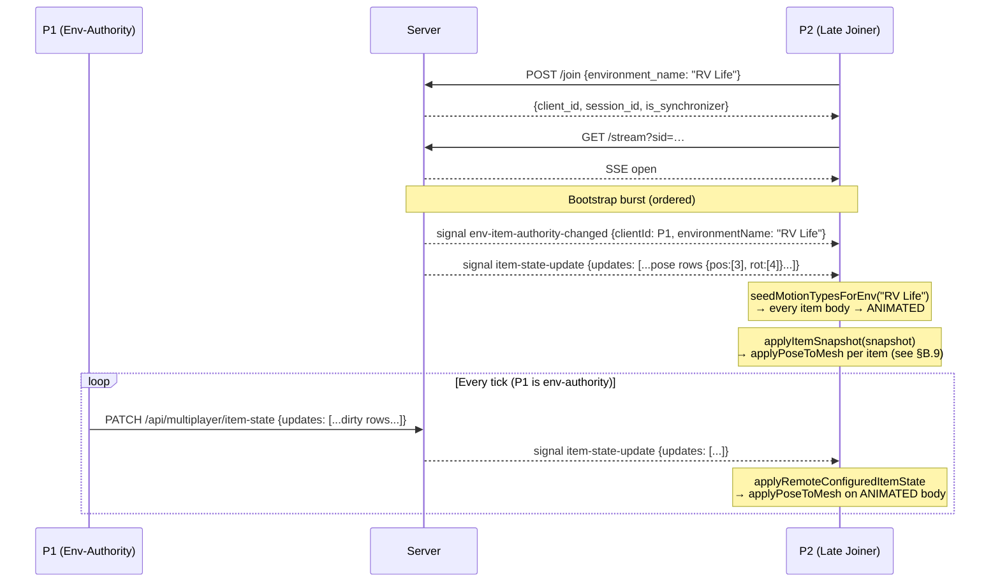

**Critical ordering constraint:** The server MUST send `env-item-authority-changed` before `item-state-update` in the bootstrap burst. If the item snapshot arrives first, the client cannot yet decide ownership, so motion types are seeded without knowing which items will be owned locally — producing a brief `DYNAMIC` window during which Havok gravity can scatter items before the first transform applies. Under the mesh-direct apply pattern ([§B.9](#b9-kinematic-apply-pattern-mesh-direct-writes-vs-settargettransform)), the mesh write itself will succeed on a `DYNAMIC` body, but the body's post-step will immediately override it with simulated position and the replica will still drift. The ordering contract is therefore about authority resolution, not about the apply primitive.

---

### B.2 Late-joiner multi-environment bootstrap (deferred apply)

The common real-world case: P2's browser opens in a different environment (e.g. "Mansion") before switching to the shared one ("RV Life"). The item snapshot arrives while P2 is still in the wrong environment, so it must be **buffered and replayed** after the environment transition completes.

```mermaid
stateDiagram-v2
  direction LR

  [*] --> WaitingForSSE : P2 joins

  WaitingForSSE --> AuthReceived : SSE burst\nenv-item-authority-changed\n(RV Life, owner=P1)

  AuthReceived --> SnapshotBuffered : SSE burst\nitem-state-update arrives\nbut currentEnv = "Mansion"\n→ dropped by env-mismatch guard\n→ stored as lastAppliedItemSnapshot

  SnapshotBuffered --> EnvLoading : User navigates to RV Life\nenvironment assets begin loading

  EnvLoading --> EnvReady : sceneManager.isEnvironmentLoaded() = true\ncurrentEnvironmentName = "RV Life"

  EnvReady --> MotionSeeded : seedMotionTypesForEnv("RV Life")\nall item bodies → ANIMATED

  MotionSeeded --> SnapshotApplied : applyItemSnapshot(lastAppliedItemSnapshot)\napplyPoseToMesh per item\n(bodies are now ANIMATED ✓)

  SnapshotApplied --> LiveSync : Ongoing item-state-update\nper-tick from P1 via server
  LiveSync --> LiveSync : applyRemoteConfiguredItemState\nenv check passes\napplyPoseToMesh
```

**Key invariant — seed-before-apply:** `seedMotionTypesForEnv` MUST be called before `applyItemSnapshot`. If the order is reversed, the mesh-direct write still writes the correct pose, but Havok's post-step on the still-`DYNAMIC` body immediately replaces it with the simulated (falling) pose. The items then drift under gravity regardless of the server-provided pose. See [§B.9](#b9-kinematic-apply-pattern-mesh-direct-writes-vs-settargettransform) for the apply primitive itself.

**Key invariant — buffer-not-discard:** When `applyItemSnapshot` encounters `parsed.envName !== currentEnvironmentName`, it MUST store the snapshot in `lastAppliedItemSnapshot` (or equivalent) rather than discarding it. Without this buffer, P2 never re-applies the snapshot once the correct environment loads.

---

### B.3 Render-loop bootstrap state machine (client-side)

The client runs a render-loop observer that tracks two boolean flags — `lastEnvironmentLoaded` and `lastAppliedItemSnapshot` — to decide when to trigger deferred operations. The four branches encode the env-ready / snapshot-ready cross-product.

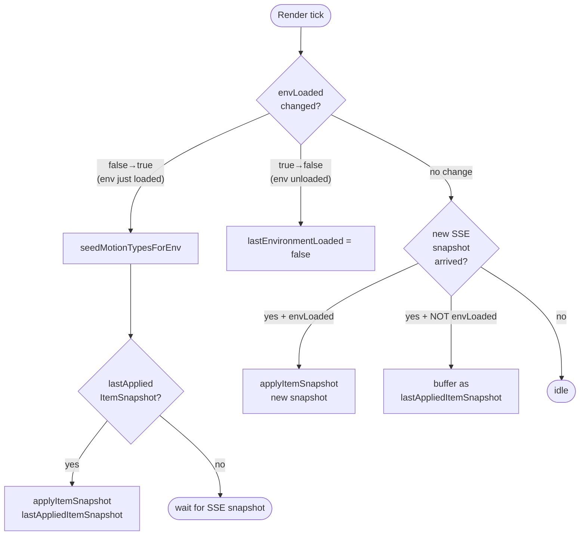

This state machine lives in `multiplayer_bootstrap.ts` inside the Babylon render-loop observer. The two flags form a two-cell latch: once both `envLoaded = true` **and** `snapshotAvailable = true`, the apply fires exactly once (per snapshot version), then waits for the next server push.

---

### B.4 Item physics motion-type lifecycle per client

Each item's physics body transitions through `ANIMATED` (kinematic, server-driven) and `DYNAMIC` (local simulation) based on the resolved ownership state. The diagram below shows the full lifecycle from spawn to post-collection.

```mermaid
stateDiagram-v2
  direction TB

  [*] --> Spawned : Environment loads\nitem instantiated by scene

  Spawned --> Animated : seedMotionTypesForEnv\n(all items → ANIMATED\nregardless of ownership)

  Animated --> Dynamic : Resolved owner = self\n(env-authority OR explicit claim)\nsetMotionType(DYNAMIC)

  Dynamic --> Animated : Resolved owner ≠ self\n(authority changed away)\nsetMotionType(ANIMATED)

  Animated --> Animated : applyRemoteConfiguredItemState\napplyPoseToMesh(pos, rot)\n[pre-step syncs mesh→body; see B.9]

  Dynamic --> Dynamic : Publish tick\nincludeRow → true\nPATCH /api/multiplayer/item-state

  Dynamic --> Collected : collectedBy = self\nOR remote collection event
  Animated --> Collected : remote collection signal received

  Collected --> [*] : item removed from scene
```

**Motion-type authority rule:** `DYNAMIC` is only correct when the client IS the resolved owner. A client that receives a remote `item-state-update` for an item it does not own MUST NOT flip that item to `DYNAMIC`; it MUST apply the transform kinematically by **writing the mesh transform directly** on the `ANIMATED` body (see [§B.9](#b9-kinematic-apply-pattern-mesh-direct-writes-vs-settargettransform) for why `setTargetTransform` is not the right primitive for replicas).

---

### B.5 Server-side item state publish gate

The server runs two independent filters before broadcasting any row from a `PATCH /api/multiplayer/item-state` request. (`item-state-update` is the SSE signal name; the HTTP path is `item-state`.)

```mermaid
flowchart TD
  A([Incoming PATCH\nitem-state-update]) --> B[Parse rows]

  B --> C{For each row}

  C --> D{Sender is\nresolved owner?}
  D -- no --> DROP1[Drop row\nsilently]

  D -- yes --> E{Dirty filter:\nany field changed\nbeyond epsilon?}
  E -- "CLEAN\n(all fields within ε)" --> CLEAN[Update lastUpdatedAt\nno broadcast]
  E -- "DIRTY\n(≥1 field changed)" --> F[Update itemTransformCache\nstamp ownerClientId]

  F --> G[broadcastExcept sender\nsignal item-state-update]

  G --> H{For each\nconnected peer}
  H --> I{Peer in same\nenvironmentName?}
  I -- no --> SKIP[Skip peer\n(AOI filter)]
  I -- yes --> J{freshness\ncell = fresh?}
  J -- "fresh\n(owner-pin)" --> SKIP2[Skip\n(owner never\nreceives own echo)]
  J -- stale --> K[Enqueue row\nfor peer SSE]
  K --> L[Mark cell fresh]
```

**Owner-pin invariant:** The resolved owner's freshness cell is permanently set to `fresh` for every item it owns. This means the server never echoes an item's own state back to its owner — preventing the owner from fighting its own physics simulation.

**Dirty filter thresholds:** Two independent comparators run per accepted row — a per-component `posEpsilon` (meters) on the pos field and a quaternion-dot-product threshold `rotDotThreshold` on the rot field. Items at rest that have not physically moved will not generate any broadcast traffic even if the owner continues to tick the publish loop. Both thresholds MUST exceed the Havok idle-jitter amplitude for settled bodies (empirically O(10 mm) translational); see [§B.9.4](#b94-dirty-filter-epsilon-must-exceed-physics-idle-jitter) for how to choose their values.

---

### B.6 Bootstrap sequencing: server-side ordering contract

The server must emit signals in a specific order during bootstrap to guarantee the client can apply item state correctly. Out-of-order delivery causes the seed-before-apply invariant to be violated.

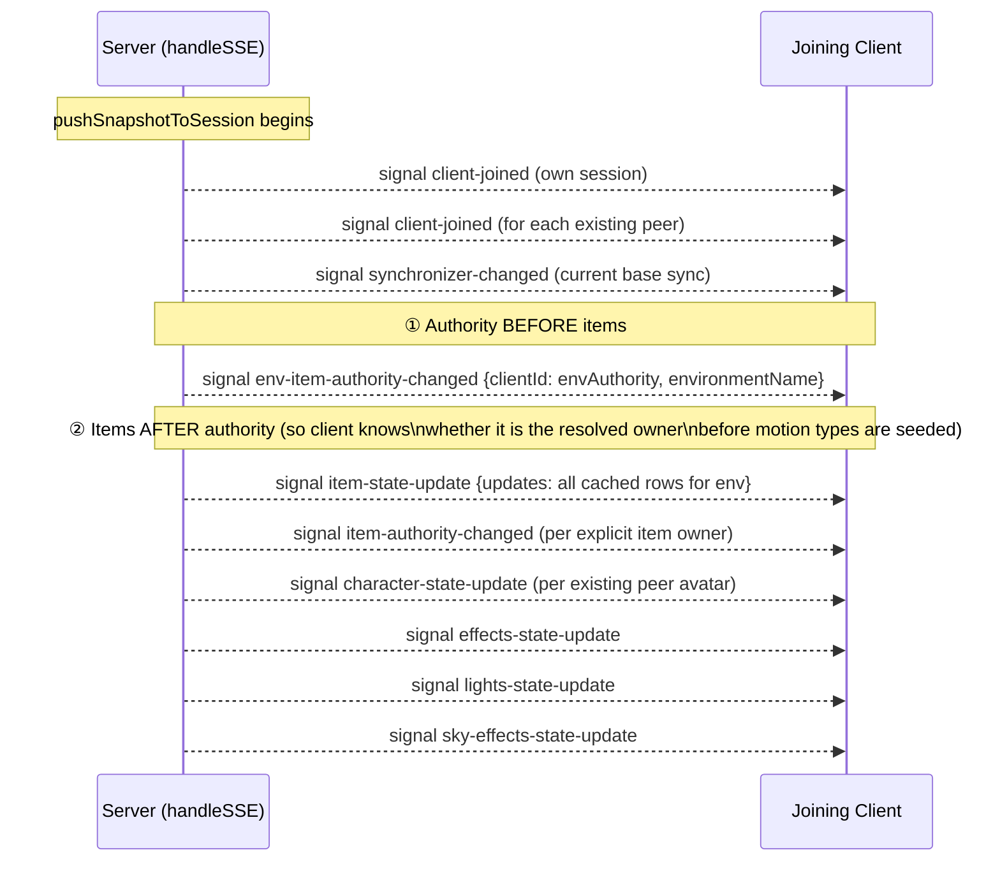

If `item-state-update` arrives before `env-item-authority-changed`, the client cannot yet determine whether it is the resolved owner for the environment. It seeds all items to `ANIMATED` (the safe default) and then calls `applyItemSnapshot`, but once the authority signal arrives later and says "you ARE the env-authority", the client must flip the items to `DYNAMIC` **after** the positions have already been applied. This means the items start at the server-cached positions (correct) but then fall under local physics immediately, which is also correct — but only because the seeding happened first. To avoid any window where the ordering is ambiguous, the server MUST send authority first.

---

### B.7 Environment-switch authority handoff

When a client switches environments the server must atomically transfer env-authority for the abandoned environment to the next arrival in the FIFO list, then assign authority in the new environment.

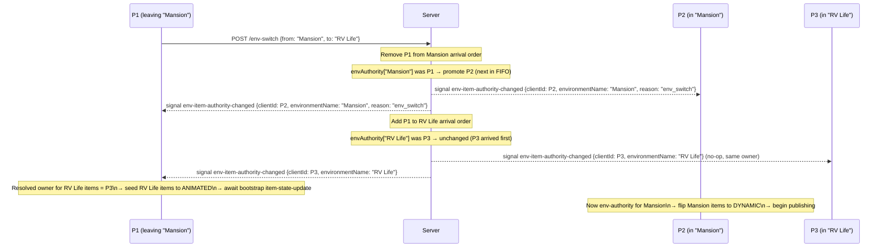

**`reason` field semantics:** When an env-authority transition is caused by an environment switch (not a disconnect), the signal carries `reason: "env_switch"`. This allows the departing client to distinguish "I left" from "I was disconnected" and handle any client-side cleanup differently.

---

### B.8 Item publish-gate: client-side includeRow decision

Before sending any row in a `PATCH /api/multiplayer/item-state` request, the client evaluates three conditions in sequence.

```mermaid
flowchart TD
  A([Publish tick]) --> B{isSnapshotApplied?\n(env fully loaded +\nbootstrap applied)}
  B -- no --> SKIP1[Skip all rows\nuntil bootstrap completes]

  B -- yes --> C{For each item\nin environment}

  C --> D{isOwnedBySelf?\n(resolvedOwner = selfClientId)}
  D -- no --> SKIP2[Skip row\nnot our authority]

  D -- yes --> E{Item collected\nby self?}
  E -- yes --> COLLECTION[Emit collection event\nin separate channel]

  E -- no --> F[sampleMeshPose(mesh)\n→ pos[3] + rot[4]]
  F --> G[Append row to\nPATCH payload]

  G --> H{Any rows\nin payload?}
  H -- no --> SKIP3[No PATCH sent\nthis tick]
  H -- yes --> I[PATCH /api/multiplayer/item-state]
```

**`isSnapshotApplied` gate:** This is the most important client-side guard. Without it, the client would begin publishing item state before it has received the bootstrap snapshot — flooding the server with the local physics spawn-scatter positions rather than the authoritative settled positions from P1. This is particularly important for the env-authority client itself: it must not publish until it has confirmed what state the server already knows.

**Self-echo guard (complementary server-side rule):** Even if a row passes the `isOwnedBySelf` check and reaches the server, the server will not echo it back to the sender (owner-pin invariant, [§5.2.2](#522-per-client-freshness-matrix) rule 2). The client-side `includeRow` guard and the server-side owner-pin together form a double barrier against phantom state loops.

---

### B.9 Kinematic apply pattern: mesh-direct writes vs `setTargetTransform`

This section explains the **canonical Babylon+Havok kinematic pattern** used by the non-owner apply path, and why an earlier design using `PhysicsBody.setTargetTransform` had to be replaced with mesh-direct writes.

#### B.9.1 The flawed design (historical, replaced)

The first implementation of `ItemSync.applyRemoteItemState` drove non-owner bodies via `body.setTargetTransform(pos, rot)` on an `ANIMATED` body. To stop Havok's pre-step sync from overwriting the body position with the (stale) mesh spawn position, `body.disablePreStep = true` was set alongside the motion-type flip.

This stack layered three fragile mechanisms on top of each other:

1. `setMotionType(ANIMATED)` — marks the body as kinematic.
2. `disablePreStep = true` — skips the mesh → body sync that would otherwise snap the body back to spawn.
3. `setTargetTransform(pos, rot)` — requests that the body interpolate to the given world pose over subsequent physics steps.

Observed failures from this stack:

- **"Whizzing demon" symptom:** When an owner body fails to physically settle (floor-contact jitter ≥ `posEpsilon`), every physics tick produces a dirty row. Peers receive a burst of `setTargetTransform` calls. Each new call replaces the previous target before the kinematic interpolator has had time to reach it, causing visible erratic motion on the replica.
- **"Invisible replica" symptom:** With `disablePreStep = true`, the mesh's `position` / `rotationQuaternion` properties are no longer authoritative — the body is. But the Havok integrator only nudges the body **toward** the target; it does not teleport. For large spawn-height-to-settled-floor jumps, the mesh can linger mid-air or remain invisible depending on the interpolator's cutoff.
- **Ordering brittleness:** `setTargetTransform` is silently ignored on `DYNAMIC` bodies. Any code path that applied a snapshot before motion types were seeded (or on a body whose authority flipped back to self between seed and apply) saw a no-op — hence the multi-layer seed-before-apply / re-apply / idempotent-safety-net scaffolding around it.

#### B.9.2 The canonical Babylon+Havok pattern (current design)

The correct primitive for driving a **network replica** of a remote-authoritative item is **mesh-direct writes**, not the physics body's target-transform API. Specifically:

1. The body's motion type is `ANIMATED` (kinematic). This stops Havok from integrating forces on it.
2. `disablePreStep` remains at its default `false`.
3. The snapshot applier writes the wire pose directly onto the mesh via `mesh.position.set(px, py, pz)` + `mesh.rotationQuaternion.set(rx, ry, rz, rw)` — i.e. the `applyPoseToMesh` helper.
4. On the next physics tick, Havok's pre-step sync copies `mesh.position` + `mesh.rotationQuaternion` → body. The body now has the correct pose for this step's collision resolution.
5. Because the body is `ANIMATED`, the post-step does not move it.

This pattern is **exactly one frame's latency**, deterministic, and requires none of `setTargetTransform`, `disablePreStep`, or the "interpolation has finished" assumptions that gave us the fragile prior design. It works identically for `collectibles_manager` items (presents, cake) and `environment_physics_sync` items (environment physics objects) because the mesh is the authoritative pose source in both cases when the body is `ANIMATED`.

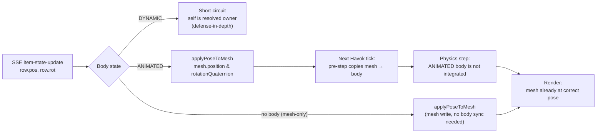

> **Invariant — non-owner apply path:** the non-owner `applyRemoteItemState` path **MUST NOT** call `setTargetTransform`, **MUST NOT** manipulate `body.disablePreStep`, and **MUST NOT** write any linear or angular velocity. It writes only `mesh.position` and `mesh.rotationQuaternion` (via `applyPoseToMesh`), and visibility via `mesh.isVisible` / `mesh.setEnabled` for collection. `mesh.scaling` is never written — it is a static per-client spawn value (see [§B.11](#b11-why-the-wire-ships-pos--rot-and-not-a-world-matrix)).

> **Invariant — DYNAMIC bodies are never targeted by remote state.** If `applyRemoteItemState` finds the body in `DYNAMIC` motion type, it MUST short-circuit. A `DYNAMIC` motion type means the local client is the resolved owner; receiving a remote snapshot for an item we own signals an authority mis-routing and any write would compete with the local simulation.

#### B.9.3 Why `setTargetTransform` is not the right primitive

`PhysicsBody.setTargetTransform` is designed for **authored kinematic animation** — e.g. driving a moving platform through its keyframe path with Havok-consistent collision resolution along the way. It assumes: (a) continuous small deltas, not teleports; (b) no mid-flight retarget every frame; and (c) exclusive authorship of the target over the interpolation window.

The multiplayer replica case violates all three:
- Deltas include single-frame teleports (bootstrap, environment re-entry, owner flip).
- Target retargets happen every received SSE update, potentially every tick.
- The *server-side dirty filter* rather than a local animator decides when a new target appears.

Using `setTargetTransform` for replicas is therefore fighting the engine. The mesh-direct write is what the engine is built to handle cleanly.

#### B.9.4 Dirty-filter thresholds must exceed physics idle-jitter

The server-side dirty filter (§5.2.1) rejects rows whose pose is within `posEpsilon` / `rotDotThreshold` of the last cached value. Both thresholds **MUST exceed the idle-jitter amplitude** of the physics engine on the owner client. Havok's default sleep threshold + finite contact-solver iteration tolerances produce small but non-zero per-frame drift (empirically O(10 mm) translational for a stacked collectible on a static floor, depending on mass / friction / restitution / timestep). A `posEpsilon` of `1e-4` (0.1 mm) is below that noise floor, causing a single idle item to generate a dirty row every tick — which the server then flood-broadcasts — which on the replica looks like the "whizzing demon" symptom even after the apply-path fix.

Recommended values:
- `posEpsilon`: lower bound `5e-3` (5 mm); upper bound the visual-tolerance threshold for 1 m-scale items (~1–2 cm). MUST be above the owner's idle-jitter and SHOULD be well below the player-character body radius so that a claimed item's motion remains perceptible on replicas.
- `rotDotThreshold`: `0.99996` (≈ cos(0.5°)). The dot product of successive unit quaternions is unit-free; `0.99996` corresponds to roughly a 0.5° rotational delta, which matches the visual significance of the recommended `posEpsilon`. The comparator uses `|dot|` so that the double-cover identity `q ≡ -q` is honored.

The exact values are implementation-dependent but both MUST track the owner's physics noise floor together — a tight pos threshold paired with a loose rot threshold (or vice versa) produces asymmetric flooding on one axis only.

#### B.9.5 Concrete call chain on the non-owner apply path

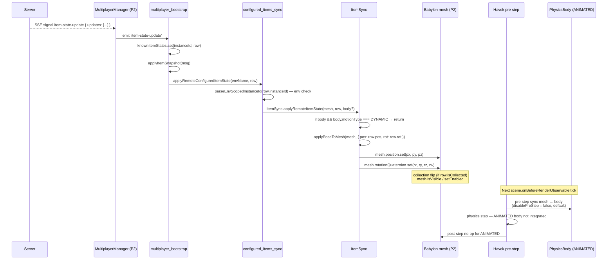

This trace supersedes the earlier `setTargetTransform` path throughout Appendix B. Read B.1 through B.8 with "setTargetTransform on ANIMATED body" mentally substituted by "mesh-direct write; Havok pre-step propagates to body".

---

### B.10 Post-mortem: lessons from the stacked-fix iteration

For future developers touching this code, the following lessons distilled from the iterative debugging sessions that produced Appendix B are recorded here as guardrails:

1. **Prefer the engine's canonical primitive.** When a multiplayer replica needs a pose applied, the canonical Babylon primitive is to write the mesh transform; the physics plugin handles the rest. Do not reach for physics APIs (`setTargetTransform`, `setPositionAndRotation`, `setMotionType` + `disablePreStep` toggles) unless the canonical path demonstrably cannot express the intent.
2. **Fragility compounds.** Each fix in the pre-B.9 sequence (seed-before-apply → re-apply on items-ready → `knownItemStates` merge → delayed re-snapshot → `disablePreStep`) compensated for a symptom whose root cause was the wrong primitive. A single fix at the primitive level (B.9) obsoletes several of them as correctness-critical (they remain as defense-in-depth).
3. **Tune the dirty filter to the physics noise floor, not to the idealized asset metadata.** `posEpsilon` / `rotDotThreshold` are runtime-physics thresholds, not logical-equality thresholds. They should be set by measuring empirical settle jitter, not by how many digits of precision look "meaningful" in a pose sample.
4. **A visibly correct bootstrap does not imply a robust apply path.** The original `setTargetTransform` implementation passed early happy-path tests when all items were small deltas from their spawn positions. The "whizzing demon" and "invisible cake" failures surfaced only once physics actually ran long enough to produce a settled state far from the authored spawn — i.e. once real gameplay timing was exercised.
5. **Authoritative logs beat theorizing.** The combination of `[SYNC_DEBUG]` (per-apply decisions), `[SYNC_GATE]` (periodic publish-gate summary), and server-side `[Broadcast]` / `[ItemState]` logs was what finally localized the bug to the apply path rather than to authority, bootstrap, or the dirty filter. Retain these logs (even at elevated verbosity) during any future reshuffling of this subsystem.

### B.11 Why the wire ships pos + rot and not a world matrix

**Historical context.** Earlier revisions of this protocol placed a full 4x4 world matrix on the item wire (16 floats per row; the unmodified output of `mesh.computeWorldMatrix(true).asArray()`). The receiver decomposed it via `Matrix.decomposeToTransformNode(mesh)` and wrote the resulting `position`, `rotationQuaternion`, **and** `scaling` back onto the mesh. That pipeline produced a family of correctness and efficiency problems that all resolve cleanly when the wire carries `{ pos, rot }` instead. This appendix records the problems, the decision, and the rationale so a future contributor cannot accidentally re-introduce the matrix pipeline.

**Problem 1 — the negative-scale decomposition trap.** `Matrix.decompose` is not a one-to-one inverse of `Matrix.Compose`. A scale of `(-s, s, -s)` is algebraically equivalent to a rotation of 180° about the world Y axis combined with a positive uniform scale:

```text
diag(-s, s, -s)  ==  Rot_Y(π) · diag(s, s, s)
```

So a world matrix `M = T · R_author · diag(-s, s, -s)` factors **two** valid ways:

| factoring | scale returned | rotation returned |
| --- | --- | --- |
| sign-in-scale | `(-s, s, -s)` | `R_author` |
| sign-absorbed | `(s, s, s)` | `R_author · Rot_Y(π)` |

Babylon's decomposer is free to choose either, and empirically returns the sign-absorbed factoring. `CollectiblesManager.createCollectibleInstance` explicitly sets `meshInstance.scaling._x *= -1; meshInstance.scaling._z *= -1` on every spawned present to re-orient the authored GLB root. When the sender shipped `M` on the wire and the receiver decomposed it, the replica rendered with subtly wrong orientations on non-owner clients while the cake (positive uniform scale) synced correctly. Writing the full TRS triple on the receiver fixes the world transform but forces the replica to overwrite its own authored `mesh.scaling`, which is itself a design smell: the scale is static config, not sync-relevant state.

**Problem 2 — bandwidth.** A 16-float matrix JSON-encodes to roughly 130–180 bytes per row; `{ pos: [3], rot: [4] }` is roughly 60–85 bytes — a ~55% reduction on every accepted dirty row, compounded across every item in every broadcast fan-out.

**Problem 3 — CPU.** On the sender, sampling a world matrix requires `computeWorldMatrix(true)` (which walks the node graph even when the mesh is unparented, because Babylon pessimistically recomputes). On the receiver, `decomposeToTransformNode` performs three square roots for the scale factors plus a quaternion extraction from the rotation block. Both are unnecessary when the mesh is unparented: `mesh.position` already IS the world position and `mesh.rotationQuaternion` already IS the pre-scale rotation. Replacing matrix sampling with direct channel reads and matrix decomposition with direct channel writes is strictly cheaper and avoids an entire class of floating-point reconstruction error.

**Problem 4 — dirty-filter noise.** Matrix entries mix distance scalars (column 3) with direction-cosine scalars (columns 0–2). A single element-wise epsilon cannot express the physically meaningful thresholds "≥ 5 mm of translation" OR "≥ 0.5° of rotation" without either false negatives at the rotational noise floor (the sender re-publishes a row for sub-millidegree jitter) or false positives at the translational noise floor (the sender drops a visible translation because a single direction-cosine happened to stay inside epsilon). Separate per-field comparators — a pos L∞ threshold and a quaternion dot-product threshold — express both thresholds naturally and independently.

**Decision.** The wire carries `{ pos: [3], rot: [4] }` (Invariant P). Scale is never on the wire. The sender reads both fields directly from the mesh's local channels; the receiver writes both fields back verbatim; no matrix composition or decomposition runs on either end.

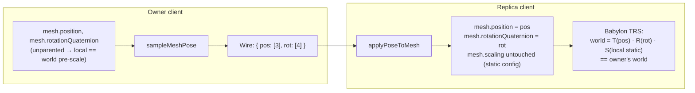

**Why scale can legitimately be dropped.** Every client spawns each item via the same `CollectiblesManager` code path driven by the same `environment.items[*].instances[*].scale` config. The GLB re-orientation flip (`_x, _z → ×(-1)` for presents) is deterministic and identical on all clients. Therefore the local `mesh.scaling` is already the same everywhere and never needs to cross the wire. Since the rotation quaternion the sender reads is the *pre-scale* local rotation (`mesh.rotationQuaternion`, not the rotation block of the post-scale world matrix), the decomposition ambiguity of Problem 1 never arises: the sender simply never runs `decompose`, and the receiver's local mesh scaling composes with the sender's local rotation to give the correct world transform automatically.

**Invariant P (normative restatement).** Senders MUST read `pos` from `mesh.position` and `rot` from `mesh.rotationQuaternion`; they MUST NOT sample `mesh.computeWorldMatrix()` nor decompose on send. Receivers MUST write `pos` onto `mesh.position` and `rot` onto `mesh.rotationQuaternion`; they MUST NOT touch `mesh.scaling`, write `mesh.rotation` (Euler), or call `setTargetTransform` / matrix APIs on the physics body. The sanctioned producer is `sampleMeshPose(mesh)`; the sanctioned consumer is `applyPoseToMesh(mesh, pose)` — both in [`src/client/utils/multiplayer_serialization.ts`](src/client/utils/multiplayer_serialization.ts).

**Lesson 6 (extending §B.10).** *"The wire carries the minimal state that cannot be reproduced locally."* Mesh scale is authored per-asset and reproduced identically by every client at spawn; it does not belong on the wire. Any replicated quantity that both sides can derive from static data is a **liability**, not a feature — it introduces decomposition ambiguity, dirty-filter noise, bandwidth waste, and subtle sign bugs exactly like the present-rotation regression that motivated this section.
