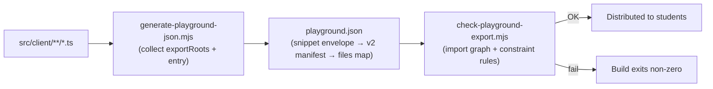

# Babylon.js Playground Contributor Guide

This document is the authoritative reference for anyone editing code that ends up inside `src/client/public/playground.json` (the snippet students paste into <https://playground.babylonjs.com/>). If you are a student just trying to *run* the snippet, you want the classroom-facing walkthrough in [`MULTIPLAYER.md` → Running in the Babylon playground](MULTIPLAYER.md#running-in-the-babylon-playground) instead.

## Contents

- [What gets exported](#what-gets-exported)
- [Constraint 1 — The ambient `BABYLON` global: never `import * as BABYLON`](#constraint-1--the-ambient-babylon-global-never-import--as-babylon)
- [Constraint 2 — Static imports only, no dynamic relative `import()`](#constraint-2--static-imports-only-no-dynamic-relative-import)
- [The smoke checker, and why it fails builds](#the-smoke-checker-and-why-it-fails-builds)
- [The full export pipeline at a glance](#the-full-export-pipeline-at-a-glance)
- [Debugging a broken playground load](#debugging-a-broken-playground-load)

## What gets exported

`npm run export:playground` packages every `.ts` file under the folders listed in [`scripts/generate-playground-json.mjs`](scripts/generate-playground-json.mjs)'s `exportRoots` array — currently `config`, `controllers`, `datastar`, `input`, `managers`, `sync`, `types`, `ui`, `utils` — plus the entry file `src/client/index.ts`. The output is a Babylon playground v2 multifile manifest wrapped in the snippet-server envelope, written to both `src/client/public/playground.json` (served by Vite in dev) and `src/client/playground/playground.json` (the distribution copy).

Everything under these folders runs inside the playground's Monaco TypeScript service and the playground's blob-URL ESM loader. Both environments are stricter / narrower than your local `tsc` + Vite setup, and the two constraints below exist because of that gap.

## Constraint 1 — The ambient `BABYLON` global: never `import * as BABYLON`

> [!IMPORTANT]
> Do **not** add `import * as BABYLON from '@babylonjs/core';` to any file under `exportRoots`. Use bare `BABYLON.Scene`, `BABYLON.Vector3`, `new BABYLON.HemisphericLight(...)`, etc. The smoke checker rejects the namespace import in bundled files.

### How types find `BABYLON` everywhere

The devDependency `babylonjs` (the UMD build of Babylon) ships a declaration file that wraps every class, enum, and type in `declare namespace BABYLON { ... }` at the top level. That file is pulled into the project by [`src/client/global.d.ts`](src/client/global.d.ts):

```ts
/// <reference types="babylonjs" />
/// <reference types="babylonjs-loaders" />
/// <reference types="babylonjs-materials" />
```

Because those are triple-slash `types` references, they attach the `BABYLON` namespace to the *global* scope. Every `.ts` file in `src/client/` inherits it — no import needed.

### How runtime finds `BABYLON` everywhere

- **In Vite (local dev and production build)**: [`src/client/main.ts`](src/client/main.ts) begins with

  ```ts
  import '@babylonjs/core/Legacy/legacy';
  ```

  The `Legacy/legacy` entry of `@babylonjs/core` exists specifically to walk the ESM package and install every class onto `globalThis.BABYLON`, mirroring the UMD global.
- **In the Babylon playground**: the playground's own loader injects a populated `BABYLON` global before the snippet runs.

Either way, bare `BABYLON.PointLight` at runtime resolves to the real, fully-formed class.

### Why the module namespace import breaks the playground

Writing `import * as BABYLON from '@babylonjs/core'` inside a file binds the identifier `BABYLON` to the module's *namespace object* for the scope of that file, shadowing the ambient global. Locally this is a superset of what you need — every class is re-exported from `@babylonjs/core`'s barrel, and the full DT covers them — so `tsc` is happy.

But the playground's Monaco TypeScript service resolves `@babylonjs/core` against a narrower, bundled declaration that does **not** expose concrete Babylon classes as named type members of the namespace. The error cascades in progression as you fix each prior diagnostic:

```text
Namespace '"@babylonjs/core"' has no exported member 'Light'.
Namespace '"@babylonjs/core"' has no exported member 'PointLight'.
Property 'Color3' does not exist on type 'typeof import("@babylonjs/core")'.
```

…and so on for every class you reach for next. The fix in every case is identical: delete the `import * as BABYLON` line. `BABYLON.*` then resolves the same way it does in the rest of the project — types from the `babylonjs` DT, runtime values from the UMD mirror — and all classes of error collapse together.

### Named subpath imports are fine

Pulling a specific export out of a specific subpath does **not** shadow the global:

```ts
import { ScenePerformancePriority } from '@babylonjs/core/scene';
import { CreateAudioEngineAsync } from '@babylonjs/core/AudioV2/webAudio/webAudioEngine';
```

Those bind only the named symbol (a local value or a local type, not the full namespace) and are the canonical way to reach parts of `@babylonjs/core` that *aren't* mirrored onto the UMD global, or to pull in type-only enums. Use them freely. [`src/client/managers/scene_manager.ts`](src/client/managers/scene_manager.ts) line 12 is a real example.

## Constraint 2 — Static imports only, no dynamic relative `import()`

> [!IMPORTANT]
> Use `import ... from '../config/game_config';` at the top of the file. Never use `await import('../config/game_config')` inside a function body in playground-bundled code. The smoke checker rejects dynamic relative imports in bundled files.

The Babylon playground's snippet loader rewrites relative module specifiers to blob URLs. For static `import` declarations, that rewrite is correct: it substitutes the blob URL back inside the quotes. For dynamic `import()` expressions, the same rewriter strips the surrounding quotes as it replaces the specifier, producing JS along the lines of

```js
const { CONFIG } = await import(__pg__/config/game_config.ts?v=modhyjwzhp6v7xt5utb);
```

V8 parses `__pg__` as an identifier, `/config/...` as division / regex, and trips on the first comma it encounters, raising

```text
SyntaxError: Unexpected token ','
```

when the compiled blob is imported. The error surfaces **after** the TS-compile timeout banner the playground shows on a cold first load, which makes it easy to misread as a timeout problem — but the syntactic failure is what actually prevents the scene from starting.

Dynamic imports of **bare** specifiers (e.g. `await import('@babylonjs/inspector')`) or **URL strings** are unaffected — the rewriter leaves those alone. The constraint is specifically on relative `./` and `../` specifiers inside `import()` calls.

## The smoke checker, and why it fails builds

[`scripts/check-playground-export.mjs`](scripts/check-playground-export.mjs) runs immediately after `scripts/generate-playground-json.mjs` as part of `npm run export:playground`. It loads the generated manifest, walks every static import from the entry, and enforces three rules:

1. **Every relative import resolves to a file in the manifest.** If a file imports `../sync/item_sync` but `sync` isn't listed in `exportRoots`, the check fails with a pointer to update the export configuration. Catches "pasted snippet throws `Cannot find module ...`" before a student ever sees it.
2. **No dynamic relative `import()` in bundled files.** See Constraint 2 above.
3. **No `import * as BABYLON from '@babylonjs/core'` in bundled files.** See Constraint 1 above.

When any rule fails, the error message includes the file, the offending text, and a pointer to this document. The build exits non-zero, so CI / pre-commit hooks will catch the regression before it reaches a classroom.

## The full export pipeline at a glance



The manifest itself is doubly wrapped: the outer object is the snippet-server envelope (`payload`, `name`, `description`, `tags`) that the playground's **Scene → Load** button expects, the `payload` is a stringified `{ code, unicode, engine, version }` object, and `code` is the stringified v2 manifest `{ v, language, entry, imports, files }`. The wrapping is handled by [`scripts/generate-playground-json.mjs`](scripts/generate-playground-json.mjs); if you ever need to introspect a shipped `playground.json`, parse JSON three times.

## Debugging a broken playground load

Symptoms map to layers as follows:

| Symptom in the playground | Likely cause | First thing to check |
|---|---|---|
| **`Unexpected token ','`** in the console or error banner | Dynamic relative `import()` in a bundled file | `npm run check:playground` locally |
| **`Namespace '"@babylonjs/core"' has no exported member ...`** in Monaco | A file has `import * as BABYLON from '@babylonjs/core'` | Grep `exportRoots` folders for that import |
| **`The playground timed out while preparing the runnable`** on the very first Run | TypeScript hydration hitting the ~10 s compile window cold | Re-click Run; the TS cache almost always succeeds the second time |
| **`HavokPhysics is not defined`** during scene build | Havok WASM plugin toggle is off | Top-right plugin menu → **Add WASM plugin → Havok** |
| **`CORS blocked`** on `fetch`/`EventSource` when pointing at an instructor server | `MULTIPLAYER_CORS_ALLOW_ORIGIN` is pinned to something that doesn't include `https://playground.babylonjs.com` | See [`RENDER_DEPLOYMENT.md` → Cross-origin access](RENDER_DEPLOYMENT.md#cross-origin-access) |
| **`Cannot find module '../sync/...'`** at import time | A folder is imported but missing from `exportRoots` | `npm run check:playground` will name the offending file and specifier |

If you get past all of these and the scene still misbehaves, the multiplayer-specific runtime concerns (server selection, cold starts, URL override, verification checklist) live in [`MULTIPLAYER.md` → Running in the Babylon playground](MULTIPLAYER.md#running-in-the-babylon-playground).
