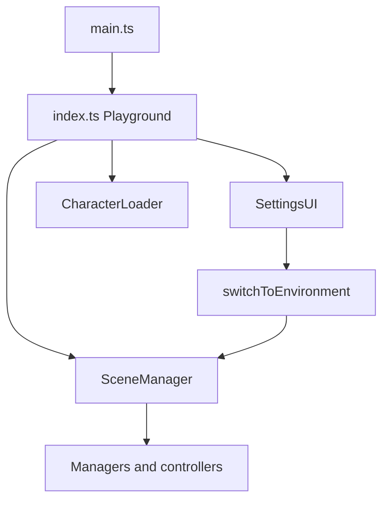

# Babylon Game Starter

A modular, configuration-driven 3D game framework built with **Babylon.js v9**, **TypeScript**, and **Vite**.

Babylon Game Starter provides a complete, ready-to-run foundation for building interactive 3D browser games. It ships with physics-based character movement, an environment system, collectibles, inventory, a behavior trigger system (proximity and fall-out-of-map), particle effects, an AudioV2-powered sound engine, and full mobile control support — all driven by configuration files. The same client can be bundled for the **Babylon.js Playground** via `playground.json`.

---

## Features

- **Modular manager architecture** — Scene, camera, audio, HUD, collectibles, inventory, behaviors, visual effects, sky, cutscenes, character loading, and more
- **Configuration-driven design** — Characters, environments, items, sounds, and rules through typed config under `src/client/config/`
- **Babylon.js v9 AudioV2** — Background music with crossfading, ambient positional sounds, and SFX via `CreateSoundAsync` when available
- **Physics-based movement** — Havok integration for character movement, jumping, and boost
- **Environment system** — Switchable 3D worlds with music, particles, items, sky, optional fall-respawn hooks
- **Collectibles and inventory** — Pickup, credits, inventory, and temporary item effects
- **Behavior system** — Proximity triggers, fall-out-of-world respawn, glow, `adjustCredits`, and environment `portal` actions
- **HUD** — Device-adaptive layout (desktop / mobile / iPad + keyboard) from `game_config.ts`
- **Mobile controls** — Virtual joystick, jump, and boost
- **Playground export** — `npm run export:playground` produces `playground.json` for the web editor

---

## Tech stack

| Package             | Version |
| ------------------- | ------- |
| `@babylonjs/core`   | ^9.1.0  |
| `@babylonjs/gui`    | ^9.1.0  |
| `@babylonjs/havok`  | ^1.3.12 |
| `@babylonjs/loaders`| ^9.1.0  |
| `@babylonjs/materials` | ^9.1.0 |
| `vite`              | ^5.0.8  |
| `typescript`        | ^5.3.3  |

---

## Quick start

```sh
npm install
npm run dev
```

Open [http://localhost:3000](http://localhost:3000) in your browser.

---

## Scripts

| Command                     | Description                                                                 |
| --------------------------- | ----------------------------------------------------------------------------- |
| `npm run dev`               | Vite dev server (client root `src/client/`)                                 |
| `npm run build`             | Production build to `dist/`                                                 |
| `npm run preview`           | Preview the production build                                                  |
| `npm run format`            | Prettier write on `src/**/*.ts`, `eslint.config.js`, `vite.config.ts`         |
| `npm run format:check`      | Prettier check (runs in CI)                                                   |
| `npm run lint`              | ESLint (runs in CI)                                                           |
| `npm run lint:fix`          | ESLint with `--fix`                                                           |
| `npm run typecheck`         | `tsc --noEmit` for app and Node configs (runs in CI)                        |
| `npm run export:playground` | Generate `playground.json` for the Babylon.js editor                        |
| `npm run deploy:prepare`    | Validate deployment settings and scaffold host artifacts / `src/server/*`   |

CI (`.github/workflows/typecheck.yml`) runs **`format:check` → `lint` → `typecheck`**.

---

## Project structure

```
src/client/
  config/              # assets.ts, game_config.ts, input_keys.ts, mobile_controls.ts,
                       # character_states.ts, local_dev.ts
  controllers/         # Character, camera, animation
  input/               # Mobile touch input
  managers/            # scene_manager, audio_manager, visual_effects_manager,
                       # behavior_manager, fall_respawn_hooks, collectibles_manager,
                       # inventory_manager, hud_manager, camera_manager, sky_manager,
                       # node_material_manager, character_loader, cut_scene_manager, …
  types/               # Shared TypeScript types
  ui/                  # Settings, inventory, HUD-related UI
  utils/               # switch_environment.ts, dev helpers, notifications, …
  index.ts             # Playground-style entry (CreateScene)
  main.ts              # Vite bootstrap (engine, audio globals, Havok)
  index.html
src/deployment/        # Typed settings, prepare-deployment, runtime install plan
src/server/            # Per-service folders (scaffolded from deployment settings)
scripts/
  generate-playground-json.mjs
src/client/public/playground.json   # Written by export:playground
src/client/playground/playground.json   # Second copy for playground bundle
vite.config.ts         # Reads deployment settings; dev proxy to local services
eslint.config.js
```

---

## Documentation

- **[USERS_GUIDE.md](USERS_GUIDE.md)** — Architecture, configuration, behaviors, fall respawn, condensed narrative notes
- **[src/deployment/DEPLOYMENT.md](src/deployment/DEPLOYMENT.md)** — Settings-driven deploy, Docker, host artifacts
- **[STYLE.md](STYLE.md)** — TypeScript / ESLint / Prettier expectations for contributors

---

## Bootstrap (high level)


