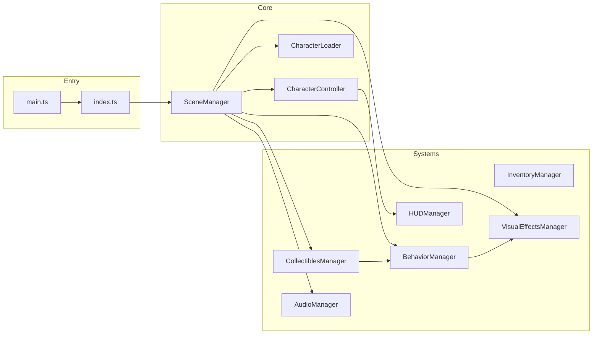
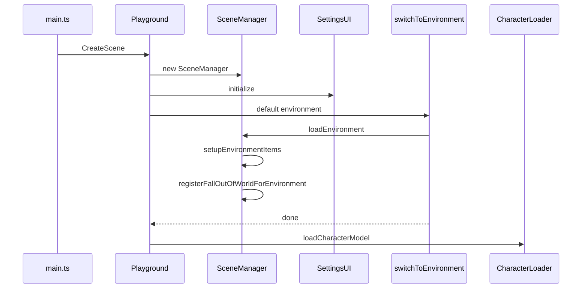
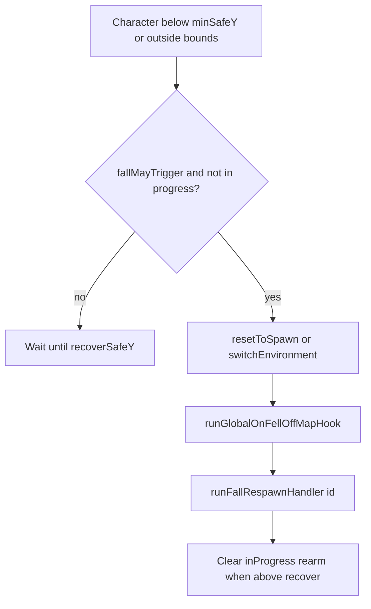

# Babylon Game Starter — User's Guide

## Introduction

**Babylon Game Starter** is a TypeScript game client built on **Babylon.js v9** and **Vite**. Configuration in `src/client/config/` drives characters, environments, items, HUD, input, and physics. The same sources can be exported to **`playground.json`** for the Babylon.js web editor (`npm run export:playground`).

The codebase uses **strict TypeScript** and ESLint; Babylon and DOM edges are handled with documented ESLint pragmatics (see [STYLE.md](STYLE.md)), not blanket `any`.

**Deployment:** [src/deployment/DEPLOYMENT.md](src/deployment/DEPLOYMENT.md) describes settings-driven scaffolds, Docker, and static vs web-service hosts.

---

## Major features

| Area | What you get |
| ---- | ------------ |
| Scene | Load/switch GLB environments, sky, lights, ambient audio, BGM crossfade |
| Character | Havok character controller, jump/boost, animation blending, `CharacterLoader` |
| Collectibles | `CollectiblesManager` — spawn from `assets.ts`, credits, physics pickup |
| Inventory | `InventoryManager` + UI for storable items and timed effects |
| Behaviors | Proximity and **fall-out-of-world** triggers; glow; `adjustCredits`; `portal` |
| Fall respawn | Always on per environment; optional `fallRespawn` tuning and hook ids |
| Effects | `VisualEffectsManager` (particles, glow); `AudioManager` (AudioV2) |
| Materials | `NodeMaterialManager` for imported / scene meshes |
| HUD / mobile | `HUDManager`, `MobileInputManager`, device classes from `game_config.ts` |

---

## System architecture

### Layers

1. **Vite entry** — `src/client/main.ts` creates the engine, globals (Havok, AudioV2), then runs `Playground.CreateScene`.
2. **Playground entry** — `src/client/index.ts` builds `SceneManager`, wires **SettingsUI** / **InventoryUI**, calls `switchToEnvironment` for the default map, then **CharacterLoader**.
3. **SceneManager** — Scene graph, physics, environment import, items, fall-OOB registration, character/camera setup.
4. **Managers** — Subsystems listed above; static singleton pattern for most coordinators.
5. **Config** — Typed modules under `src/client/config/` (see below).

### Configuration files (actual paths)

| File | Role |
| ---- | ---- |
| [src/client/config/assets.ts](src/client/config/assets.ts) | Characters, environments (spawn, sky, items, particles, optional `fallRespawn`, …) |
| [src/client/config/game_config.ts](src/client/config/game_config.ts) | Speeds, physics, HUD layout, performance, effects list |
| [src/client/config/input_keys.ts](src/client/config/input_keys.ts) | Keyboard bindings |
| [src/client/config/mobile_controls.ts](src/client/config/mobile_controls.ts) | Touch UI layout |
| [src/client/config/character_states.ts](src/client/config/character_states.ts) | Animation state metadata |
| [src/client/config/local_dev.ts](src/client/config/local_dev.ts) | Local-only overrides |

### Manager and loader roles

| Component | Responsibility |
| --------- | -------------- |
| **SceneManager** | Environment load/dispose, physics setup, BGM/ambient, items setup, `registerFallOutOfWorldForEnvironment`; cutscenes are driven from **SettingsUI** via **CutSceneManager** |
| **CharacterController** | Movement, jump, boost, rotation, capsule, effect modifiers |
| **CharacterLoader** | GLB characters, spawn position, handoff to scene reveal / physics |
| **CollectiblesManager** | Item meshes, collection impulse, credits, integration with behaviors |
| **InventoryManager** | Stored items, use/effect timing |
| **BehaviorManager** | Proximity + fall-out-of-world evaluation, glow, actions |
| **VisualEffectsManager** | Particle snippets, mesh glow, environment vs item particles |
| **AudioManager** | `CreateSoundAsync` / streaming, BGM crossfade, ambient, one-shots |
| **HUDManager** | Credits, boost, FPS, layout by device class |
| **CameraManager** | Offsets and smooth-follow integration |
| **SkyManager** | Per-environment sky mesh |
| **NodeMaterialManager** | NME materials on imported meshes |
| **CutSceneManager** | Used from environment switch / **SettingsUI** for cutscenes |

### High-level relationships



### Typical boot flow



---

## Core systems (concise)

### Scene management

Central orchestrator: physics (Havok), mesh import, sky, lights, particles, items, fall monitoring, camera offset. **Notable APIs:** `loadEnvironment`, `setupEnvironmentItems`, `resetToStartPosition`, `changeCharacter`, `showPlayerMeshResumePhysicsAndRevealEnvironment`.

### Character

`CharacterController` + `CharacterLoader`: physics-driven locomotion, jump delay, boost multiplier from `assets.ts` per character, mobile + keyboard input via existing managers.

### Environments

Each **Environment** in `assets.ts` may include `model`, `spawnPoint`, `spawnRotation`, optional `transitionPosition` / `transitionRotation`, `sky`, `particles`, `items`, `physicsObjects`, `lights`, `backgroundMusic`, `ambientSounds`, `cameraOffset`, `cutScene`, and optional **`fallRespawn`** (tuning only; respawn is always registered).

**Switching at runtime:**

```typescript
import { switchToEnvironment } from './utils/switch_environment';

await switchToEnvironment('Level Test');
```

`switchToEnvironment` delegates to **SettingsUI.changeEnvironment** (cutscene, concurrent load, physics pause, etc.).

### Collectibles and inventory

Items are defined on environments in `assets.ts`. Collectibles spawn with physics; credits go through **CollectiblesManager**. Inventory items apply effects for a duration per config.

### Behavior system

Behaviors attach to meshes, physics objects, or particle emitters via `behavior` on asset entries. **`triggerKind`**:

- **`proximity`** — radius, optional `checkPeriod`, optional `triggerOutOfRange`, glow (`edgeColor` / `edgeWidth`), optional **`action`**.
- **`fallOutOfWorld`** — Registered once per loaded environment from merged env config (see below); not attached to a single mesh in assets.

**Actions** (`action` on proximity behaviors):

| `actionType` | Fields | Behavior |
| -------------- | ------ | -------- |
| `adjustCredits` | `amount: number` | Credits delta |
| `portal` | `target: string` | Calls `switchToEnvironment(target)` (fire-and-forget at trigger site) |

### Fall-out-of-map respawn

- **Always on** for every environment after a successful load: `SceneManager.loadEnvironment` calls `BehaviorManager.registerFallOutOfWorldForEnvironment(environment)` after `setupEnvironmentItems`.
- **Default band:** `minSafeY = environment.spawnPoint.y - 100` when `fallRespawn.minSafeY` is omitted (`DEFAULT_FALL_DEPTH_BELOW_SPAWN` in `behavior_manager.ts`).
- **Optional `environment.fallRespawn`:** `minSafeY`, `recoverSafeY`, `bounds`, `checkPeriod`, `respawnEnvironmentName` (cross-env respawn), `onRespawnedHandlerId` (string id for a hook).

**Hooks** — [src/client/managers/fall_respawn_hooks.ts](src/client/managers/fall_respawn_hooks.ts):

- `registerFallRespawnHandler(id, fn)` — implement handlers for ids referenced from assets.
- `setGlobalOnFellOffMapHook(fn | null)` — optional callback for **every** fall respawn (same ordering as below).

**Order after teleport** (`executeFallRespawn`): `resetToSpawn()` **or** `await switchEnvironment(target)` → `await runGlobalOnFellOffMapHook()` → `await runFallRespawnHandler(onRespawnedHandlerId)`.



### Visual and audio effects

- **VisualEffectsManager** — Babylon particle snippets, glow on mesh names, environment vs item particle lifecycle.
- **AudioManager** — Sound creation prefers Babylon AudioV2 `CreateSoundAsync`; BGM crossfade/stop; ambient loops at positions.

### Physics, camera, HUD, mobile

Match **README** and `game_config.ts`: Havok aggregates for static/dynamic meshes, smooth follow + drag, HUD visibility matrix, **MobileInputManager** for on-screen controls.

---

## Narrative design (condensed)

Christopher Alexander’s **fifteen properties** (popularized in game talks by Jesse Schell) describe spaces that “feel alive.” You can express them in this starter **without** pasting huge configs: use **environments** as chapters, **behaviors** as beats, **audio** as rhythm, and **empty space** as intentionally quiet areas.

| Property | Practical lever in this starter |
| -------- | -------------------------------- |
| Levels of scale | Chapters = environments; beats = behaviors/items on a map |
| Strong centers | Spawn + landmark particles/lights; hub collectibles |
| Boundaries | `triggerOutOfRange`, environment switches, `fallRespawn.bounds` |
| Alternating repetition | Alternate dense particle/item zones with quiet traversal |
| Positive / negative space | Mix active particles vs open geography |
| Good shape | Behaviors that match danger/reward of an area |
| Local symmetries | Per-environment item sets and sky themes |
| Deep interlock | Hidden proximity rewards; optional fall hooks |
| Contrast | Opposing credit actions or biomes back-to-back |
| Gradients | BGM crossfade; slower `checkPeriod` intervals |
| Roughness | Varied `updateSpeed` / placement instead of perfect grids |
| Echoes | Reuse particle **names** with different `behavior` per map |
| The void | Regions with no items/particles on purpose |
| Simplicity | One clear `proximity` behavior before stacking systems |
| Not-separateness | Same collectible drives credits **and** story beats you surface in UI |

**Single pattern example** (valid object shape — extend with your real meshes):

```typescript
particles: [
  {
    name: 'Magic Sparkles',
    position: new BABYLON.Vector3(-2, 0, -8),
    behavior: {
      triggerKind: 'proximity',
      radius: 3,
      checkPeriod: { type: 'interval', milliseconds: 5000 },
      action: { actionType: 'adjustCredits', amount: 10 }
    }
  }
];
```

Further reading: [resources/RESOURCES.md](resources/RESOURCES.md), _A Pattern Language_, _The Art of Game Design_.

---

## Resources

- [Babylon.js documentation](https://doc.babylonjs.com/)
- [Babylon.js forum](https://forum.babylonjs.com/)
- [Babylon.js Playground](https://playground.babylonjs.com/)
- [Node Material Editor](https://nme.babylonjs.com/)
- [AudioV2 — playing sounds and music](https://doc.babylonjs.com/features/featuresDeepDive/audio/playingSoundsMusic)

---

## Conclusion

Use **typed config** first, then small TypeScript hooks (`fall_respawn_hooks`, custom UI) when declarative data is not enough. Keep **CI green**: `npm run format:check`, `npm run lint`, `npm run typecheck`.

Share builds with **#BabylonGameStarter** when you ship something fun.
