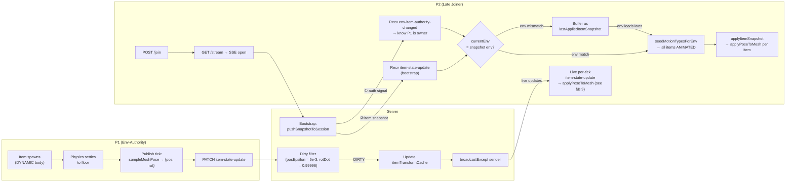
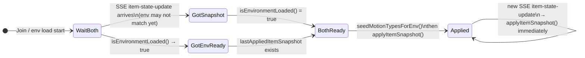

# Babylon Game Starter - Multiplayer Implementation Guide

> [!NOTE]
> **Historical integration guide.** Superseded by [`MULTIPLAYER.md`](../../MULTIPLAYER.md) for onboarding and [`MULTIPLAYER_SYNCH.md`](../../MULTIPLAYER_SYNCH.md) for the normative spec. The "Phase 3: Integrate into SceneManager" steps below do not reflect the current code — multiplayer is wired via [`src/client/managers/multiplayer_bootstrap.ts`](../../src/client/managers/multiplayer_bootstrap.ts).

## Overview

This guide walks through the multiplayer architecture implementation for babylon-game-starter using **Datastar** for real-time state synchronization.

## Architecture Summary

### Client-Side (TypeScript + Babylon.js)
- **MultiplayerManager**: Orchestrates SSE connection and state broadcasts
- **Sync Modules**: Track entity state changes (CharacterSync, ItemSync, EffectsSync, LightsSync, SkySync)
- **Datastar Client**: SSE wrapper for Datastar protocol
- **Serialization Utils**: Convert Babylon.js types to JSON-friendly formats

### Server-Side (Go + Datastar SDK)
- **HTTP Handlers**: Join/leave endpoints, health check, authority claim/release
- **State Update Handlers**: Receive, row-filter, dirty-filter, and broadcast state updates
- **Client Registry**: Ordered map for base-synchronizer role management
- **Explicit Item Authority Registry**: `itemOwners` map driving per-item authorization ([§4.7](MULTIPLAYER_SYNCH.md#47-item-authority-lifecycle))
- **Environment Authority Registry**: `envAuthority` + `envArrivalOrder` maps driving per-environment default item authorization ([§4.8](MULTIPLAYER_SYNCH.md#48-environment-item-authority-lifecycle))
- **Item Transform Cache**: `itemTransformCache` of last-accepted field values per `instanceId`, backing the dirty filter ([§5.2](MULTIPLAYER_SYNCH.md#52-item-state))
- **SSE + patch-signals**: Long-lived `EventSource` stream; server pushes `datastar-patch-signals` events (Datastar Go SDK `MarshalAndPatchSignals`)
- **SSE transport compression**: Brotli by default on the multiplayer SSE route via [`github.com/CAFxX/httpcompression`](https://github.com/CAFxX/httpcompression); env-var override `MULTIPLAYER_SSE_COMPRESSION=brotli|gzip|off` ([MULTIPLAYER_SYNCH.md §9.1](MULTIPLAYER_SYNCH.md#91-sse-transport-compression-non-normative))

#### SSE compression (pseudo-code)

Compression is applied via a single middleware in the server's request pipeline, between CORS and the route mux. The factory lives in its own file so the Brotli tuning and the Content-Type allow-list stay in one place; nothing in `handlers.go` changes.

```go
// src/server/multiplayer/compression.go

import (
  "net/http"
  "os"
  "strings"

  httpcompression "github.com/CAFxX/httpcompression"
  brotlienc        "github.com/CAFxX/httpcompression/contrib/andybalholm/brotli"
  gzipenc          "github.com/CAFxX/httpcompression/contrib/klauspost/gzip"
)

// mode() reads MULTIPLAYER_SSE_COMPRESSION (default "brotli"; accepts "gzip" or "off").
func compressionMode() string {
  switch strings.ToLower(strings.TrimSpace(os.Getenv("MULTIPLAYER_SSE_COMPRESSION"))) {
  case "off", "none", "disabled":
    return "off"
  case "gzip":
    return "gzip"
  default:
    return "brotli"
  }
}

// buildCompressionMiddleware returns a pass-through when mode == "off".
func buildCompressionMiddleware() func(http.Handler) http.Handler {
  mode := compressionMode()
  if mode == "off" {
    return func(next http.Handler) http.Handler { return next }
  }

  // Brotli: streaming mode, small window, low-latency quality.
  // Quality 11 (default) buffers too aggressively for per-event SSE flushes.
  brEnc, _ := brotlienc.New(brotlienc.Options{Quality: 4, LGWin: 18})
  gzEnc, _ := gzipenc.New(gzipenc.Options{Level: 4})

  opts := []httpcompression.Option{
    httpcompression.ContentTypes([]string{"text/event-stream", "application/json"}, false),
    httpcompression.MinSize(256), // don't compress tiny PATCH 200s
  }
  if mode == "brotli" {
    opts = append(opts, httpcompression.Compressor(brotlienc.Encoding, 1, brEnc))
    opts = append(opts, httpcompression.Compressor(gzipenc.Encoding, 2, gzEnc))
  } else {
    opts = append(opts, httpcompression.Compressor(gzipenc.Encoding, 1, gzEnc))
  }

  adapter, err := httpcompression.Adapter(opts...)
  if err != nil {
    return func(next http.Handler) http.Handler { return next } // fail-open
  }
  return adapter
}
```

Wiring in [`src/server/multiplayer/main.go`](src/server/multiplayer/main.go):

```go
compress := buildCompressionMiddleware()
handler := withCORS(compress(mux))
```

Key correctness constraints (enforced by library; cited here for reviewers):

- The wrapped response writer **must** preserve `http.Flusher`. `CAFxX/httpcompression` does — its wrapper forwards `Flush()` through and emits a Brotli "flush block" to the wire on every flush. Hand-rolling a compression wrapper without flush support would silently break SSE, buffering until the connection closes.
- **Never set `Content-Length`** on SSE. The middleware honors chunked transfer automatically.
- PATCH responses are tiny `200 OK` ACKs; the `MinSize(256)` filter keeps them uncompressed.

#### Dev-proxy interaction

[vite.config.ts](vite.config.ts) configures the multiplayer route through Vite's built-in proxy. Vite's proxy does **not** decode `Content-Encoding` by default — `br` passes through untouched to the browser, and the browser's `EventSource` decodes it natively. No changes to the Vite config are required.

If a custom proxy (nginx, Traefik, a CDN, etc.) sits between the multiplayer backend and the browser, verify:

1. The proxy forwards `Content-Encoding` unchanged on the `/api/multiplayer/stream` route.
2. The proxy does not buffer chunks for compression (e.g., nginx's `proxy_buffering off;` on that location).
3. The proxy does not attempt to re-compress an already-compressed response.

When in doubt, set `MULTIPLAYER_SSE_COMPRESSION=off` on the server side and let the proxy handle compression itself.

#### Environment Authority Registry (pseudo-code)

```go
// MultiplayerServer fields
envAuthority    map[string]string   // envName → clientID (head of arrival order)
envArrivalOrder map[string][]string // envName → FIFO of clientIDs currently in that env

// On join (and on server-observed env switch IN)
func (ms *MultiplayerServer) noteEnvEnter(clientID, envName string) {
  order := ms.envArrivalOrder[envName]
  for _, id := range order { if id == clientID { return } } // idempotent
  ms.envArrivalOrder[envName] = append(order, clientID)
  if ms.envAuthority[envName] == "" {
    ms.envAuthority[envName] = clientID
    ms.broadcastEnvItemAuthorityChanged(envName, "", clientID, "arrival")
  }
  // else: sender is a waiter; no signal
}

// On leave / disconnect / server-observed env switch OUT
func (ms *MultiplayerServer) noteEnvLeave(clientID, envName, reason string) {
  order := ms.envArrivalOrder[envName]
  next := order[:0]
  for _, id := range order { if id != clientID { next = append(next, id) } }
  ms.envArrivalOrder[envName] = next

  if ms.envAuthority[envName] != clientID { return }
  prev := clientID
  if len(next) == 0 {
    delete(ms.envAuthority, envName)
    ms.broadcastEnvItemAuthorityChanged(envName, prev, "", reason)
  } else {
    newAuth := next[0] // ordered failover: next-earliest remaining arrival
    ms.envAuthority[envName] = newAuth
    ms.broadcastEnvItemAuthorityChanged(envName, prev, newAuth, reason)
  }
}
```

Re-entry is a normal arrival: returning to an env you previously held authority over appends you to the back of `envArrivalOrder[envName]` and does NOT reclaim the role unless you are again the only client present.

#### Item Transform Dirty Filter (pseudo-code)

Item rows carry a pose pair — `Pos [3]float64` (world-space position, meters) and `Rot [4]float64` (unit quaternion `[x,y,z,w]`). See Invariant P in [MULTIPLAYER_SYNCH.md §5.2](MULTIPLAYER_SYNCH.md#52-item-state). No `Matrix`, no `Euler`, no `Velocity`, no `Scale`. The dirty filter therefore runs two independent comparators — an L∞ translation threshold on `Pos` and an absolute-quaternion-dot-product threshold on `Rot`.

```go
type cachedItemTransform struct {
  pos                           [3]float64
  rot                           [4]float64
  isCollected                   bool
  collectedByClientID           string
  ownerClientID                 string
  lastBroadcastAt               int64
}
// map[instanceId] cachedItemTransform lives on the MultiplayerServer.

const posEpsilon       = 5e-3    // meters; must exceed Havok settled-body idle jitter (~10 mm observed)
const rotDotThreshold  = 0.99996 // ≈ cos(0.5°); |q_new · q_cached| below this is "different orientation"

func posDirty(a, b [3]float64) bool {
  for i := 0; i < 3; i++ { if math.Abs(a[i]-b[i]) > posEpsilon { return true } }
  return false
}

func rotDirty(a, b [4]float64) bool {
  dot := a[0]*b[0] + a[1]*b[1] + a[2]*b[2] + a[3]*b[3]
  if dot < 0 { dot = -dot } // quaternion double-cover: q ≡ -q
  return dot < rotDotThreshold
}

func (ms *MultiplayerServer) applyDirtyFilter(rows []ItemInstanceState) []ItemInstanceState {
  out := rows[:0]
  for _, r := range rows {
    cached, ok := ms.itemTransformCache[r.InstanceID]
    dirty := !ok ||
      posDirty(cached.pos, r.Pos) ||
      rotDirty(cached.rot, r.Rot) ||
      cached.isCollected != r.IsCollected ||
      cached.collectedByClientID != r.CollectedByClientID ||
      cached.ownerClientID != r.OwnerClientID
    // Always refresh activity tracking on explicit-owned items
    if owner, has := ms.itemOwners[r.InstanceID]; has && owner.OwnerClientID == r.SenderID {
      owner.LastUpdatedAt = ms.now()
    }
    if dirty {
      ms.itemTransformCache[r.InstanceID] = cached.updateFrom(r, ms.now())
      out = append(out, r)
    }
  }
  return out
}
```

Late-joiners are not starved by the dirty filter: when a client enters an environment, the per-client freshness matrix (below) seeds every cell for that client to `stale`, so the next broadcast window emits the full cached env as a per-recipient `item-state-update` bootstrap.

#### Per-client freshness matrix (pseudo-code)

```go
// MultiplayerServer fields
//   freshness[envName][instanceId][clientId] = fresh | stale
freshness map[string]map[string]map[string]bool // true == fresh, false == stale

// Owner pin: called whenever the resolved owner of I changes OR a DIRTY row is accepted.
func (ms *MultiplayerServer) pinOwner(env, instanceId, owner string) {
  if ms.freshness[env] == nil || ms.freshness[env][instanceId] == nil { return }
  ms.freshness[env][instanceId][owner] = true // owner is always FRESH
}

// Called once per accepted DIRTY ItemInstanceState row.
func (ms *MultiplayerServer) projectDirtyRow(env, instanceId, owner string) {
  cells := ms.freshness[env][instanceId]
  if cells == nil { return }
  for clientId := range cells {
    if clientId == owner { cells[clientId] = true } else { cells[clientId] = false }
  }
}

// AOI enter: initial join / env-switch in / SSE reconnect for this env.
func (ms *MultiplayerServer) onEnvEnter(env, clientId string) {
  if ms.freshness[env] == nil { ms.freshness[env] = map[string]map[string]bool{} }
  for instanceId := range ms.itemsInEnv(env) {
    row, ok := ms.freshness[env][instanceId]
    if !ok { row = map[string]bool{}; ms.freshness[env][instanceId] = row }
    row[clientId] = false // stale — triggers a bootstrap row in the next window
  }
  // Owner-pin re-seat for any items where this arrival is already the resolved owner
  for instanceId, owner := range ms.resolvedOwnersInEnv(env) {
    if owner == clientId { ms.freshness[env][instanceId][clientId] = true }
  }
}

// AOI leave: explicit leave, disconnect, env-switch out.
func (ms *MultiplayerServer) onEnvLeave(env, clientId string) {
  for instanceId := range ms.freshness[env] {
    delete(ms.freshness[env][instanceId], clientId)
  }
}

// Ownership transition: item-authority-changed or env-item-authority-changed for I in E.
func (ms *MultiplayerServer) onOwnerChange(env, instanceId, prevOwner, newOwner string) {
  cells := ms.freshness[env][instanceId]
  if cells == nil { return }
  cells[newOwner] = true   // re-pin
  if prevOwner != "" { cells[prevOwner] = false } // previous owner is now a subscriber
  // other cells keep their value; next DIRTY row from newOwner re-projects via projectDirtyRow
}

// Per-recipient fan-out: build one item-state-update per client with stale cells or pending collections.
func (ms *MultiplayerServer) buildFanoutForClient(env, clientId string) *ItemStateUpdate {
  var updates []ItemInstanceState
  for instanceId, cells := range ms.freshness[env] {
    if !cells[clientId] { // stale
      updates = append(updates, ms.itemTransformCache[instanceId].toRow())
      cells[clientId] = true // flip to fresh after enqueue
    }
  }
  collections := ms.drainPendingCollectionsFor(env, clientId)
  if len(updates) == 0 && len(collections) == 0 { return nil }
  return &ItemStateUpdate{Updates: updates, Collections: collections, Timestamp: ms.now()}
}

// Always-deliver collections: projected independently of updates.
func (ms *MultiplayerServer) onCollectionAccepted(env, instanceId, senderId string, ev ItemCollectionEvent) {
  for clientId := range ms.clientsInEnv(env) {
    if clientId != senderId { ms.enqueuePendingCollection(env, clientId, ev) }
  }
  // Mark the next ItemInstanceState row for instanceId as unconditionally DIRTY so
  // the coupled transform echoes to peers; collection delivery MUST NOT be gated on it.
  ms.markTerminalNextRow(instanceId)
}
```

#### Orphan reassignment on leave (pseudo-code)

Executed atomically in the server tick that observes departure; combines explicit-claim release, AOI eviction, env-authority failover, and freshness re-pin.

```go
func (ms *MultiplayerServer) handleClientLeaveEnv(clientId, env, reason string) {
  // 1. Release every explicit claim held by clientId in this env.
  for instanceId, owner := range ms.itemOwners {
    if owner.OwnerClientID != clientId { continue }
    if ms.envOfInstance(instanceId) != env { continue }
    delete(ms.itemOwners, instanceId)
    ms.broadcastItemAuthorityChanged(instanceId, clientId, "", reason) // resolves to env-authority
  }

  // 2. Evict AOI column for the leaver.
  ms.onEnvLeave(env, clientId)

  // 3. Env-authority failover if the leaver held the role.
  ms.noteEnvLeave(clientId, env, reason) // existing helper: pops arrivalOrder, emits env-item-authority-changed

  // 4. After the env-authority swap, re-pin freshness + flush.
  newAuth := ms.envAuthority[env] // "" if nobody left
  for instanceId := range ms.itemsInEnv(env) {
    // Only items whose resolved owner actually changed need re-pinning.
    if ms.resolvedOwner(instanceId) != newAuth && newAuth != "" { continue }
    ms.onOwnerChange(env, instanceId, clientId, newAuth)
    ms.markTerminalNextRow(instanceId) // force next row from newAuth to be DIRTY
  }
}

// On hard disconnect, call handleClientLeaveEnv for every env the client was resident in.
func (ms *MultiplayerServer) handleDisconnect(clientId string) {
  for _, env := range ms.envsForClient(clientId) {
    ms.handleClientLeaveEnv(clientId, env, "disconnect")
  }
  ms.removeClientState(clientId)
}
```

`markTerminalNextRow` is the same mechanism §5.2.1 rule 5 uses for `isCollected` transitions — it guarantees the very next row the server accepts for that `instanceId` is projected DIRTY to every in-env non-owner, even if the geometric delta is below epsilon.

#### Client-side applyItemSnapshot (pseudo-code)

```ts
// Called for every item-state-update received from the server.
function applyItemSnapshot(update: ItemStateUpdate): void {
  // 1. Collections first — INDEPENDENT of updates[]. Idempotent.
  //    Parity rule (§6.2 rule 1 *Remote-collect feedback parity*): if the local
  //    representation is still present, play the same particles + spatialized
  //    sound as the local-collect path. Never emit scoring side-effects.
  for (const ev of update.collections ?? []) {
    applyRemoteCollectedWithFeedback(ev.instanceId);
  }

  // 2. Updates — drop self-owned rows (defense-in-depth); non-owned rows via mesh-direct write.
  //    Each row carries two transform fields: row.pos (3 floats) and row.rot (4 floats,
  //    unit quaternion) — Invariant P. We write them directly onto the mesh's local
  //    channels; Havok's pre-step sync propagates the pose onto the ANIMATED body before
  //    the next physics tick. We NEVER touch mesh.rotation (Euler) on this path
  //    (Invariant E), NEVER write mesh.scaling (static per-client spawn value), and
  //    NEVER call setLinearVelocity / applyImpulse / addForce on a non-owned body.
  for (const row of update.updates ?? []) {
    if (authorityTracker.isOwnedBySelf(row.instanceId)) {
      continue; // server should never send this under owner-pin; drop if it does
    }
    const mesh = collectiblesManager.getMesh(row.instanceId);
    if (!mesh) continue;
    CollectiblesManager.setItemKinematic(row.instanceId, true);
    applyPoseToMesh(mesh, { pos: row.pos, rot: row.rot });
  }
}

// §6.2 rule 1 *Remote-collect feedback parity*. Plays particles + spatialized
// collect sound at the item's last world position, then performs the silent
// cleanup half of collection (disable mesh, dispose body, mark collected). No
// credits, no inventory, no achievement / analytics side-effects.
function applyRemoteCollectedWithFeedback(instanceId: string): void {
  if (collectiblesManager.isAlreadyCollected(instanceId)) return;
  const mesh = collectiblesManager.getMesh(instanceId);
  if (mesh) {
    const pos = mesh.getAbsolutePosition().clone();
    collectiblesManager.showCollectionEffects(pos);
    collectiblesManager.playCollectSoundAt(pos);
  }
  // Silent cleanup (existing applyRemoteCollected path): disables mesh, disposes body, marks collected.
  collectiblesManager.applyRemoteCollected(instanceId);
}

function onEnvironmentLoaded(envName: string): void {
  // 1. Hold all env items kinematic until the bootstrap snapshot + authority snapshot are applied.
  //    (§6.2 rule 4 *ANIMATED-default-then-promote*, §4.8 *No-authority-means-non-owner*.)
  for (const item of itemsInEnv(envName)) {
    CollectiblesManager.setItemKinematic(item.instanceId, true);
  }
  // 2. Do NOT start the local physics loop for this env yet.
  envPhysicsLoop.pauseFor(envName);
  // 3. Wait for the first item-state-update addressed to this client for envName
  //    (driven by freshness-matrix AOI-enter on the server side).
  mp.once("item-state-update", (update) => {
    applyItemSnapshot(update);
    // 4. Re-derive motion types now that the authority snapshot has been applied
    //    (§6.2 rule 5 trigger c). Items where self is resolved owner flip to DYNAMIC.
    seedMotionTypesForEnv(envName);
    envPhysicsLoop.resumeFor(envName);
  });
}

// §6.2 rule 5. Re-derive motion type for every item in env, atomically per-item.
// This is the DEFENSE-IN-DEPTH belt that handles (a) authority changes mid-session
// and (b) the single-player / mp-disabled fallback. The primary path is
// pre-scene ownership resolution (Invariant P): MultiplayerManager.switchEnvironment
// applies envAuthority for the new env before sceneManager.loadEnvironment, and
// CollectiblesManager.createCollectibleInstance spawns each body DYNAMIC or
// ANIMATED directly, removing the need for any promote step in the happy path.
function seedMotionTypesForEnv(envName: string): void {
  for (const item of itemsInEnv(envName)) {
    const ownedBySelf = authorityTracker.isOwnedBySelf(item.instanceId);
    CollectiblesManager.setItemKinematic(item.instanceId, !ownedBySelf);
    if (!ownedBySelf) {
      // Seed kinematic target to current world pose so the body does not drift
      // between the flip and the first applied updates[] row. The absolute
      // rotation is sampled as a quaternion (Invariant E: we never touch
      // mesh.rotation Euler channels on item paths).
      const body = collectiblesManager.getPhysicsBody(item.instanceId);
      const mesh = collectiblesManager.getMesh(item.instanceId);
      if (body && mesh) {
        body.setTargetTransform(
          mesh.getAbsolutePosition(),
          mesh.absoluteRotationQuaternion,
        );
      }
    }
  }
}

// §6.2 rule 5 trigger b. Env-authority transition re-drives motion types for
// every item in that env whose resolved owner changes as a result. Because
// env-authority is the default owner for any item with no explicit itemOwners
// entry, in practice this is every such item.
function onEnvItemAuthorityChanged(evt: EnvItemAuthorityChanged): void {
  if (evt.envName !== currentLoadedEnv()) return;
  seedMotionTypesForEnv(evt.envName);
}

// §6.2 rule 5 trigger c. Applied exactly once per SSE session on open, then
// discarded; subsequent authority updates arrive as per-item / per-env signals.
function onAuthoritySnapshot(snapshot: AuthoritySnapshot): void {
  authorityTracker.absorb(snapshot); // writes itemOwners + envAuthority maps
  authorityTracker.markSnapshotApplied(currentLoadedEnv());
  seedMotionTypesForEnv(currentLoadedEnv());
}

function applyCollections(events: ItemCollectionEvent[]): void {
  // Standalone; used when a caller has already de-coupled collections[] from updates[].
  for (const ev of events) applyRemoteCollectedWithFeedback(ev.instanceId);
}
```

The pseudocode blocks above (AOI lifecycle, orphan reassignment, `applyItemSnapshot`, `applyRemoteCollectedWithFeedback`, `seedMotionTypesForEnv`, `onEnvItemAuthorityChanged`, `onAuthoritySnapshot`) together implement the server-side freshness matrix and the client-side receiver contract that MULTIPLAYER_SYNCH.md §5.2.2 and §6.2 require, including the §6.2 rule 1 remote-collect feedback parity and the §6.2 rules 4–5 ANIMATED-default-then-promote motion-type discipline.

---

## File Structure

```
src/client/
  datastar/
    datastar_client.ts         # SSE wrapper for Datastar
  managers/
    multiplayer_manager.ts     # Main orchestration
  sync/
    character_sync.ts          # Character state tracking
    item_sync.ts               # Item state tracking
    effects_sync.ts            # Particle effects tracking
    lights_sync.ts             # Lights state tracking
    sky_sync.ts                # Sky effects tracking
  types/
    multiplayer.ts             # Synchronized state interfaces
  utils/
    multiplayer_serialization.ts # Serialization & utilities

src/server/multiplayer/
  main.go                       # Entry point & server setup
  handlers.go                   # HTTP endpoint handlers
  utils.go                      # Helper functions
  go.mod                        # Go module definition
```

---

## Configuration

Multiplayer settings are configured in `src/client/config/game_config.ts`:

```typescript
MULTIPLAYER: {
  ENABLED: true,                           // Enable/disable multiplayer entirely
  PRODUCTION_SERVER: 'bgs-mp.onrender.com', // Production server hostname
  LOCAL_SERVER: 'localhost:5000',          // Local development server
  CONNECTION_TIMEOUT_MS: 15000,            // 15 seconds (Render cold start tolerance)
  PRODUCTION_FIRST: true                   // Try production before local fallback
}
```

### Custom Server Configuration

To use your own multiplayer server:

```typescript
// src/client/config/game_config.ts
MULTIPLAYER: {
  ENABLED: true,
  PRODUCTION_SERVER: 'my-multiplayer-server.example.com', // Your server
  LOCAL_SERVER: 'localhost:5000',
  CONNECTION_TIMEOUT_MS: 15000,
  PRODUCTION_FIRST: true
}
```

### Disabling Multiplayer

To run in single-player mode only:

```typescript
MULTIPLAYER: {
  ENABLED: false,
  // ... other settings ignored when disabled
}
```

The client automatically detects if multiplayer is disabled:

```typescript
const mp = getMultiplayerManager();
if (!mp.isEnabled()) {
  console.log('Multiplayer is disabled');
  // Run single-player only
}
```

---

## Integration Checklist

### Phase 1: Setup Go Backend

- [ ] Install Go 1.21+
- [ ] Run `cd src/server/multiplayer && go mod download`
- [ ] Test with `go run main.go handlers.go utils.go`
- [ ] Backend should listen on `http://localhost:5000`

### Phase 2: Register Multiplayer Routes

Add to deployment settings if not already configured:

```typescript
// src/deployment/settings/settings.mjs
export default {
  services: [
    // ... existing services
    {
      name: 'multiplayer',
      type: 'go',
      localPort: 5000,
      routePrefix: '/api/multiplayer'
    }
  ]
};
```

### Phase 3: Integrate into SceneManager

Update `src/client/managers/scene_manager.ts`:

```typescript
import { getMultiplayerManager } from './multiplayer_manager';

export class SceneManager {
  private multiplayerManager: MultiplayerManager;

  constructor(engine: BABYLON.Engine, canvas: HTMLCanvasElement) {
    // ... existing setup
    this.multiplayerManager = getMultiplayerManager();
    this.setupMultiplayerSync();
  }

  private setupMultiplayerSync(): void {
    // Listen for character state updates
    this.multiplayerManager.on('character-state-update', (update) => {
      // Update remote character meshes
      for (const state of update.updates) {
        this.applyRemoteCharacterState(state);
      }
    });

    // Listen for item updates
    this.multiplayerManager.on('item-state-update', (update) => {
      // Update item positions and collection state
      for (const itemState of update.updates) {
        this.applyRemoteItemState(itemState);
      }
      // Handle collections
      for (const collection of update.collections ?? []) {
        this.handleRemoteItemCollection(collection);
      }
    });

    // Similar setup for effects, lights, sky effects...
  }
}
```

### Phase 4: Add Player Join/Leave UI

Update HUD to show multiplayer status:

```typescript
// In HUDManager or SettingsUI
private renderMultiplayerStatus(): void {
  const mp = getMultiplayerManager();
  if (mp.isMultiplayerActive()) {
    const isSyncLabel = mp.isSynchronizer() ? '(Sync)' : '(Client)';
    this.statusElement.textContent = `Multiplayer ${isSyncLabel}`;
  }
}
```

### Phase 5: Integrate Sync Modules with Managers

#### Character Sync Integration

```typescript
// In CharacterController after state changes
private updateCharacterState(): void {
  // ... existing logic
  
  const characterSync = this.getCharacterSync();
  const state = characterSync.sampleState(Date.now());
  if (state && mp.isSynchronizer()) {
    const update = characterSync.createStateUpdate(Date.now(), [state]);
    mp.updateCharacterState(update);
  }
}
```

#### Item Sync Integration

Items use a **three-tier authority model** — see [MULTIPLAYER_SYNCH.md §4.7](MULTIPLAYER_SYNCH.md#47-item-authority-lifecycle) and [§4.8](MULTIPLAYER_SYNCH.md#48-environment-item-authority-lifecycle). Collection events are first-write-wins, so any client may emit them. Transform rows (each carrying `pos: [3]float64` and `rot: [4]float64` per Invariant P) must come from the item's **resolved owner**:

1. The **explicit item owner** (an active `itemOwners` entry from proximity claims), if any.
2. Otherwise, the **environment item authority** for the item's environment — the first-in-env client, with ordered failover.
3. Otherwise, no row is accepted (server silently drops).

The client-side `ItemAuthorityTracker` resolves this for you: `tracker.isResolvedOwnerSelf(instanceId, envName)` returns `true` whenever self is either the explicit owner or the env-authority for `envName` and no other client explicitly claimed `instanceId`.

```typescript
// In CollectiblesManager when item collected (first-write-wins)
public async collectItem(item: ItemInstance): Promise<void> {
  // ... existing logic

  const itemSync = this.getItemSync();
  itemSync.recordCollection({
    instanceId: item.id,
    itemName: item.name,
    collectedByClientId: mp.getClientID()!,
    creditsEarned: item.creditValue,
    timestamp: Date.now()
  });

  // Any client may emit collection events; the server keeps the first per instanceId.
  const update = itemSync.createStateUpdate(Date.now());
  if (update) mp.updateItemState(update);
}

// In the item-authority loop: resolved owner publishes transforms.
private publishOwnedItemStates(): void {
  const tracker = this.getItemAuthorityTracker();
  const envName = this.getCurrentEnvironmentName();

  // Every instanceId for which self is the resolved owner:
  //   - explicit-owned (proximity claim), OR
  //   - unclaimed and self is env-authority for envName.
  const resolvedIds = tracker.getResolvedOwnedInstanceIds(envName);
  if (resolvedIds.size === 0) return;

  const itemSync = this.getItemSync();
  const update = itemSync.createStateUpdate(Date.now(), resolvedIds);
  if (update) mp.updateItemState(update);
}
```

Per-row authorization is enforced by the server ([§7.5](MULTIPLAYER_SYNCH.md#75-item-authority-authorization)) — unauthorized rows are silently dropped rather than failing the whole PATCH. The server additionally applies a **dirty filter** to the surviving rows ([§5.2](MULTIPLAYER_SYNCH.md#52-item-state)): rows whose `pos` (per-component within `posEpsilon`) AND `rot` (quaternion dot-product at or above `rotDotThreshold`) match the cached value, AND whose categorical fields match exactly, are dropped from the broadcast. Clients SHOULD still filter locally (send at most ~10 Hz, skip rows that haven't changed beyond a local threshold) to avoid wasted upstream bandwidth; the server-side filter is a safety net, not a substitute.

#### Effects Sync Integration

```typescript
// In VisualEffectsManager when particle effect created
public createParticleEffect(particleSystem: BABYLON.IParticleSystem): void {
  // ... existing logic
  
  const effectsSync = this.getEffectsSync();
  effectsSync.updateParticleEffect({
    effectId: particleSystem.name,
    snippetName: snippetName,
    position: serializeVector3(particleSystem.emitter.position),
    isActive: true,
    timestamp: Date.now()
  });
  
  if (mp.isSynchronizer()) {
    const update = effectsSync.createStateUpdate(Date.now());
    if (update) mp.updateEffectsState(update);
  }
}
```

#### Lights Sync Integration

```typescript
// In SceneManager when creating lights
private createLight(config: LightConfig): void {
  // ... existing logic
  
  const lightsSync = this.getLightsSync();
  lightsSync.updateLight({
    lightId: light.name,
    lightType: config.lightType as LightType,
    position: config.position ? serializeVector3(config.position) : undefined,
    direction: config.direction ? serializeVector3(config.direction) : undefined,
    diffuseColor: serializeColor3(light.diffuse),
    intensity: light.intensity,
    isEnabled: light.isEnabled(),
    timestamp: Date.now()
  });
}
```

#### Sky Sync Integration

```typescript
// In SkyManager when applying effects
public effectHeatLightning(strength: number, frequency: number, duration: number): void {
  // ... existing logic
  
  const skySync = this.getSkySync();
  skySync.updateEffect({
    effectType: 'heatLightning',
    isActive: true,
    visibility: 1 - strength,
    intensity: frequency,
    durationMs: duration,
    elapsedMs: 0,
    timestamp: Date.now()
  });
  
  if (mp.isSynchronizer()) {
    const update = skySync.createStateUpdate(Date.now());
    if (update) mp.updateSkyEffects(update);
  }
}
```

---

## Usage Examples

### Joining Multiplayer Session

```typescript
const mp = getMultiplayerManager();
await mp.join('dystopia', 'alex');
console.log('Connected:', mp.isMultiplayerActive());
console.log('Synchronizer:', mp.isSynchronizer());
```

### Leaving Multiplayer

```typescript
await mp.leave();
console.log('Disconnected');
```

### Listening to State Updates

```typescript
mp.on('character-state-update', (update: CharacterStateUpdate) => {
  for (const state of update.updates) {
    if (state.clientId !== mp.getClientID()) {
      // Apply remote character state to mesh
      CharacterSync.applyRemoteCharacterState(remoteMesh, state);
    }
  }
});
```

---

## Roles

Each client holds up to **three independent role buckets** at any moment (see [MULTIPLAYER_SYNCH.md §2](MULTIPLAYER_SYNCH.md#2-terms)). All three are optional and non-exclusive — one client may hold all of them, or none.

### Base Synchronizer Role

Exactly one client at a time, global scope. Owns global world state: **lights, sky effects, environment particles**. Does **not** own items.

**Responsibilities**

1. Sample lights / sky / env-particle state each frame.
2. Throttle updates (~10 Hz each — see tunables below).
3. PATCH global-world-state endpoints; the server `403`s non-synchronizer senders.

**Assignment**

- First connected client becomes base synchronizer.
- On disconnect, the next client in join order is promoted.
- Server emits `synchronizer-changed` ([§6.6](MULTIPLAYER_SYNCH.md#66-synchronizer-changed)). Item authority is **not** transferred by this signal.

`mp.isSynchronizer()` returns `true` when this client currently holds the base-synchronizer role. This flag is **irrelevant for item-state decisions**.

### Environment Item Authority Role

At most one client per environment. Owns, by default, the `ItemInstanceState` stream for **every item in that environment that isn't explicitly claimed**. This is the tier that keeps gravity running on a just-loaded env before anyone has reached a claim bubble.

**Responsibilities**

1. On entry to (or arrival in) an environment `E`, listen for `env-item-authority-changed` with `environmentName: E` and `newAuthorityId: self`.
2. When authority is self: for every item in `E` whose `instanceId` is not in the explicit `itemOwners` map, flip the local physics body to `DYNAMIC` and begin sampling rows.
3. PATCH `/api/multiplayer/item-state` with those rows. The server runs the three-tier resolved-owner filter followed by the dirty filter, broadcasting only changed rows.
4. On `env-item-authority-changed` with `newAuthorityId ≠ self` (or `null`): stop sampling for the items you held by default; flip their bodies back to `ANIMATED` (kinematic) unless they are explicitly claimed by self.
5. Publish bootstrap positions for collectible items in `E` that are not yet collected (responsibility moves with env-authority; collection events themselves remain first-write-wins).

**Assignment (§4.8)**

- First client to enter an environment becomes env-authority for that env.
- Subsequent arrivals append to `envArrivalOrder[E]` but do NOT displace the current authority.
- When the current authority leaves / disconnects / env-switches, the server promotes the new head of `envArrivalOrder[E]` — the next-earliest remaining arrival — and emits `env-item-authority-changed` with `reason` set to `"failover"`, `"disconnect"`, or `"env_switch"` respectively.
- Returning to an environment you previously held authority over does NOT reclaim the role; you re-enter at the back of the arrival order.

`mp.isEnvAuthority(envName)` / `tracker.isEnvAuthoritySelf(envName)` should be your test.

### Explicit Item Owner Role

Held per `instanceId` and independently per client. Overrides env-authority for that single row. Used when a client walks up to a specific dynamic item and needs deterministic local ownership of its simulation.

Scope:
- `environment.items` (both `collectible: false` and, for pre-collection transform, `collectible: true`).
- `environment.physicsObjects` with `mass > 0`.

**Responsibilities**

1. Monitor proximity between the local character and nearby dynamic items.
2. PATCH `/api/multiplayer/item-authority-claim` on proximity enter; server responds with accept/reject.
3. On accept: flip the local physics body for that `instanceId` to `DYNAMIC`, begin publishing `ItemInstanceState` rows for it (as a superset of whatever you publish under env-authority).
4. On `item-authority-changed` with `newOwnerId ≠ self`: flip the body to `ANIMATED` (kinematic) — unless you are still the env-authority AND no other client holds an explicit claim, in which case the resolved owner remains self and the body stays `DYNAMIC`.
5. PATCH `/api/multiplayer/item-authority-release` after `claimGraceMs` of continuous non-proximity with body at rest, or on env switch. After release, the item falls back to env-authority for continued simulation.

**Assignment**

Last-claim-wins with the guardrails in [§4.7](MULTIPLAYER_SYNCH.md#47-item-authority-lifecycle):
- An existing owner is displaceable only when idle (`claimIdleTimeoutMs`), explicitly released, or disconnected.
- Disconnects release every owned `instanceId` (`reason: "disconnect"`).
- Environment switches release via `reason: "env_switch"`.

Use the `ItemAuthorityTracker` resolver — or the per-row `ownerClientId` in incoming `item-state-update` payloads — to check ownership; do **not** use `mp.isSynchronizer()` for item decisions.

### Env-switch pre-scene flow (Invariant P)

The client side honours [Invariant P](MULTIPLAYER_SYNCH.md#48-environment-item-authority-lifecycle) by running env-switch as a strict sequence, with the authority map applied to `ItemAuthorityTracker` **before** any item body for the new environment is created. The chokepoint is `SettingsUI.changeEnvironment`:

```typescript
// SettingsUI.changeEnvironment (simplified)
await mp.switchEnvironment(newEnv);
// At this point the server's env-switch PATCH response has been parsed,
// st.environment = newEnv, and a synthetic env-item-authority-changed has
// already been fed into ItemAuthorityTracker via the listener hoisted above
// mp.join(). isOwnedBySelf(instanceId) now returns the final answer for
// every item in newEnv.
await sceneManager.loadEnvironment(newEnv);
// setupEnvironmentItems() calls CollectiblesManager.createCollectibleInstance
// for each item; each body is created DYNAMIC if isOwnedBySelf returns true
// and ANIMATED otherwise — no transient ANIMATED-then-promote flicker.
```

`MultiplayerManager.switchEnvironment` emits the synthetic `env-item-authority-changed` before its promise resolves; callers MUST NOT begin scene loading before that promise has settled. `CollectiblesManager` consults the tracker through a static `isOwnedBySelfLookup` callback registered by `multiplayer_bootstrap.ts` (and cleared on scene dispose) so that the manager stays tracker-agnostic. `seedMotionTypesForEnv` and `CollectiblesManager.onEnvironmentItemsReady` remain wired as **defense-in-depth** for the cases where the callback is unset (single-player, mp disabled, late authority signal); in the conforming happy path they are no-ops.

### State Update Throttling

Each sync module uses `ThrottledFunction` to limit update frequency:

```typescript
// Character: 50ms throttle (~20 Hz)
new CharacterSync(clientId, 50);

// Items: 100ms throttle (~10 Hz)
new ItemSync(100);

// Effects: 100ms throttle (~10 Hz)
new EffectsSync(100);

// Lights: 100ms throttle (~10 Hz)
new LightsSync(100);

// Sky: 100ms throttle (~10 Hz)
new SkySync(100);
```

---

## Update Flow Example: Character Movement

```
┌─ Timer every frame ─┐
│ Synchronizer Client │
│ CharacterController │
└──────────┬──────────┘
           │
      ┌────▼──────┐
      │ Character │
      │ moves     │
      └────┬──────┘
           │
      ┌────▼──────────────┐
      │ CharacterSync     │
      │ .sampleState()    │ (throttled every 50ms)
      └────┬──────────────┘
           │ Has significant change?
           ├─────→ YES ─┐
           │            │
           │        ┌───▼────────────┐
           │        │ MultiplayerMgr │
           │        │ .updateCharacter
           │        │ State()        │
           │        └───┬────────────┘
           │            │
           │        ┌───▼────────────┐
           │        │ Datastar.patch │
           │        │ /api/.../      │
           │        │ character-state│
           │        └───┬────────────┘
           │            │
           │        ┌───▼────────────┐
           │        │ Broadcaster: character-
           │        │ state-update  │
           │        │ signal → all  │
           │        └───┬────────────┘
           │            │
           │        ┌───▼──────────────┐
           │        │ All connected    │
           │        │ clients receive  │
           │        │ update & apply   │
           │        └──────────────────┘
           │
           └─────→ NO ─→ Skip this frame
```

---

## Security Considerations

1. **Base-synchronizer-only global world state**: lights / sky / env particles require `X-Client-ID == baseSynchronizerId`; other senders get `403 Forbidden` ([§7.2](MULTIPLAYER_SYNCH.md#72-global-world-state-authorization)).
2. **Three-tier item authorization**: item-state rows are filtered per `instanceId` by resolved owner — explicit `itemOwners` entry first, else `envAuthority` for the item's environment, else drop ([§7.5](MULTIPLAYER_SYNCH.md#75-item-authority-authorization)). Rows that fail the filter are dropped silently rather than failing the whole request. Base-synchronizer role alone confers **no** item write privilege.
3. **Server-side dirty filter**: surviving rows are compared to the server's `itemTransformCache` via a per-component `posEpsilon` comparator on `pos` and a quaternion-dot-product comparator on `rot` (Invariant P), plus exact-match on categorical fields; unchanged repeats are silently dropped from the broadcast without affecting activity tracking ([§5.2](MULTIPLAYER_SYNCH.md#52-item-state)).
4. **Timestamp Validation**: Rejects updates older than 30 seconds.
5. **Position Bounds**: Validates positions within ±10000 units.
6. **Animation State**: Only accepts valid animation states.
7. **Session Tokens**: SSE requires valid session ID.

---

## Performance Optimization

### Update Throttling
- Character: 50ms (20 Hz max)
- Items: 100ms (10 Hz max)
- Effects: 100ms (10 Hz max)
- Lights: 100ms (10 Hz max)
- Sky: 100ms (10 Hz max)

### Significance Thresholds
- Position: 0.1 units
- Rotation: 0.05 radians (~2.9°)
- Animation Frame: 0.01 (1% change)

### Server-Side Dirty Filter (Item Transforms)

The server runs a second-stage filter after authority row filtering ([§5.2](MULTIPLAYER_SYNCH.md#52-item-state)): accepted `ItemInstanceState` rows are compared against the last-broadcast cached values for the same `instanceId`. Rows whose `pos` is within `posEpsilon` per component AND whose `rot` quaternion has `|dot| ≥ rotDotThreshold` AND whose categorical fields (`isCollected`, `collectedByClientId`, `ownerClientId`) are exactly equal are considered CLEAN and dropped from the outgoing broadcast.

Defaults:
- `posEpsilon = 5e-3` (meters; must exceed Havok settled-body idle jitter, empirically O(10 mm)).
- `rotDotThreshold = 0.99996` (≈ cos(0.5°); uses absolute dot product so the quaternion double-cover `q ≡ -q` is honored).

Activity bookkeeping (`itemOwners.lastUpdatedAt`) is refreshed for CLEAN rows too — only the broadcast is suppressed. Late joiners are seeded by the **per-client freshness matrix AOI-enter** hook ([§5.2.2](MULTIPLAYER_SYNCH.md#522-per-client-freshness-matrix) rule 4): every item cell for the arriving client is initialized to `stale`, so the next broadcast window emits a per-recipient `item-state-update` containing the full `itemTransformCache` for the arrived env plus any undelivered collection events. There is no separate SSE-open replay code path.

### Per-Client Freshness Projection (Fan-out)

After the dirty filter, accepted DIRTY rows are projected through the freshness matrix ([§5.2.2](MULTIPLAYER_SYNCH.md#522-per-client-freshness-matrix)): each (environment, item, client) cell is marked `stale` if the client is not the resolved owner, and the fan-out producer emits one `item-state-update` per client with stale cells. Consequences:

- **Owners receive zero rows for their own items** (owner-pin invariant). Self-echo is eliminated at the protocol level rather than on the client.
- **Clients not in env `E` receive zero rows for items in `E`.** There are no cells for them in `freshness[E]`.
- **Bandwidth scales with `|stale_cells|` per window, not `|clients| × |dirty_rows|`.** Every row goes only to recipients that need it.

### Bulk Updates
All state updates batched into single SIGNAL message per type, reducing network overhead. When both `updates` and `collections` are empty after dirty-filtering, the server elides the broadcast entirely.

### SSE transport compression

Brotli is enabled on the SSE route by default (see *SSE compression (pseudo-code)* above and [MULTIPLAYER_SYNCH.md §9.1](MULTIPLAYER_SYNCH.md#91-sse-transport-compression-non-normative)). On typical item-heavy workloads the per-client fan-out produces small, repetitive JSON payloads that compress 70–85% at Brotli quality 4 without measurably affecting frame-to-frame latency — the compression middleware emits a flush block on every `MarshalAndPatchSignals`, preserving the same event cadence as the uncompressed path. Set `MULTIPLAYER_SSE_COMPRESSION=off` at the server to disable it when debugging proxy interactions or measuring uncompressed baselines.

---

## Testing Multiplayer

### Local Testing (Two Clients)

```bash
# Terminal 1: Start backend
cd src/server/multiplayer
go run *.go

# Terminal 2: Start client dev server
npm run dev

# Terminal 3: Start client dev server on different port
PORT=3001 npm run dev
```

Open both clients in separate browser tabs and verify:
- [ ] Both show "Connected to multiplayer"
- [ ] First client shows "(Sync)", second shows "(Client)"
- [ ] Character movement from sync client appears on other clients
- [ ] Items collected sync to other clients
- [ ] Disconnect first client → second client becomes base synchronizer
- [ ] Claim an item on one client (walk up to it) → other clients receive `item-authority-changed`
- [ ] Non-owner client sees the item as kinematic (no local simulation); owner sees dynamic
- [ ] Owner disconnects mid-interaction → item transitions to `Unowned`; another client can claim

Environment item authority scenarios:
- [ ] First client into an env simulates gravity for all its dynamic items: spawn an env whose items free-fall (e.g. RV Life cake). P1 entering alone sees the cake settle onto the floor locally and P2 (joining later) also sees it settled — not bouncing or invisible.
- [ ] Env-authority leaves before any proximity claim; remaining client takes over simulation: P1 and P2 both in env, neither claims any item. P1 env-switches out. Server emits `env-item-authority-changed` with `reason: "env_switch"`, `newAuthorityId: P2`. P2 takes over simulation; items continue to behave consistently.
- [ ] Proximity claim during env-authority's tenure survives env-authority's departure: P1 is env-authority, P2 walks up to item I and claims it explicitly. P1 leaves env. P2 retains explicit ownership of I regardless of env-authority handoff.
- [ ] Env-authority handoff on disconnect (not just env switch): same as above, but P1 closes the tab rather than env-switching.
- [ ] Re-entry does not reclaim: P1 (env-authority for rv-life) env-switches out; P2 becomes env-authority. P1 returns to rv-life. P2 keeps env-authority; P1 is a waiter.

Bandwidth / dirty-filter scenarios:
- [ ] A stationary item held at rest by env-authority produces no `item-state-update` traffic on the wire after the initial settle (server elides clean broadcasts).
- [ ] A late joiner sees the stationary item in its correct position immediately on entering the env (freshness AOI-enter bootstrap), not after the next movement.

Freshness-matrix / receiver-contract scenarios:
- [ ] **P1-alone-smooth-fall.** P1 joins RV Life alone. Presents and the cake fall at normal gravity speed (~9.8 m/s²). The cake settles on the floor without hovering or oscillating. Network tab shows P1 receives *zero* `item-state-update` payloads addressed to P1 that contain rows for items P1 is the resolved owner of. (Owner-pin invariant; fixes "presents dropping super slow" and "cake hovering and oscillating".)
- [ ] **P2-joins-no-blur.** P1 is env-authority in RV Life with all items settled. P2 joins. P2 receives exactly one bootstrap `item-state-update` containing every item in the env before its local physics loop ticks; P2 sees items in their final positions with no initial blur/spin/whiz. (Env-entry seed-before-tick; fixes "items whizzing in a blur on P2".)
- [ ] **Collectibles-visible-for-peers.** P1 collects a present. P2 sees that present disappear within one broadcast window, regardless of whether any corresponding `ItemInstanceState` row is present in the same payload. The `collections[]` entry alone is sufficient. (Receiver rule 1; fixes "P2 does not see collectibles disappear".)
- [ ] **Leaver-orphan-reassignment-preserves-physics.** P1 is env-authority of RV Life with items settled. P2 is present in RV Life but has never claimed any item. P1 disconnects or env-switches out. The server emits `env-item-authority-changed(newAuthorityId = P2, reason = "failover" | "disconnect")`. P2's bodies for every RV Life item flip to `DYNAMIC`; P2 resumes publishing rows within one send-tick. Items in RV Life do not teleport, oscillate, or fall through the floor during the handoff. (Orphan reassignment + freshness re-pin.)
- [ ] **Owner-receives-no-self-echo.** Any client that is resolved owner of any item MUST NOT receive any `updates[]` row for its own items, under any condition short of reconnect. Capture the SSE stream for a resolved owner over a 30-second window and grep for its own `instanceId`s — matches MUST be zero. (Owner-pin invariant.)
- [ ] **Reconnect rehydrates.** A resolved owner briefly loses its SSE connection and reconnects. On reconnect the server treats it as an AOI enter — the first `item-state-update` burst includes every item in the env. The client MUST ignore rows for items it resolves as self-owned (defense-in-depth) and apply the rest.

### Production Testing

Use `npm run build` and deploy backend following [DEPLOYMENT.md](src/deployment/DEPLOYMENT.md).

---

## Troubleshooting

### SSE Connection Fails
- Check backend is running: `curl http://localhost:5000/api/multiplayer/health`
- Verify CORS headers if cross-origin
- Check browser console for detailed errors

### Observer does not see collection burst
Symptom: P1 collects a present in RV Life. On P1 there is a particle burst and a "pop" sound. On P2 the present simply disappears with no VFX and no audio.

Diagnostic:
- Verify `applyItemSnapshot` (or the equivalent handler for `item-state-update`) routes each `collections[]` entry through `applyRemoteCollectedWithFeedback(instanceId)` — **not** through the silent `applyRemoteCollected(instanceId)`. The silent variant is reserved for idempotent reconciliation cases where the mesh is already gone; it MUST NOT be on the primary collection path (see MULTIPLAYER_SYNCH.md §6.2 rule 1 *Remote-collect feedback parity*).
- In `applyRemoteCollectedWithFeedback`, verify the world position is captured from the mesh *before* the mesh is disabled/disposed. If the position is read after cleanup, `getAbsolutePosition()` returns a stale or zeroed vector, anchoring the VFX off-screen.
- Verify the `isCollected: true` branch of the `updates[]` handler stays silent (no VFX). When both an `updates[]` row with `isCollected: true` and a `collections[]` entry arrive in the same payload, only the `collections[]` path must fire feedback — otherwise the observer gets two bursts.
- Check that the collection sound is spatialized (`Sound.spatialSound = true` and an emitter attached to the mesh or to a transient `TransformNode` at the stored position). A non-spatial sound is audible but gives misleading proximity cues.
- If the mesh is already gone when the `collections[]` entry arrives (e.g., previous bootstrap snapshot dispatched it), `applyRemoteCollectedWithFeedback` MUST silently idempotent-merge without feedback — no anchor position, no VFX. This is correct behavior per §6.2 rule 1.

### Item stays DYNAMIC on non-owner
Symptom: the cake (or any non-collectible physics item) is visibly running local physics on both clients simultaneously. Transforms do not propagate in either direction. Each client's SSE stream shows the client itself is not receiving rows for this `instanceId` (owner-pin drops them as self-echoes on both sides).

Diagnostic:
- Confirm `ItemAuthorityTracker.isOwnedBySelf(instanceId)` returns `false` by default — i.e., for any item the tracker has not yet observed an explicit authority assignment for (MULTIPLAYER_SYNCH.md §4.8 *No-authority-means-non-owner*). Any ambient "self is owner when no data is present" default produces exactly this failure mode: both clients enter the env, both assume self-ownership, both run DYNAMIC, both drop each other's rows.
- Verify `seedMotionTypesForEnv(envName)` is invoked on each of the three triggers defined in §6.2 rule 5: (a) `item-authority-changed` for items in that env, (b) `env-item-authority-changed` for that env, (c) authority-snapshot application on SSE open. In particular, trigger (c) is the one that lifts a newcomer out of the ANIMATED-default state into the correct role.
- Verify the server-side authority snapshot pushed on SSE open (typically `pushAuthoritySnapshotToSession`) includes **both** the `envAuthority` map and the `itemOwners` map for every env that has state. If only `itemOwners` is sent, a newcomer that is waiting-in-FIFO will never learn the current env-authority's identity and can never correctly mark the cake as "someone else's".
- Verify the `includeRow` publish guard refuses to publish rows for an env whose authority snapshot has not been absorbed yet. Otherwise a racing newcomer can publish cake rows in the window between SSE open and snapshot apply, establishing a false claim on the server side.
- Capture a 10-second SSE window for the non-owning client. The stream MUST contain `updates[]` rows for the cake at the sample rate defined by the item's send cadence. If zero rows arrive, the server-side owner resolution is wrong; if rows arrive but the body does not move, the client is erroneously dropping them as self-echoes (check `isOwnedBySelf`).

### SSE events delayed by seconds (Brotli / proxy buffering)
Symptom: character or item updates arrive in bursts every few seconds rather than continuously; chat or authority signals lag noticeably behind the wall clock.

Diagnostic:
- Inspect the response headers on `GET /api/multiplayer/stream` in devtools. You should see `Content-Encoding: br` (or `gzip`) and no `Content-Length`. If `Content-Length` is present the proxy is buffering the whole response; fix the proxy or set `MULTIPLAYER_SSE_COMPRESSION=off`.
- If the server is direct-to-browser (no proxy) and you still see batching, the compression quality is too high. The reference implementation uses Brotli quality 4; confirm the middleware factory wasn't overridden with a higher quality.
- Any intermediate proxy (nginx, Traefik, Cloudflare, corporate egress) MUST forward `Content-Encoding` unchanged on `/api/multiplayer/stream` and MUST NOT buffer chunks. For nginx: `proxy_buffering off;` on that location, and do not set `gzip on;` at that level.
- As a last-resort workaround, restart the server with `MULTIPLAYER_SSE_COMPRESSION=off`. Latency will return to baseline but bandwidth will increase; see [MULTIPLAYER_SYNCH.md §9.1](MULTIPLAYER_SYNCH.md#91-sse-transport-compression-non-normative).

### Base synchronizer not broadcasting (lights / sky / env particles)
- Verify client has `isSynchronizer: true` from join response.
- If a different client holds the role, check for `synchronizer-changed` signals in the SSE stream.
- Check `MultiplayerManager.on('character-state-update'...)` and related listeners are registered.
- Monitor the network tab for PATCH requests — non-synchronizer clients are expected to skip global-world PATCHes entirely.

### Item not updating on peers (item ownership)
- Verify either (a) `item-authority-changed` for the affected `instanceId` shows `newOwnerId` equal to the sender's `clientId` (explicit tier), or (b) `env-item-authority-changed` for the sender's current environment shows `newAuthorityId: sender` AND the item is not in any explicit `itemOwners` entry (env tier).
- If the sender is neither the explicit owner nor the env-authority for the item's env, their rows are silently dropped by the server. For env cases, ensure the client observed `env-item-authority-changed` before publishing rows; for explicit cases, ensure the client emitted `PATCH /api/multiplayer/item-authority-claim` before publishing transforms.
- On receivers: check that `ownerClientId` on the incoming `ItemInstanceState` row matches what the client believes. A mismatch usually indicates a missed `item-authority-changed` or `env-item-authority-changed` signal — reopen the SSE stream to trigger the bootstrap replays described in [§6.8](MULTIPLAYER_SYNCH.md#68-item-authority-changed) and [§6.9](MULTIPLAYER_SYNCH.md#69-env-item-authority-changed).
- If two clients appear to both be "driving" the same item, confirm that the body's motion type is `ANIMATED` on every non-resolved-owner — local simulation there will produce exactly this symptom.

### Dynamic item bounces wildly or disappears on env load
Symptom: first client into an environment sees a free-falling item (e.g. RV Life cake) bouncing uncontrollably, teleporting into the floor, or becoming invisible.

Diagnostic:
- Open devtools and inspect the `env-item-authority-changed` signal stream. After joining the env there MUST be one such signal with `environmentName` equal to the loaded env and `newAuthorityId` equal to this client.
- If no such signal arrives, no client is env-authority and every client keeps the item kinematic; the item cannot simulate gravity and later `item-state-update` rows from stale senders will be dropped. This is the core failure mode fixed by [§4.8](MULTIPLAYER_SYNCH.md#48-environment-item-authority-lifecycle).
- Confirm `envAuthority` on the server shows this client as head of `envArrivalOrder[envName]`.
- Confirm that on receiving env-authority the client flipped item bodies in that env to `DYNAMIC` (`PhysicsMotionType.DYNAMIC`) and resumed sampling.

### Item rows reach the server but never appear on peers
- Accepted rows may still be dropped by the **server-side dirty filter** if the row's `pos` is within `posEpsilon` of the cached value AND its `rot` is within `rotDotThreshold` AND its categorical fields match. Confirm the values genuinely differ from the cached state — temporarily lower `posEpsilon` / raise the effective rotation threshold, or inject a large test displacement to verify the broadcast path.
- A client that enters an env and does not see any items usually indicates the **freshness matrix AOI-enter** hook was not invoked for that session's current env — verify `onEnvEnter` runs on initial join, on server-observed env switch, and on SSE reconnect.

### Env-authority's own items hover / oscillate / fall in slow motion
Symptom: P1 is the only client in an env; the cake hovers above the floor and oscillates; presents fall noticeably slower than gravity would predict. This is the classic resolved-owner self-echo loop.

Diagnostic:
- Capture the SSE stream for P1 and search for `item-state-update` payloads whose `updates[]` contains any `instanceId` that P1 is the resolved owner of. Under a conforming server, the count is zero. Any non-zero count indicates the **owner-pin invariant** ([§5.2.2](MULTIPLAYER_SYNCH.md#522-per-client-freshness-matrix) rule 2) is not being enforced; the server is echoing P1's own rows back and P1 is applying them via `setTargetTransform`, fighting its own dynamic body.
- As an interim mitigation, verify the client-side defense-in-depth drop in `applyItemSnapshot` is in place: `if (authorityTracker.isOwnedBySelf(row.instanceId)) continue;`.
- Permanent fix: the server's fan-out producer MUST build per-recipient payloads filtered by the freshness matrix, not broadcast a single payload to every SSE session.

### Joining client sees items whizzing in a blur
Symptom: P2 joins an environment after P1 has it settled; items appear to spin, jitter, or fly around for ~1 second before snapping into place.

Diagnostic:
- P2's local physics loop is ticking before the bootstrap `item-state-update` has been applied. Confirm `onEnvironmentLoaded` pauses the env-physics loop, holds every env item in `ANIMATED` motion type, and resumes only after the first `item-state-update` addressed to P2 for this env is applied.
- Confirm the server emits a bootstrap per-recipient `item-state-update` on AOI enter. Under the freshness matrix that burst arrives in the first broadcast window after `onEnvEnter`; if it does not, check that `onEnvEnter` was called for P2 when P2 joined the env.

### Cake hovers or presents whip around chaotically on non-owner (cake hovering / presents whipping)
Symptom: On P1 the cake falls and settles; on P2 the same items visibly thrash / whip / spin despite P1 not touching them. Classic rotation-representation ambiguity.

Diagnostic:
- Confirm the wire payload carries `pos: [3 floats]` AND `rot: [4 floats]` per row and does NOT carry any of `matrix`, `position` (spelled out), `rotation` (Euler), `velocity`, or `scale` (Invariant P). Any remnant of the legacy schema will cause the owner's sampler and the non-owner's applier to disagree about which rotation channel is authoritative.
- Confirm `ItemSync.applyRemoteItemState` writes `mesh.position` / `mesh.rotationQuaternion` via `applyPoseToMesh` and does NOT call `body.setTargetTransform`, `setLinearVelocity`, or `setAngularVelocity` on non-owned bodies. Pre-step sync propagates the mesh channels to the ANIMATED body on the next tick.
- Confirm no code path writes `mesh.rotation.x/y/z` (Euler) or `mesh.scaling` on any replicated item mesh (Invariants E and P). Legacy "spin in place" animations on collectibles (see `CollectiblesManager.addRotationAnimation`) MUST be quaternion-based (`rotationQuaternion.multiplyInPlace(dq)`) and MUST be gated to massless (`instance.mass === 0`) items so they never conflict with the kinematic apply path.

### Peers do not see collected items disappear
Symptom: P1 collects a present; P2's view still shows the present on the floor.

Diagnostic:
- Receivers MUST apply `collections[]` independently of `updates[]` (MULTIPLAYER_SYNCH.md §6.2 Receiver rule 1). If the client-side `applyItemSnapshot` only iterates `updates[]`, collections will be silently ignored whenever the collection payload arrives without a paired `ItemInstanceState` row.
- Server-side: confirm `onCollectionAccepted` enqueues the event for every in-env client except the sender, regardless of freshness state for the item.

### Orphan items after env-authority leaves
Symptom: P1 (env-authority) leaves the env; P2 (no prior claim) is still present. Items stop moving or clients disagree about who should publish rows.

Diagnostic:
- Confirm `handleClientLeaveEnv` ran and emitted `env-item-authority-changed(newAuthorityId = P2, reason = "failover" | "env_switch" | "disconnect")`.
- On P2: after receiving the signal, every item whose resolved owner is now P2 MUST flip from `ANIMATED` to `DYNAMIC` and P2 MUST begin publishing rows within one send-tick.
- Server-side: confirm `onOwnerChange` was invoked and `markTerminalNextRow` was called so the next row from P2 is unconditionally DIRTY and delivered to every remaining in-env client via the freshness projection.

### Remote Characters Not Updating
- Verify synchronizer is moving and generating updates
- Check if client is subscribed to `character-state-update` signal
- Ensure `CharacterSync.applyRemoteCharacterState()` is called

### High Latency or Jitter
- Reduce throttle times (faster updates)
- Increase significance thresholds
- Consider client-side prediction/interpolation

---

## Item Sync: The Stateful Multiplayer Dance

Item synchronization is the most complex stateful interaction in the multiplayer system. The diagrams and explanations below summarize the key invariants that must hold simultaneously for items to appear correctly on all clients. Full normative detail and additional Mermaid diagrams are in [MULTIPLAYER_SYNCH.md Appendix B](MULTIPLAYER_SYNCH.md#appendix-b-item-sync-state-machines-and-interaction-diagrams-implementation-patterns).

### The five simultaneous invariants

For item state to be correct on every client, five conditions must hold simultaneously:

| # | Invariant | Violation symptom |
|---|-----------|-------------------|
| 1 | **Pose-only transport on the wire** — `sampleMeshPose` reads `mesh.position` + `mesh.rotationQuaternion` directly and ships them as `{ pos: [3], rot: [4] }`. Scale is never on the wire (it is a static per-client spawn value), and no matrix composition or decomposition runs on sender or receiver. See [MULTIPLAYER_SYNCH.md §5.2](MULTIPLAYER_SYNCH.md#52-item-state) Invariant P and [§B.11](MULTIPLAYER_SYNCH.md#b11-why-the-wire-ships-pos--rot-and-not-a-world-matrix). | Regressions to a 16-float world matrix reintroduce the negative-scale decomposition trap: Babylon's `Matrix.decompose` absorbs a `scaling._x/_z = -1` flip as a `Rot_Y(π)` factor, which then composes with the receiver's own local flip and produces a 180° visual mismatch on collectible presents while the cake (clean positive scale) appears correct. |
| 2 | **Mesh-direct apply on replicas** — non-owner meshes receive their pose via `applyPoseToMesh` (writes `mesh.position` + `mesh.rotationQuaternion`), **not** via `body.setTargetTransform`. Pre-step sync copies mesh → body before the next physics tick. See [MULTIPLAYER_SYNCH.md §B.9](MULTIPLAYER_SYNCH.md#b9-kinematic-apply-pattern-mesh-direct-writes-vs-settargettransform). | "Whizzing demon" visual (target-transform interpolator retargeted every frame) or invisible replicas stuck at spawn height (interpolator never reaches target). |
| 3 | **Seed-before-apply** — `seedMotionTypesForEnv` runs before `applyItemSnapshot` | Items render at spawn-scatter height; Havok post-step on the still-`DYNAMIC` body overrides the mesh write with simulated falling position. |
| 4 | **Auth-before-items** — server sends `env-item-authority-changed` before `item-state-update` in every bootstrap burst | Client cannot determine if it is the resolved owner before motion types are seeded; brief `DYNAMIC` window allows gravity to scatter items before first transform applies. |
| 5 | **Buffer-not-discard** — `applyItemSnapshot` stores snapshots arriving for the wrong environment in a merged `knownItemStates` map | Late-joiner misses the only bootstrap snapshot; items never appear after environment transition, or only the subset present in the most recent dirty broadcast is positioned. |

**Dirty-filter threshold caveat:** The server's `posEpsilon` / `rotDotThreshold` MUST exceed the Havok idle-jitter amplitude of settled bodies on the owner client (empirically ~5–20 mm translational). Thresholds below the jitter floor produce a continuous stream of dirty rows for an item that is visually at rest — the "whizzing demon" symptom on the replica. See [MULTIPLAYER_SYNCH.md §B.9.4](MULTIPLAYER_SYNCH.md#b94-dirty-filter-thresholds-must-exceed-physics-idle-jitter) for the chosen values and rationale.

### Overview flow: two players, one shared environment



### Client render-loop state machine (condensed)

The client render loop maintains two latched booleans. Both must be `true` before item state is applied to physics bodies:



### Physics body motion type rules

```
On env load (any client):              all item bodies → ANIMATED
On receiving authority (self):         own items      → DYNAMIC
On losing authority:                   affected items → ANIMATED
On recv item-state-update (non-owner): mesh-direct write on ANIMATED body
                                        (applyPoseToMesh; Havok pre-step
                                         propagates mesh → body)
On recv item-state-update (owner):     silently ignored
                                        (owner-pin, no self-echo)
```

See [Appendix B.4](MULTIPLAYER_SYNCH.md#b4-item-physics-motion-type-lifecycle-per-client) for the full state machine and [Appendix B.9](MULTIPLAYER_SYNCH.md#b9-kinematic-apply-pattern-mesh-direct-writes-vs-settargettransform) for the apply primitive itself.

---

## Future Enhancements

1. **Client-Side Prediction**: Interpolate remote character movement between updates
2. **Lag Compensation**: Account for network latency in physics
3. **Interest Management**: Only sync nearby entities
4. **Persistence**: Save multiplayer session state to database
5. **Matchmaking**: Auto-group players into sessions
6. **Rollback**: Handle out-of-order state updates
7. **Replication**: Replicate custom entity types (NPCs, projectiles, etc.)

---

## References

- [Datastar Go SDK](https://github.com/starfederation/datastar-go)
- [Babylon.js v9 Documentation](https://doc.babylonjs.com/)
- [Havok Physics Integration](https://www.babylonjs-playground.com/?version=9#NBVTQG)
