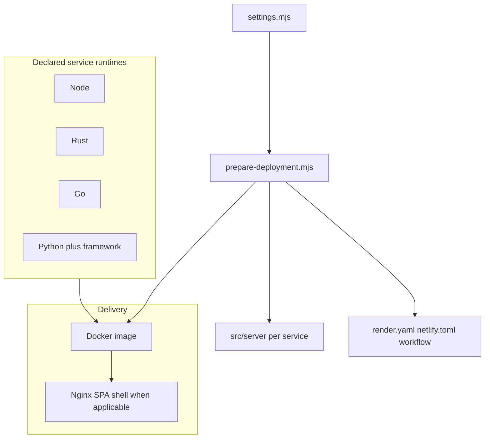
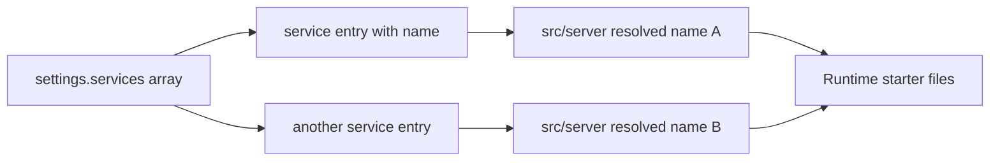
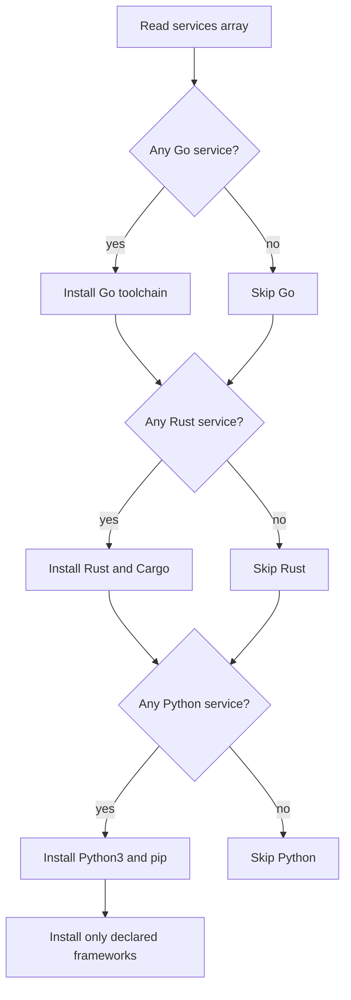

# Deployment system guide

Settings-driven deployment: one source of truth for **host**, **service type**, and **endpoint services**, with validated scaffolds and conditional Docker installs.

**Centerpieces**

- Typed settings: [src/deployment/types/settings.ts](types/settings.ts), [src/deployment/settings/settings.mjs](settings/settings.mjs), [src/deployment/settings/settings.ts](settings/settings.ts)
- [src/deployment/scripts/prepare-deployment.mjs](scripts/prepare-deployment.mjs) — validate, scaffold `src/server/<name>/`, emit host files
- [src/deployment/scripts/runtime-install-plan.mjs](scripts/runtime-install-plan.mjs) — flags consumed by the Dockerfile
- [vite.config.ts](../../vite.config.ts) — `base` for GitHub Pages static, dev `proxy` to `localPort` services

---

## Stack overview (conceptual)

Runtimes you can declare today: **Node**, **Rust**, **Go**, **Python** (with `flask` | `falcon` | `bottle`). Images below are descriptive only (no binary assets required in-repo).



---

## Directory layout

| Path | Role |
| ---- | ---- |
| `src/deployment/types/settings.ts` | Type definitions for settings |
| `src/deployment/settings/settings.mjs` | Authoritative JS settings (imported by Node scripts and re-export patterns) |
| `src/deployment/settings/settings.ts` | Typed surface for `vite.config.ts` |
| `src/deployment/scripts/prepare-deployment.mjs` | Prepare / scaffold / host artifacts |
| `src/deployment/scripts/runtime-install-plan.mjs` | Prints install flags for Docker |
| `src/server/<service-name>/` | One folder per `services[]` entry |

---

## Core model

| Field | Values |
| ----- | ------ |
| `host` | `github.io`, `netlify`, `render.com` |
| `type` | `web-service` or `static` |
| `services` | Endpoint services with `name`, `type` (`node` \| `rust` \| `go` \| `python`), optional `routePrefix`, optional `localPort` |

**Host vs type (enforced in types + prepare script)**

- `github.io` → **static** only
- `netlify` → **static** only
- `render.com` → **static** or **web-service**

**Python** services must set `pythonFramework` (`flask` \| `falcon` \| `bottle`); non-Python services must not.

---

## Settings and example shape

- Primary: `src/deployment/settings/settings.mjs`
- Typed companion: `src/deployment/settings/settings.ts`

Example:

```yaml
# conceptual — actual file is JS module exporting an object
host: render.com
type: web-service
services:
  - name: api
    type: node
    routePrefix: /api
    localPort: 8787
```

---

## Service-to-folder mapping

Each `services[]` entry maps to **`src/server/<name>/`**. Declaring `api` and `users` yields `src/server/api` and `src/server/users`. The prepare script adds runtime-specific starter files.



---

## Scaffolding by runtime

| Runtime | Created artifacts (typical) |
| ------- | --------------------------- |
| Node | `index.ts` with a **healthcheck** export |
| Rust | `Cargo.toml`, `src/main.rs` |
| Go | `go.mod`, `main.go` |
| Python | `requirements.txt`, `app.py` template for chosen framework |

---

## Conditional runtime installation

Docker installs only what `settings.services` needs.

1. `runtime-install-plan.mjs` reads `services`.
2. It emits shell flags: `NEED_GO`, `NEED_RUST`, `NEED_PYTHON`, `PYTHON_FRAMEWORKS`.
3. The Dockerfile branches on those flags.
4. Python installs only declared framework packages.



---

## Host artifact generation

| Host / type | Output (via prepare) |
| ----------- | --------------------- |
| Render web-service | Updates `render.yaml`, Docker-oriented defaults |
| Render static | Static-site style in `render.yaml` |
| Netlify static | `netlify.toml` with SPA fallback |
| GitHub Pages static | `.github/workflows/deploy-github-pages.yml` |

---

## Vite integration

[vite.config.ts](../../vite.config.ts) imports deployment settings for:

- **`base`** when `host` is `github.io` and `type` is `static`
- **Dev proxy** map: `routePrefix` → `http://localhost:<localPort>` for services that define `localPort`

---

## Default profile

Defaults target **Render** **web-service**: Docker + Nginx-style SPA serving, `PORT` aligned with Render conventions (see generated `render.yaml` after prepare).

---

## Typical workflow

1. Edit `src/deployment/settings/settings.mjs`.
2. Run `npm run deploy:prepare`.
3. Review `src/server/*` and generated host files.
4. Run `npm run dev` and hit proxied API routes locally.
5. Deploy to the chosen host.

### Static host quick notes

- **github.io** — `host: github.io`, `type: static`, prepare, commit workflow.
- **netlify** — `host: netlify`, `type: static`, prepare, commit `netlify.toml`.
- **render static** — `host: render.com`, `type: static`, prepare.

---

## Validation (prepare)

- Valid `host` / `type` pairs
- Unique service `name` values
- `routePrefix` shape
- `localPort` integer when provided
- `pythonFramework` required for Python, forbidden otherwise

---

## Troubleshooting

| Symptom | Check |
| ------- | ----- |
| Missing `src/server/<name>` | Non-empty unique `name`; prepare exited 0 |
| Extra languages in Docker image | Current `services` list; run `node src/deployment/scripts/runtime-install-plan.mjs` |
| Missing Netlify / Pages files | `host` and `type` in `settings.mjs`; re-run `npm run deploy:prepare` |

---

## Future enhancements

- Multi-service port helpers
- Non-Docker buildpack presets
- Service env / secrets schema
- Typed client stubs from OpenAPI or similar
