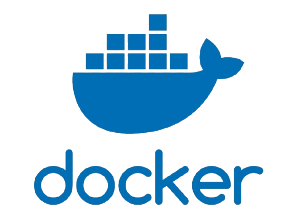
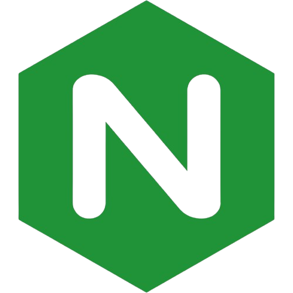
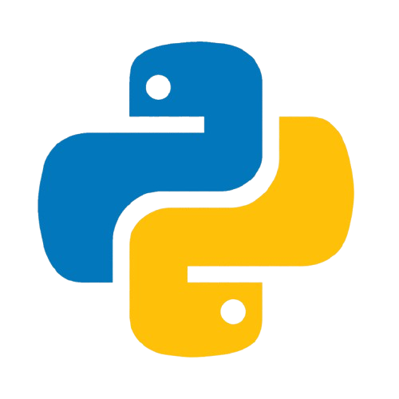
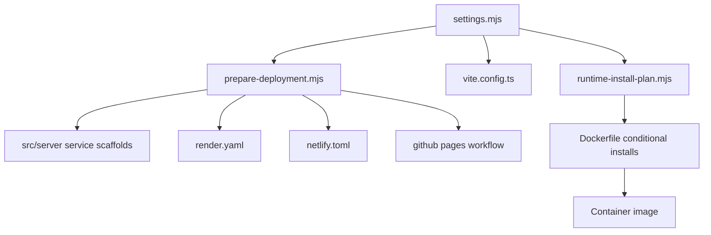
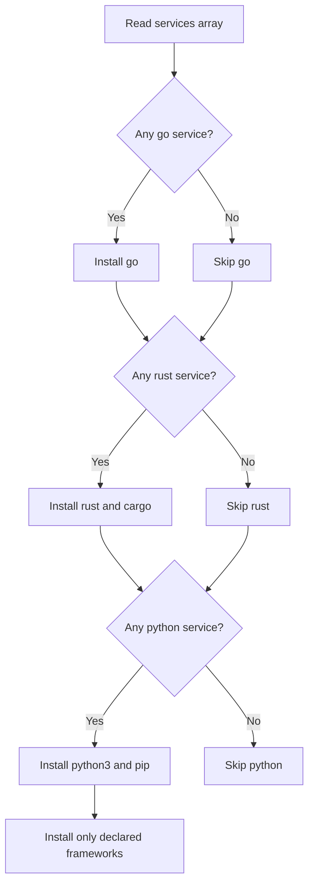
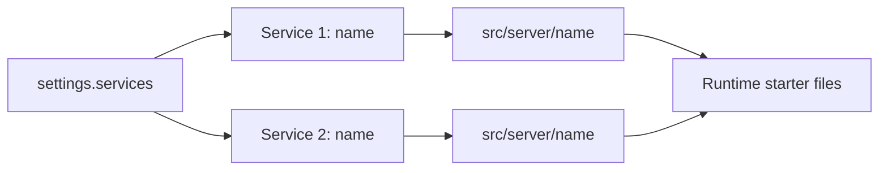

# Deployment System Guide

This project uses a settings-driven deployment system designed to support multiple hosts and deployment styles while keeping one source of truth for service topology.

The deployment system is centered around:

- Typed deployment settings under src/deployment/settings and src/deployment/types
- A preparation script that validates configuration and scaffolds service folders
- Conditional language/runtime install planning for Docker builds
- Host-specific artifact generation for Render, Netlify, and GitHub Pages

## Visual Stack Overview

  
  
  
  
  

These logos are referenced from the repository-level resources directory for GitHub documentation viewing.

## Directory Layout

- src/deployment/types/settings.ts
- src/deployment/settings/settings.mjs
- src/deployment/settings/settings.ts
- src/deployment/scripts/prepare-deployment.mjs
- src/deployment/scripts/runtime-install-plan.mjs
- src/server/<service-name>/...

## Core Model

The deployment model expresses:

- host: github.io, netlify, or render.com
- type: web-service or static
- services: endpoint service array

Service runtime types currently supported:

- node
- rust
- go
- python

For python services, a framework must be declared:

- flask
- falcon
- bottle

### Host and Type Compatibility

Rules enforced by type model and script validation:

- github.io only allows static
- netlify only allows static
- render.com allows static or web-service

## Settings File

Primary runtime configuration lives in:

- src/deployment/settings/settings.mjs

Typed companion file for TypeScript consumers:

- src/deployment/settings/settings.ts

Example shape:

- host: render.com
- type: web-service
- services:
  - name: api
    type: node
    routePrefix: /api
    localPort: 8787

## Service-to-Folder Mapping

Each entry in settings.services maps to a folder under src/server.

If settings declares:

- name: api
- name: users

Then scaffolding creates:

- src/server/api
- src/server/users

The prepare script also emits runtime-specific starter files.

## Scaffolding Behavior by Runtime

Node service:

- Creates index.ts with a basic healthcheck export.

Rust service:

- Creates Cargo.toml
- Creates src/main.rs

Go service:

- Creates go.mod
- Creates main.go

Python service:

- Creates requirements.txt with selected framework
- Creates app.py template matching framework style

## Conditional Runtime Installation

Conditional installation is used in Docker build stage so language-specific dependencies are only installed when needed by configured routes.

How it works:

1. runtime-install-plan.mjs reads settings.services.
2. It emits shell flags:
   - NEED_GO
   - NEED_RUST
   - NEED_PYTHON
   - PYTHON_FRAMEWORKS
3. Dockerfile evaluates flags.
4. Only required packages are installed.

Current package behavior:

- Go services present -> install go
- Rust services present -> install rust and cargo
- Python services present -> install python3 and pip, then only selected framework libraries

## Host Artifact Generation

prepare-deployment.mjs generates host-specific files based on settings.

Render:

- Updates render.yaml
- Uses web service defaults for Docker deploy when type is web-service
- Uses static_site style when type is static

Netlify static:

- Generates netlify.toml with SPA redirect fallback

GitHub Pages static:

- Generates .github/workflows/deploy-github-pages.yml

## Vite Integration

vite.config.ts reads deployment settings and applies:

- base path behavior for static github.io deployments
- dev proxy routing for services that define localPort

This keeps local development aligned with deployment topology.

## Default Deployment Profile

Current defaults are set for Render free web-service:

- host: render.com
- type: web-service
- PORT default aligned for Render web service behavior
- Docker and Nginx defaults configured for SPA serving

## Mermaid Diagrams

### 1) High-Level Deployment Configuration Flow

### 2) Conditional Runtime Installation Logic

### 3) Service Scaffold Mapping

## Typical Workflow

1. Edit src/deployment/settings/settings.mjs.
2. Run npm run deploy:prepare.
3. Review generated artifacts and server scaffolds.
4. Run local dev and validate service proxy behavior.
5. Deploy to chosen host.

## Switching to Static Hosts

For github.io:

- Set host to github.io
- Set type to static
- Run npm run deploy:prepare
- Commit generated GitHub Pages workflow

For netlify:

- Set host to netlify
- Set type to static
- Run npm run deploy:prepare
- Commit generated netlify.toml

For render static:

- Set host to render.com
- Set type to static
- Run npm run deploy:prepare

## Validation and Safety Notes

Validation performed during preparation includes:

- valid host and type values
- host/type compatibility constraints
- unique service names
- valid routePrefix shape
- valid localPort integer when supplied
- required pythonFramework for python service type
- forbids pythonFramework for non-python service types

## Troubleshooting

If a service folder is not created:

- Ensure service has a non-empty name
- Ensure prepare script ran successfully
- Ensure no duplicate names

If runtime tools are unexpectedly installed in Docker:

- Check current settings.services list
- Verify runtime-install-plan output by running:
  - node src/deployment/scripts/runtime-install-plan.mjs

If host artifacts are missing:

- Confirm host and type values in settings.mjs
- Re-run npm run deploy:prepare

## Future Enhancements

Potential extensions:

- Multi-service port coordination helpers
- Language-specific buildpack presets for non-Docker targets
- Service-level env var schema and secrets contract
- Endpoint contract generation for client-side typed APIs
